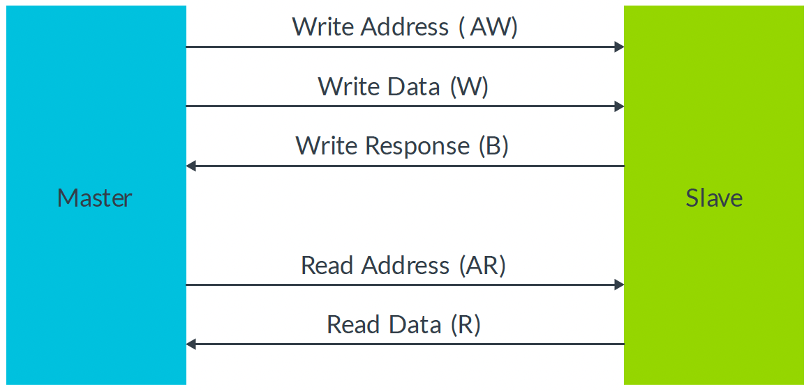
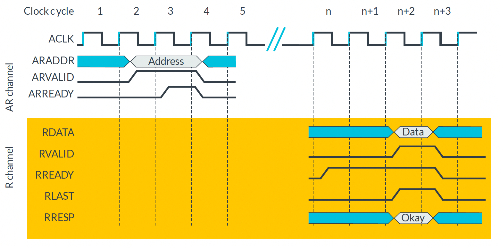

### AXI Protocol  

AMBA **AXI(Advanced eXtensible Interface)** protocol

SoC (System on Chip) 설계에서 데이터를 주고받는 표준 통신 프로토콜이다.

**Feature**  
- High bandwidth  
- Pipelined Operation: AW, W, B 같은 stage가 pipeline으로 시행된다.    
- **Burst transfer**: 하나의 주소를 던지면 여러개의 데이터를 주고 받을 수 있다.  
- **Multiple Outstanding Address**: Transfer가 끝나기 이전에 주소를 미리 여러개 던져놓아도 된다.  
- **Out-of-order transaction completion**: 던진 순서대로 처리하지 않고 순서를 바꿔서 더 빠르게 처리한다.  

**Background**  

- Handshake  

Source: 보낼 데이터가 유효함 (VALID)
Destination: 데이터를 받을 준비가 됨 (READY)

VALID && READY 일 때를 Handshake 라고 부르며 데이터가 transfer 된다.  

**Overview**  
  

Write을 위한 채널 3개와 Read를 위한 채널 2개로 이루어져 있다.

Write: AW -> W -> B
Read: AR -> R

Write Response(B)는 Slave가 Master한테 데이터를 제대로 받았는지 알려준다. Read Response가 없는 이유는 에러 정보를 데이터에 담아서 같이 보내면 되기 때문이다.  

**Transaction**  

**1. Write**  

1. AW Channel
Master: ADDR를 내보내고 VALID를 High로 만듦  
Slave: READY를 High로 만들어서 Handshake  

2. W Channel
Slave: Data를 받을 준비가 되면 READY를 High로 만듦  
Master: ADDR를 내보내고 VALID를 High로 만들면 Handshake  

3. B Channel
Master: Response를 받을 준비가 되면 READY를 High로 만듦  
Slave: Response를 보내고 VALID를 High로 만들어서 Handshake  

**2. Write (burst)**  

하나의 ADDR로 여러개의 데이터를 보낼 수 있다. 몇 개의 데이터를 보낼지 AW에서 알려주고(AWLEN, AWSIZE, AWBURST), Slave가 마지막 데이터를 받으면 WLAST가 High가 되고 Response로 Okay를 보낸다. AWLEN은 Burst Length, AWSIZE는 W 채널에서 전송되는 데이터의 Bitwidth이다. AWBURST는 FIXED, INCR 등 여러 방법 중 어떤 burst 방식을 이용할지 알려준다. FIXED는 고정된 주소에 Write을 하고 INCR은 주소를 데이터의 byte 만큼 증가시키면서 Write을 한다. WRAP은 INCR와 비슷한데 주소가 끝에 도달하면 다시 처음으로 돌아간다.  

**3. Read**  
  

1. AR Channel
Master: ADDR를 내보내고 VALID를 High로 만듦  
Slave: READY를 High로 만들어서 Handshake  

2. R Channel  
Master: Data를 받을 준비가 되면 READY를 High로 만듦  
Slave: Data를 내보내고 VALID를 High로 만들어서 Handshake, 이때 Last가 High가 되면 Response도 같이 보냄  

**4. Read (burst)**  

하나의 ADDR로 여러개의 데이터를 받을 수 있다. 몇 개의 데이터를 보낼지 AR에서 알려주고(ARLEN, ARSIZE, ARBURST), Slave가 마지막 데이터를 보내면 데이터 Read가 완료된 것이다. ARLEN은 Burst Length, ARSIZE는 R 채널에서 전송되는 데이터의 Bitwidth이다. ARBURST는 FIXED, INCR, WRAP 등 여러 방법 중 어떤 burst 방식을 이용할지 알려준다. FIXED는 고정된 주소에서 Read를 하고 INCR은 주소를 데이터의 byte 만큼 증가시키면서 Read를 한다. WRAP은 INCR와 비슷한데 주소가 끝에 도달하면 다시 처음으로 돌아간다.  

**주소 채널과 데이터 채널이 분리되어 있기 때문에 Transaction이 끝나기 전에 새로운 Request를 날리는 것이 가능하다**  

