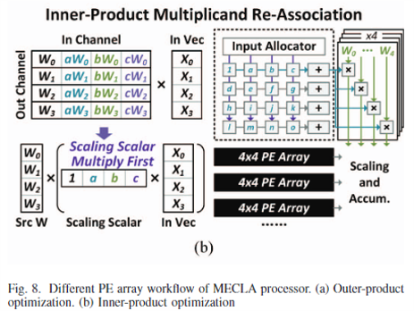

## HyperAccel 논문 세미나 정리

---

#### **1. 2024/06/28**
### **QLLM: Accurate and Efficient Low-Bitwidth Quantization for Large Language Models**  

**Channel Disassembly**  

LLM은 두 개의 코어 파트가 있는데, 멀티헤드 셀프 어텐션과 FFN이다. 이들은 주로 Linear layers로 구성되어 있으며 다음과 같이 표현된다.  

$$
\mathbf{y}_k = \sum_{i=1}^M \mathbf{x}_i\mathbf{W}_{ik}
$$

M 번째 채널에 아웃라이어가 존재한다고 하면 해당 채널을 T개로 쪼갤 수 있다. 하나의 큰 Activation 값을 여러 개의 작은 값들로 표현하는 것이다.

$$
\mathbf{y_k} = \sum_{i=1}^M \mathbf{x}_i\mathbf{W}_{ik} + \frac {\mathbf{x}_M}{T}\mathbf{W}_{Mk} + \cdots + \frac {\mathbf{x}_M}{T}\mathbf{W}_{Mk}
$$

$$
T = \lceil max(\vert \mathbf{x}_M \vert /\theta) \rceil
$$

$\theta$ 는 아웃라이어 채널이 어떤 크기로 쪼개질지 조절하는 매개변수다.  

**Channel Assembly**  

채널을 쪼개고 나면 채널의 개수는 $M + T - 1$ 가 된다. 원래 M개 였으므로 이를 M개로 다시 줄여주는 작업이 필요하다.

이때 LLM에는 상당히 많은 채널이 존재하므로 몇개 생략해도 성능에 별 지장이 없다. 그렇지만 단순히 Channel Pruning을 하면 정보를 잃게 되므로, Channel Assembly를 통해 비슷한 채널들을 하나로 합쳐주는 방법으로 채널의 수를 줄인다.  

Distance가 가까운 채널들을 Merge 해주는데, 식을 잘보면 Activation 차와 가중치 차의 곱으로 인수분해가 가능하다. 두 가지 모두 비슷해야 Distance가 작아짐을 알 수 있다.

$$
D(i, j) = \begin{Vmatrix} \frac {\mathbf{x}_i(\mathbf{W}_{ik}-\mathbf{W}_{jk})}{2} + \frac {\mathbf{x}_j(\mathbf{W}_{jk}-\mathbf{W}_{ik})}{2} \end{Vmatrix} ^2
$$

$$
\mathbf{x}_i\mathbf{W}_{ik} + \mathbf{x}_j\mathbf{W}_{jk} \approx \frac {\mathbf{x}_i + \mathbf{x}_j}{2} (\mathbf{W}_{ik}+\mathbf{W}_{jk})
$$

Merge에는 이 단순한 식을 사용한다.  

**Choosing T and $\theta$**  

$$
arg min_\theta \vert Softmax(\mathbf{QK}^T)\mathbf{V} - Softmax(\mathbf{\tilde{Q}\tilde{K}}^T)\mathbf{\tilde{V}}
$$

$\theta$ 를 Grid Search로 찾는다.    

- Efficient Gradient Based Error Correction  

Fine tuning 해주는 부분인데 Lora 논문을 참고한다. 

$$
Y = quant(X)quant(W) + quant(X)W_{correction}
$$

로 $W_{correction}$ 을 학습을 시키는데 $W_{correction}=AB$ 로 해서 결국 AB를 학습시킨다. 이렇게 하면 메모리를 줄일 수 있기 때문이다.  

---

#### **2. 2024/07/05**
### **NeuPIMs: NPU-PIM Heterogeneous Acceleration for Batched LLM Inferencing**  

---

#### **3. 2024/07/12**
### **TCP: A Tensor Contraction Processor for AI Workloads**  

---

#### **4. 2024/07/19**
### **Tender: Accelerating Large Language Models via Tensor Decomposition and Runtime Requantization**  

내 발표라 따로 자세하게 정리해놓았다.  

[Tender: Accelerating Large Language Models via Tensor Decomposition and Runtime Requantization](https://seoyoonkims.github.io/docs/paper_review/Tender/)  

---

#### **5. 2024/07/26**
### **8-bit Transformer Inference and Fine-tuning for Edge Accelerators**  

Edge Accelerator는 리소스가 제한되어 있으므로 compressed model이 필요한데, 여전히 많은 메모리를 요구하고 있다. Quantization이 활발하게 연구되고 있지만, inference 시에 disadvantage가 많고 주로 GEMM 연산에만 quantization이 적용되어 데이터들이 여전히 high precision을 유지하고 있다.  

이 논문은 **8-bit Inference and Fine Tuning with FP8 and Posit**에 관한 연구이며 
1. 8-bit Quantization + Operation Fusion이 Inference Accuracy에 미치는 영향 분석  
2. Fine Tuning을 위해 FP8과 Posit8에 LoRA 적용  
3. Softmax Hardware 설계  
로 크게 나누어진다.  

**Posit**  

  

기존의 수 체계가 아니라 새로운 방식을 채택한다.  

exponent, mantissa가 고정되어 있었던 것과 달리 Posit은 flexible 하게 bit 수가 조절된다.

es: Predetermined 되는 값으로 $2^{2^{es}}$ 에 따라 수가 띄엄띄엄 표현될지가 결정된다.  

e: es가 뛰어넘는 수 사이를 e가 모두 커버해줘야 하므로 es에 따라 결정된다.  

s: sign bit

k: regime으로 s 이후에 나오는 0과 1에 따라 결정된다. 만약 0000이 나오면 이는 작은 수이므로 $k = -4$ 가 되어 촘촘한 간격으로 표현되고 1111이면 큰 수이므로 $k=3$ 이 되어 넓은 간격으로 표현된다.  

모든 수를 동일한 간격으로 매핑하는 FP8 Quantization에 비해 Posit은 작은 수에 대해서는 더 높은 정확도를 보이고 큰 수에서는 낮은 정확도를 갖게 될 것이다.  

**Posit Encoding**  

$$
x = (-1)^S \cdot 1.f \cdot (2^{2^{es}})^k \cdot 2^e  
$$

1. 실수 x를 $(2^{2^{es}})^k$ 로 나눠서 k 추출 (1.xxx 지나기 전까지)  
2. 2로 나눠가며 e 추출 (1.xxx 나올 때까지)  
3. f 추출  
4. round to even  

**FP8, Posit8 Quantization**  

GEMM만 Quantization 하는 것이 아니라 Residual, LayerNorm, Activation, Attension Scaling 등에도 적용했더니 Accuracy drop이 상당했다.  

그래서 Operation Fusion을 이용한다. 각 단계마다 Quantization 하는 것이 아니라 Fusion된 Operation까지 FP8로 진행하다가 마지막에 Posit8로 바꾸는? 그런 거 같음..  

MobileBERT 모델의 경우 모든 operation을 fusion 해야 정확도 차이가 1% 내로 줄어든다.  

**Fine-tuning for Edge device**  

Dark gray region은 E4M3으로 표현가능하고, light gray region은 Posit8로 표현 가능한 범위인데 activation과 weight의 경우는 대부분 범위 내에 들어오지만 gradient는 벗어나는 부분이 많아서 scaling을 해줘야 한다. 일반적인 FP8 같은 경우는 Tensor Max 값이랑 그 Format이 나타낼 수 있는 최댓값으로 매핑을 진행하는데, Posit8은 최댓값인 2^12일 때 정확도가 많이 떨어져서 64로 매핑했을 때 결과가 가장 좋았다고 한다.   

**Appriximate Softmax Using Posits**  

Softmax는 exponential와 division을 요구하는데 posit은 sigmoid와 reciprocal을 bitwise로 연산할 수 있어서 간단하게 구현할 수 있다.  

$$
S(x) = \frac {1}{1+e^{-x}} => e^x = \frac {1}{S(-x)}-1
$$

---

#### **6.2024/08/02**  
### **FlashAttention-2: Faster Attention with Better Parallelism and Work Partitioning**  

---

#### **7.2024/08/09**  
### **MECLA: Memory-Compute-Efficient LLM Accelerator with Scaling Sub-matrix Partition**  

SSMP 기반 하드웨어 가속기를 소개하는 논문이다. 아이디어가 직관적이면서 메모리와 연산에 강력한 이점을 제공한다.  

**SSMP Method**  

Weight Matrix를 여러 개의 작은 Source Matrix(SS)와 Derived Matrix(DS)로 나눈다. DS는 SS에 Scaling Parameter를 곱해서 유도되는 Matrix다. 

  

위 그림을 예시로 들면 기존 Matrix를 $2 \times 3$ 의 submatrix로 나누고 1개를 SS로 지정한다. 나머지 5개의 DS는 SS에 Scaling Parameter를 곱해서 얻는다. 그러면 원래 $4 \times 6 = 24$ 개의 Parameter를 저장해야 했는데, 이제는 $4 + 5 = 9$ 개의 Parameter만 저장하면 되어서 메모리 측면에 큰 이점을 제공한다.  

선행 연구에 따르면 Weight Matrix에서 중요한 정보는 1% 이하여서 이 1%는 따로 저장하고, 나머지 99%에 대해서 이 기법을 적용하면 정확도를 떨어뜨리지 않고 메모리를 절약할 수 있다. 

  

Pre-trained Model Weight에서 시작해서, 이 가중치를 가장 잘 설명할 수 있는 새로운 파라미터를 찾는 것이다. LoRA와 비슷해보인다.  

$\sigma$ 는 Forget Factor로 처음에 1부터 시작해서 점점 줄여나가는 방향으로 학습된다. 식을 보면 $\sigma$에 따라서 처음에 $W$에서 시작해서 $W_{new}$로 수렴하게 된다. 

$$
Loss \leftarrow L_{LM} (Output) + L(\sigma);  
$$

Loss Function이 재밌는데, $L_{LM} (Output)$ 에다가 $\sigma$ 의 L2 Regularization 항을 더해서 sigma가 커지는 것을 막는다. 이는 $W$가 $W_{new}$ 방향으로 학습되도록 하는 penalty 항이라고 보면 된다.  

**MECLA Overall Architecture**  

RISC-V 코어에 1.25MB의 On chip buffer(Data + Source Matrix + Scaling Param), DDR Controller, 8 PE Clusters, 그리고 Auxiliary Unit으로 구성되어 있다.  

**Outer-product Reuse and Inner-product Re-association**  

1. $n_x > n_y$

 Mecla는 Data Reuse도 크게 늘릴 수 있다. SS와 DS가 상수 배이므로 같은 Input에 대해 곱한 결과도 상수 배이기 때문이다. 따라서 MECLA는 SS Weight을 한번만 로드하면 DS Weight의 Output도 계산할 수 있다. 

 

 Weight Stationary 처럼 Systolic Array에 Weight을 고정해놓고 Input 조각을 순서대로 넣어주면 된다. 그리고 부분합이 나오면 거기에 Scaling Paramter만 곱해서 Output을 얻는다.  

 

2. $n_x < n_y$

 Inner Product도 비슷한데 연산 순서만 다르다.  

 

 이번에는 Scaling Paramter를 고정해놓고 Input 조각들을 넣어준 뒤 Weight와 곱하게 된다.  

 

 이렇게 두 가지로 나눠서 연산하는 이유는 조금만 생각해보면 알 수 있다. 당연히 더 길이가 짧은 쪽으로 연산을 하고 그거에 Scaling Parameter를 곱해서 얻는 것이 Compute 면에서 이득이기 때문이다. 

