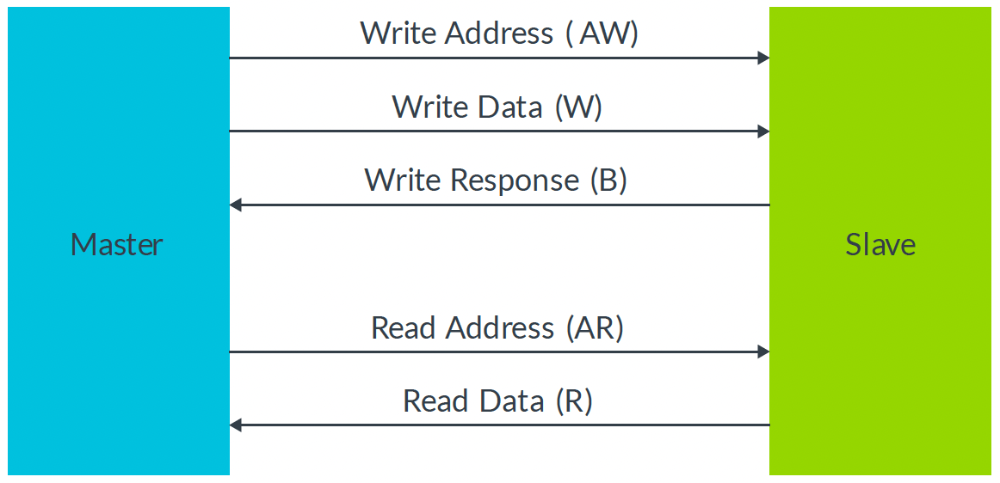
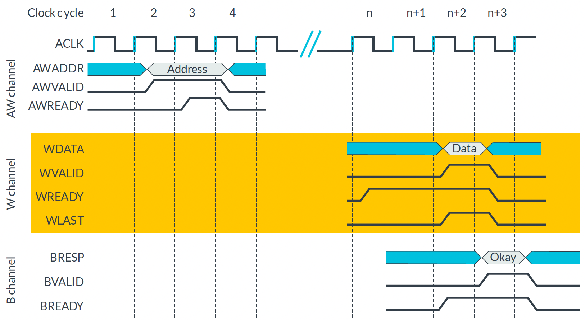
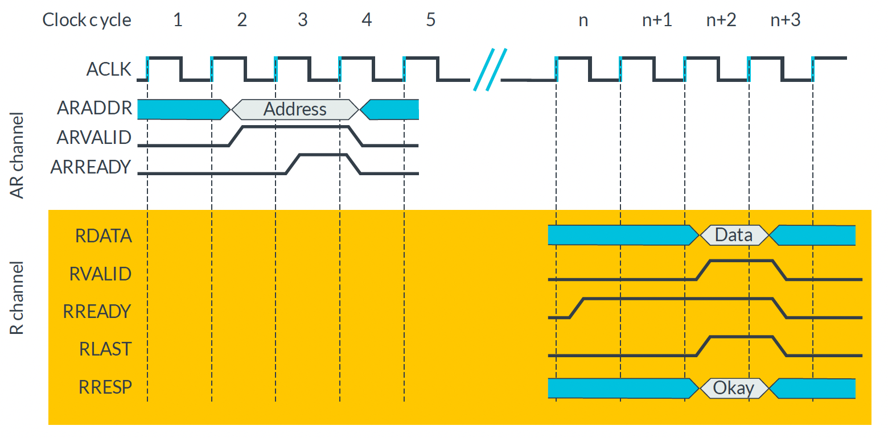
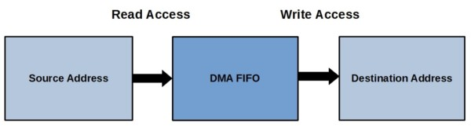
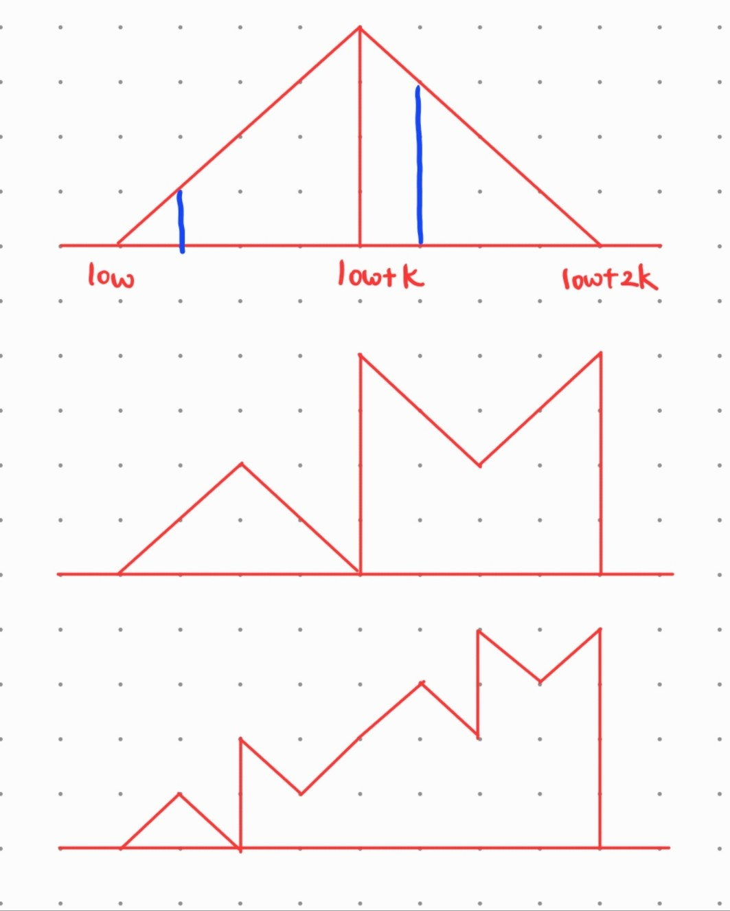
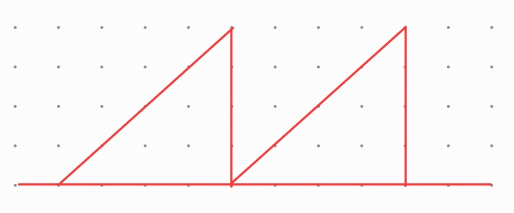

## HyperAccel 인턴하면서 찾아본 것들  

---

## 1. AXI Protocol  

AMBA **AXI(Advanced eXtensible Interface)** protocol  


SoC (System on Chip) 설계에서 데이터를 주고받는 표준 통신 프로토콜이다.

### **Feature**  
- High bandwidth  
- Pipelined Operation: AW, W, B 같은 stage가 pipeline으로 시행된다.    
- **Burst transfer**: 하나의 주소를 던지면 여러개의 데이터를 주고 받을 수 있다.  
- **Multiple Outstanding Address**: Transfer가 끝나기 이전에 주소를 미리 여러개 던져놓아도 된다.  
- **Out-of-order transaction completion**: 던진 순서대로 처리하지 않고 순서를 바꿔서 더 빠르게 처리한다.  


### **Handshake** 

Source: 보낼 데이터가 유효함 (VALID)  
Destination: 데이터를 받을 준비가 됨 (READY)

VALID && READY 일 때를 Handshake 라고 부르며 데이터가 transfer 된다.  


### **Overview**  
  


Write을 위한 채널 3개와 Read를 위한 채널 2개로 이루어져 있다.
```
Write: AW -> W -> B  
Read: AR -> R
```
Write Response(B)는 Slave가 Master한테 데이터를 제대로 받았는지 알려준다. Read Response가 없는 이유는 에러 정보를 데이터에 담아서 같이 보내면 되기 때문이다.  


### **Transaction**  

**1. Write**  



1. AW Channel
Master: ADDR를 내보내고 VALID를 High로 만듦  
Slave: READY를 High로 만들어서 Handshake  

2. W Channel
Slave: Data를 받을 준비가 되면 READY를 High로 만듦  
Master: ADDR를 내보내고 VALID를 High로 만들면 Handshake  

3. B Channel
Master: Response를 받을 준비가 되면 READY를 High로 만듦  
Slave: Response를 보내고 VALID를 High로 만들어서 Handshake  

Write Burst 모드는 하나의 ADDR로 여러개의 데이터를 보낼 수 있다. 몇 개의 데이터를 보낼지 AW에서 알려주고(AWLEN, AWSIZE, AWBURST), Slave가 마지막 데이터를 받으면 WLAST가 High가 되고 Response로 Okay를 보낸다.  


**2. Read**  
  

1. AR Channel
Master: ADDR를 내보내고 VALID를 High로 만듦  
Slave: READY를 High로 만들어서 Handshake  

2. R Channel  
Master: Data를 받을 준비가 되면 READY를 High로 만듦  
Slave: Data를 내보내고 VALID를 High로 만들어서 Handshake, 이때 Last가 High가 되면 Response도 같이 보냄  

Read Burst 모드는 하나의 ADDR로 여러개의 데이터를 받을 수 있다. 몇 개의 데이터를 보낼지 AR에서 알려주고(ARLEN, ARSIZE, ARBURST), Slave가 마지막 데이터를 보내면 데이터 Read가 완료된 것이다.   


**주소 채널과 데이터 채널이 분리되어 있기 때문에 Transaction이 끝나기 전에 새로운 Request를 날리는 것이 가능하다**  


---

## 2. DMA (Direct Memory Access)  

CPU의 개입 없이 메모리들 간에 데이터를 주고 받을 수 있다. CPU cycle을 소모하지 않고 DMA Engine을 사용하므로 Data를 전송하는 동안 CPU Cycle을 다른 곳에 사용할 수 있다.  


CPU와 DMA는 Master Interfaces를 갖고 있다. DMA Controller가 DMA의 동작을 수행하는 Functional Unit인데, CPU가 인식할 수 있는 register를 포함하고 있어서 src addr, dest addr, num byte 등을 요청할 수 있다.  

각 DMA Controller는 FIFO Buffer를 가지고 있어서 데이터를 일시적으로 저장하고 전송 속도를 조절한다.  



1. Read access – data is transferred from the source address to the DMA FIFO
2. Write access – data is transferred from the DMA FIFO to the destination address


---

## 3. Bitonic Sort  

병렬처리 컴퓨터에서 많이 쓰는 Sorting 알고리즘이다.  


1. Bitonic Sequence: 배열을 원소 개수가 2개가 될 때까지 계속 절반으로 쪼개나가서 (재귀적으로) Ascending / Descending 이 반복되도록 각 부분 배열을 Sorting을 한다.  
2. Bitonic Merge: 두 개의 부분 배열을 비교하여 Merge 하는데, 일정 인덱스 만큼 떨어진 원소를 규칙에 맞게 교환하는 식으로 한다. 역시 Ascending / Descending 이 반복되도록 한다.  

코드로 보면 이해가 편하다.  

```
def compare_and_swap(arr, i, j, direction):
    if direction == (arr[i] > arr[j]):
        arr[i], arr[j] = arr[j], arr[i]

def bitonic_merge(arr, low, cnt, direction):
    if cnt > 1:
        k = cnt // 2
        for i in range(low, low + k):
            compare_and_swap(arr, i, i + k, direction)
        bitonic_merge(arr, low, k, direction)
        bitonic_merge(arr, low + k, k, direction)

def bitonic_sort(arr, low, cnt, direction):
    if cnt > 1:
        k = cnt // 2
        bitonic_sort(arr, low, k, 1)  # Ascending order
        bitonic_sort(arr, low + k, k, 0)  # Descending order
        bitonic_merge(arr, low, cnt, direction)

def sort(arr, N, up):
    bitonic_sort(arr, 0, N, up)

# Example usage
arr = [3, 7, 4, 8, 6, 2, 1, 5]
N = len(arr)
up = 1  # 1 for ascending order, 0 for descending order
sort(arr, N, up)
print("Sorted array is:", arr)

```

처음에 3가지 의문이 있었는데,

1. 왜 병렬 처리에 유용한가  
 분할할 때 부분 배열 간 간섭이 전혀 없고 재귀적으로 이루어지므로 다른 프로세서가 독립적으로 처리할 수 있어서 그런것 같다. 그리고 Merge를 할 때도 k 만큼 떨어진 원소끼리만 비교 및 교환을 하므로 여러 프로세서가 동시에 작업을 수행할 수 있다.  

2. 왜 Sorting이 되는가  
   
 이게 되네?

3. 왜 Ascending / Descending 을 번갈아 사용하는가
   
 Ascending / Ascending 이면 원소 교환해도 Sorting이 안됨


## 4. Systolic Array  


---

## 5. HBM  


---


