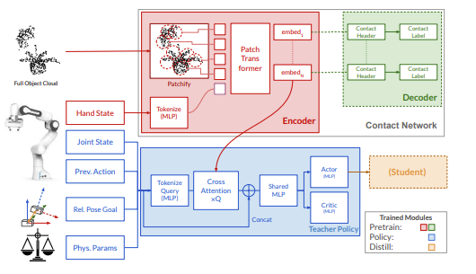
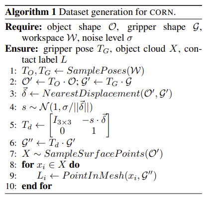

### 논문 리뷰

## CORN: Contact-based Object Representation for Nonprehensile Manipulation of General Unseen Objects    

---

### **3. Method**  

**3.1 Overview**  
물체를 특정 6D Pose가 되도록 조절하는 과정에서 Pushing(밀기), Toppling(넘어뜨리기), 그리고 Pivoting(피벗팅) 같은 **Nonprehensile Manipulation** 기술을 사용한다. 

훈련에는 다음의 3단계가 필요하다.  
- 1st Stage: Pretraining  
- 2nd Stage: Teacher Policy w/ Privileged Information  
- 3rd Stage: Student Policy w/ Partial Information  

1단계에서는 빨간색 부분의 Encoder 모듈을 훈련시킨다. 이 모듈은 관측한 Point Cloud $(512 \times 3)$와 Hand State $9 (3D position + 6D Orientation)$를 바탕으로 오브젝트의 Patch-wise Embedding을 만들어낸다. 이것을 초록색 부분의 Decoder로 넘겨준 후, 각 임베딩된 Patch가 Gripper와 만나는지 분류하면서 학습이 이루어지는 것이다. 따라서 이때는 Point Cloud 인코더와 Collision 디코더가 동시에 학습된다.  

Policy 학습 단계에서는 Collision Decoder를 없애고, 인코더는 Freeze 해서 Policy 모듈만 Learnable 하게 만든다. Policy는 Joint State, Previous Action, Goal Pose에 대한 현재의 Relative pose, 물리적 성질 등을 인풋으로 받은 뒤 이것을 MLP로 토큰화화여 쿼리로 만들고, 이것으로 Point Cloud의 임베딩 정보와 Cross Attention을 진행한다. 이후 Concat과 Shared MLP 단계를 거쳐서 Actor와 Critic 네트워크로 나뉘게 된다. 현실 세계에서는 전체 클라우드 정보나 물리적 성질들을 완전하게 알 수 없기 때문에 Teacher Policy를 Student Policy로 Distill 하는 PPO 방법을 이용한다.  

**3.2 Learning CORN**  

1-2: 오브젝트와 그리퍼의 SE(3) Transform을 샘플링한다. 
3: 오브젝트 표면과 그리퍼 사이의 최단 거리를 찾는다.  
4-6: 그리퍼를 그 최단 거리 벡터 방향으로 가우시안 노이즈만큼 움직인다. 
7: 레이블을 계산하기 위해 오브젝트 표면에서 포인트를 샘플링한다.  
8-10: 각 포인트가 그리퍼와 교차하는지 판단한다.  

이후 각 패치가 오브젝트와 교차하는지 분류함으로써 Cross Entropy로 훈련된다.  

**3.3 Patch-Based Architecture for CORN**  

Point Cloud의 모든 점을 처리할 수 없으므로, 이를 Patch로 만든다.  

**Patch Tokenization**  
Farthest Point Sampling (FPS)를 이용해서 전체 중에서 N개의 대표 포인트를 찾는다. 이후, k-nearest neighbor (kNN)으로 대표 포인트 주변에서 k개의 포인트를 찾고, 이 k개가 하나의 Patch를 이룬다. 이후 MLP를 통해서 토큰으로 임베딩 된다.  

---
**용어 정리**  
PPO(Proximal Policy Optimization)는 강화학습에서 널리 사용되는 정책 최적화 알고리즘으로, Actor-Critic 구조를 기반으로 정책(Policy)을 안정적이고 효율적으로 업데이트하는 방법이다.  
