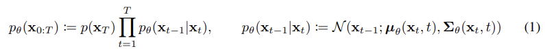
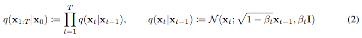
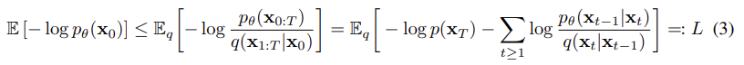

### 논문 리뷰

## **Denoising Diffusion Probabilistic Models**

By Jonathan Ho, Ajay Jain, Pieter Abbeel

---

### 1. Introduction  

Diffusion Probabilistic Model은 Variational Inference로 훈련된 Markov Chain이며 데이터와 일치하는 샘플을 생성해낸다. 

### 2. Background   

확산 모델은 식 (1) 형태의 잠재 변수 모델임.

Joint distribution $p_\theta(x_{0:T})$ 이 reverse process이고 Markov chain으로 정의된다. 

확산 모델이 다른 잠재 변수 모델과 구분되는 점은 posterior $q(x_{1:T} \vert x_{0})$ 이며 forward process에 해당함.

Markov chain 형태이고 점차 가우시안 노이즈를 $\beta$ 에 따라 더해가면서 스케줄링함. 

식 (2)

훈련은 variational bound를 최적화하는 방식으로 이루어진다. 

식 (3)

잘 보면 ELBO임

### 3. Diffusion Models and Denoising Autoencoders  

Forward process에서 $\beta$ 가 learnable 하다는 것을 무시하고 상수로 고정한다. 
따라서 $L_{T}$ 를 상수 취급할 수 있음.

---
reverse process이므로 조건부가 $p_{\theta}(x_{t-1} \vert x_{t})$ 같은 식으로 정의됨.
forward process는 반대.

---
### 용어 정리  
- Variational Inference: posterior 분포 $p(z \vert x)$를 다루기 쉬운 확률분포 $q(z)$로 근사하는 것
- Parametrize: 하나의 표현식을 다른 파라미터를 사용해서 간단하게 표현하는 것 (차수 줄일 수 있음)
