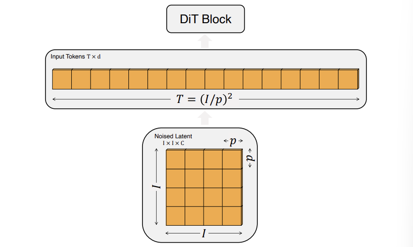
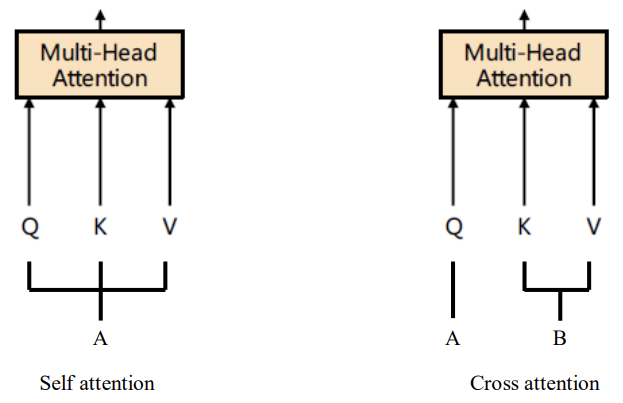
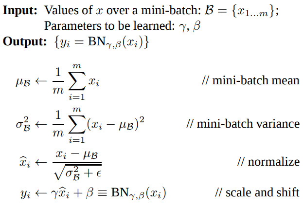
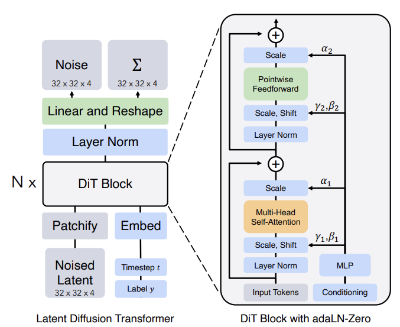

### 논문 리뷰  

## Scalable Diffusion Models with Transformers

William Peebles, Saining Xie  

---

DDPM을 이해했다면, 사실상 다음 그림만 이해하면 된다. DDPM에서는 Image to Image 매핑에 U-Net을 사용했다면, DiT는 U-Net을 Transformer 구조로 바꾼 것이라고 보면 된다.  

위 구조를 이해하기 위해서 다음의 몇 가지 개념들을 알고 넘어가야 한다.  

**Classifier-free Guidance**  

Conditional diffusion models는 class label c 같은 정보들을 추가로 입력받는다. 이 경우 reverse process는 $p_{\theta}(x_{t-1} \vert x_t ,c)$가 되고 $\epsilon_\theta$와 $\Sigma_\theta$는 c에 conditioned 된다. 이러한 설정에서 CFG는 샘플링 과정이 $log p(x \vert c)$를 높이는 방향으로 일어나도록 한다.  

Bayes Rule에 따르면 $log p(c \vert x) \propto \log p(x \vert c) - \log p(x)$이므로 다음과 같다.  

$$
\nabla_x \log p(c|x) \propto \nabla_x \log p(x|c) - \nabla_x \log p(x)
$$

$$
\hat \epsilon_\theta (x_t, c) = \epsilon_\theta(x_t, \varnothing) + s \cdot \nabla_x \log p(x|c)  
$$

$$
\propto \epsilon_\theta(x_t, \varnothing) + s \cdot (\epsilon_\theta(x_t, c) - \epsilon_\theta(x_t, \varnothing))  
$$

$s>1$ 이고 guidance의 정도를 나타낸다. ($s=1$이면 standard sampling 이다.)  

이 그림은 CG와 CFG를 비교한 것이다. CG의 경우 노이즈 이미지를 학습한 후 Classifier로부터 Gradient를 받아서 Class Guidance를 해준다. 반면 CFG는 Positional Encoding과 비슷한 방법으로 t와 c를 모델에 입력해준다. 디퓨전 모델은 Condition을 받았을 때와 받지 않았을 때 두 가지의 노이즈를 예측하고 최종적으로는 이 두 값의 Interpolation을 통해서 노이즈를 계산한다.

**Patchify**  

DiT의 인풋은 spatial representation z($32 \times 32 \times 4$)이다. Patchify는 DiT의 첫번째 레이어로 이러한 spatial 인풋을 T개의 토큰 시퀀스로 바꿔준다. 각각의 디멘션은 d로 동일하다. ViT에서 이용했던 frequency-based positional embedding을 적용한다. 생성되는 토큰의 개수는 아래 그림과 같이 hyperparameter인 p에 의해서 결정된다. p가 작을수록 더 촘촘하게 나누게 되므로 토큰 수가 많아진다.   

---

**DiT Block Design**  

Patchify가 된 인풋 토큰들이 들어오면 트랜스포머 블록으로 들어간다. 이때 노이즈 이미지와 함께 Conditional Information (timesteps t, class label c, 자연어) 등이 함께 입력된다. 이 논문에서는 입력받은 정보들을 처리하는 4가지 방법을 제시하고 있다.

**1. In-context Conditioning**  

t, c의 임베딩에 해당하는 토큰 2개를 추가로 넣어주는 것이다. ViT의 cls 토큰과 비슷하며, ViT의 기본 구조를 바꾸지 않고 사용할 수 있다는 장점이 있다. Final block 이후에 이 토큰들을 제거해준다.  

**2. Cross-attention Block**  

t, c의 임베딩을 Concatenate 하여 추가적인 Cross-attention layer에서 이미지와 어텐션 연산을 수행한다. Self-attention layer 다음에 나온다. 15% 정도의 오버헤드가 더해진다.   

Self Attention과 매커니즘은 동일하나 인풋의 출처가 다르다고 보면 된다. 위의 경우에서는 Q는 이미지에서 나온 값이고 K, V가 임베딩에서 온 것으로 볼 수 있다. 

**adaLN Block**  

Standard layer norm의 경우 Channel 단위로 normalization을 진행하고, 다음과 같이 scale $\gamma$와 shift $\beta$를 학습하는 방식이었다. 

adaLN은 직접적으로 $\gamma$와 $\beta$를 학습하는 대신, t와 c의 임베딩 벡터를 입력해서 나온 출력 값으로 대신한다. 

위 그림처럼 MLP에서 conditioning과 관련된 정보를 학습해서 t와 c를 넣어주면 적절한 scale과 shift 값을 알려주는 것이라고 볼 수 있다.  

**adaLN-Zero**  

ResNet에서 알 수 있듯이 각 Residual 블록을 Identity Function으로 초기화해주는 것은 많은 장점이 있다. 예를 들어, Goyal et al은 최종 batch norm의 scale factor를 zero-initializing 하는 것이 학습을 가속화한다는 것을 발견했다. Diffusion U-Net도 비슷한 전략을 사용하여, Final Convolutional Layer에서 각 블록을 Residual Connection으로 초기화한다. 이것을 DiT에도 적용하여 $\gamma$, $\beta$와 함께 Scaling Factor인 $\alpha$도 함께 regress 하여서 Residual Connection으로 연결하는데 사용한다. $\alpha$의 초깃값을 0으로 설정하기 때문에 첫 DiT 블록에서는 결국 Input Token만 살아남어 Identity Function이라고 볼 수 있다.  

---

2024/09/08
