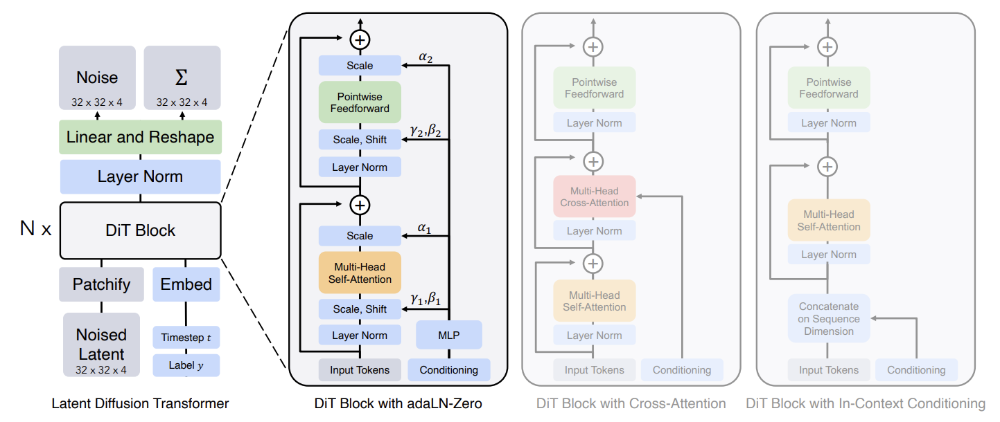
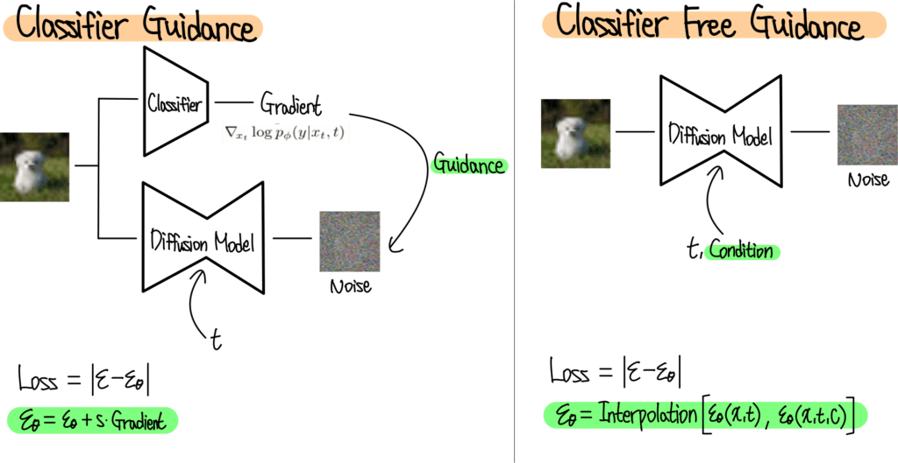

### 논문 리뷰  

## Scalable Diffusion Models with Transformers

William Peebles, Saining Xie  

---

DDPM을 이해했다면, 사실상 다음 그림만 이해하면 된다. DDPM에서는 Image to Image 매핑에 U-Net을 사용했다면, DiT는 U-Net을 Transformer 구조로 바꾼 것이라고 보면 된다.  

위 구조를 이해하기 위해서 다음의 몇 가지 개념들을 알고 넘어가야 한다.  

**Classifier-free Guidance**  

Conditional diffusion models는 class label c 같은 정보들을 추가로 입력받는다. 이 경우 reverse process는 $p_{\theta}(x_{t-1} \vert x_t ,c)$가 되고 $\epsilon_\theta$와 $\Sigma_\theta$는 c에 conditioned 된다. 이러한 설정에서 CFG는 샘플링 과정이 $log p(x \vert c)$를 높이는 방향으로 일어나도록 한다.  

Bayes Rule에 따르면 $log p(c \vert x) \propto \log p(x \vert c) - \log p(x)$이므로 다음과 같다.  

$$
\nabla_x \log p(c|x) \propto \nabla_x \log p(x|c) - \nabla_x \log p(x)
$$

$$
\hat \epsilon_\theta (x_t, c) = \epsilon_\theta(x_t, \varnothing) + s \cdot \nabla_x \log p(x|c) \propto \epsilon_\theta(x_t, \varnothing) + s \cdot (\epsilon_\theta(x_t, c) - \epsilon_\theta(x_t, \varnothing))  
$$

$s>1$ 이고 guidance의 정도를 나타낸다. ($s=1$이면 standard sampling 이다.)  

이 그림은 CG와 CFG를 비교한 것이다. CG의 경우 노이즈 이미지를 학습한 후 Classifier로부터 Gradient를 받아서 Class Guidance를 해준다. 반면 CFG는 Positional Encoding과 비슷한 방법으로 t와 c를 모델에 입력해준다. 디퓨전 모델은 Condition을 받았을 때와 받지 않았을 때 두 가지의 노이즈를 예측하고 최종적으로는 이 두 값의 Interpolation을 통해서 노이즈를 계산한다.

