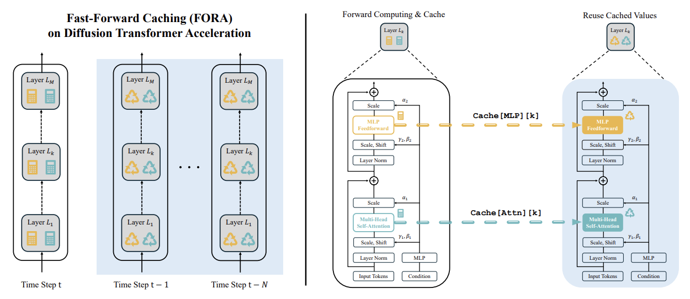
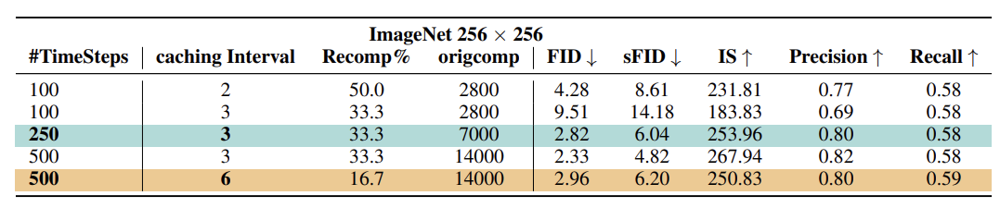

### 논문 리뷰  

## FORA: Fast-Forward Caching in Diffusion Transformer Acceleration

---

### **1. Introduction**  

- FORA는 디퓨전 모델의 어텐션이나 MLP 레이어의 중간값들을 캐싱하여 반복적인 연산을 줄인다. 
- 연산 오버헤드를 상당히 많이 줄일 수 있고 DiT 모델에 쉽게 통합할 수 있다.
- 실험적으로 FORA의 성능을 입증하였다. Real-time use에 적합하다.  

---


### **2. Related Work**  
  
**Diffusion Models**  

큰 스케일의 트랜스포머 기반 디퓨전 모델은 연산량이 엄청나기 때문에 추론 속도나 과도한 리소스 사용이 real-time 어플리케이션의 보틀넥이었다. 이 논문에서는 training-free 방식으로 기존 성능을 유지하면서 추론의 효율을 높이는데 주력한다.  

**Efficiency Enhancements of Diffusion Model**  


위 그림은 타임 스텝에 따른 어텐션과 MLP 레이어의 유사도를 나타낸 히트맵이다. **연속된 타임 스텝의 Feature 간의 유사도가 높고**, 나중 단계에서 특히 유사도가 큰 것을 확인할 수 있다. 이 점에 착안하여 캐싱을 활용하여 연산을 최적화하는 FORA를 제안한다. 

---

### **Fast-Forward Caching for Accelerated Sampling**  

Feature caching은 이미 연산된 정보들을 저장하고 재사용해서 속도와 효율을 높이는 강력한 기법이다. 이러한 접근이 연산의 오버헤드를 줄이고 Latency를 최소화할 수 있다.  

**Motivation**  
- 연속된 타임 스텝에서 나온 아웃풋 간의 유사도가 높다.  
- 디퓨전 모델의 구조는 샘플링 과정 동안 계속 유지된다.  
- 연산 오버헤드를 공유하는 단계는 성능에 주된 영향을 미치는 셀프 어텐션과 MLP이다.  

**FORA**  



FORA는 static caching 매커니즘을 이용한다. Hyperparameter인 N은 Cache Interval를 뜻하며 모델이 몇 타임 스텝마다 한 번씩 연산을 할지 결정한다. 해당 타임 스텝이 아니면 이전 단계에서 나온 값들을 재사용하게 된다. T가 총 타임 스텝이라고 하면, N은 1부터 T-1의 값을 가질 수 있다.  

- Initialization: 샘플링 과정이 시작될 때 (t=T) 모든 레이어에서 연산을 수행하고 그 결과를 캐싱한다. 
- Caching Condition: $t \% N = 0$ 일 때 조건이 성립한다.
- Recomputation and Caching: 조건이 충족되면 모든 레이어의 포워드 패스를 연산하고 Attn과 MLP의 결과가 Cache Dictionary에 저장된다. 예를 들어, k번째 레이어의 경우, ```cache[Attn][k]```와 ```cache[MLP][k]```에 저장된다.  
- Feature Reuse: $N-1$ 타임 스텝 동안 (다음 캐싱 이벤트가 생기기 전까지) 모델은 Cached Features를 이용한다. 
- Cycle Repetition: $t=0$이 될 때까지 위의 과정을 반복한다.  


**Discussion**  

N에 따라서 속도와 퀄리티 간의 Trade-off가 생기게 된다. 실험 결과 N이 7을 넘어가면 성능 저하가 상당해졌다.  

---

### **Experiments**  



타임 스텝과 Cache Interval에 따른 성능을 나타낸 것이다. Cache Interval을 높여도 성능 저하가 크지는 않다.  

---

질문: 온칩 메모리에 담기 힘들어서 HBM에 넣는 걸로 아는데 latency 괜찮은지.

---

2024/09/09

