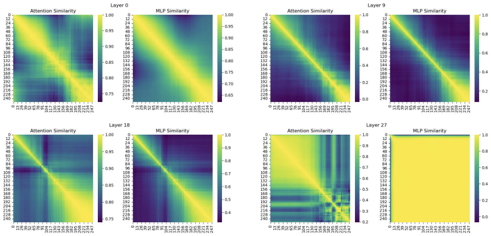

### 논문 리뷰  

## FORA: Fast-Forward Caching in Diffusion Transformer Acceleration

---

### **1. Introduction**  

- FORA는 디퓨전 모델의 어텐션이나 MLP 레이어의 중간값들을 캐싱하여 반복적인 연산을 줄인다. 
- 연산 오버헤드를 상당히 많이 줄일 수 있고 DiT 모델에 쉽게 통합할 수 있다.
- 실험적으로 FORA의 성능을 입증하였다. Real-time use에 적합하다.  

---

### **2. Related Work**  

**Diffusion Models**  

큰 스케일의 트랜스포머 기반 디퓨전 모델은 연산량이 엄청나기 때문에 추론 속도나 과도한 리소스 사용이 real-time 어플리케이션의 보틀넥이었다. 이 논문에서는 training-free 방식으로 기존 성능을 유지하면서 추론의 효율을 높이는데 주력한다.  

**Efficiency Enhancements of Diffusion Model**  

위 그림은 타임 스텝에 따른 어텐션과 MLP 레이어의 유사도를 나타낸 히트맵이다. 연속된 타임 스텝의 Feature 간의 유사도가 높고, 나중 단계에서 특히 유사도가 큰 것을 확인할 수 있다. 

---

### **Fast-Forward Caching for Accelerated Sampling**  

