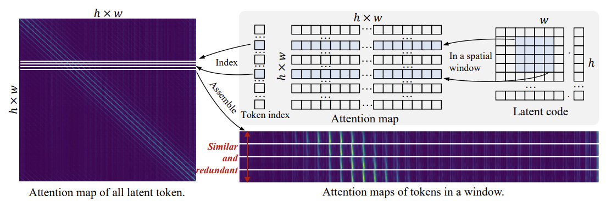
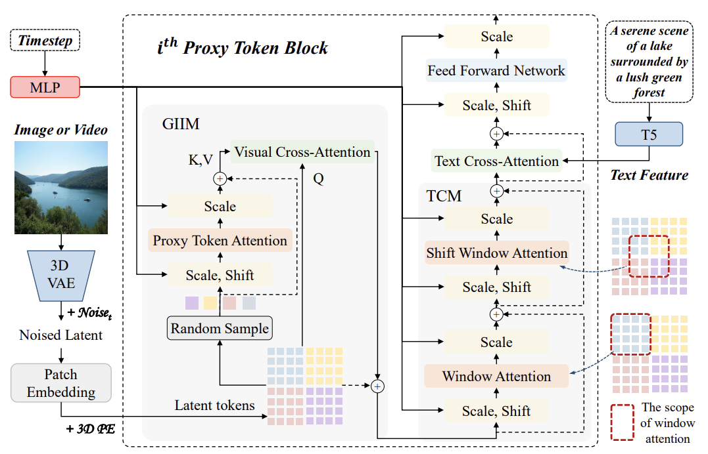
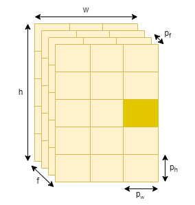
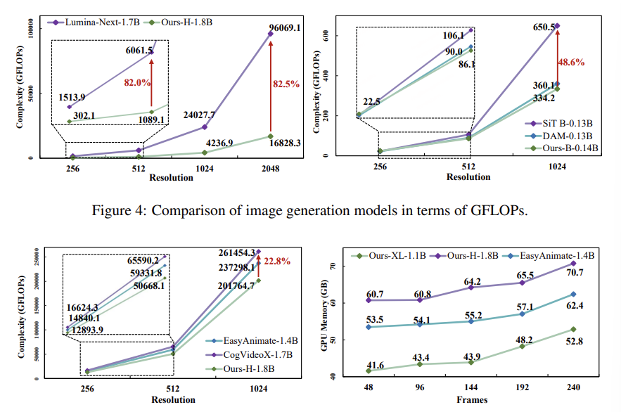

### 논문 리뷰  

## QIHOO-T2X: AN EFFICIENCY-FOCUSED DIFFUSION TRANSFORMER VIA PROXY TOKENS FOR TEXT-TO-ANY-TASK  

---

### **1. Introduction**  

---

### **2. Related Work**  

---

### **3. Method**  

**3.1 Redundancy Analysis**  

위 그림은 Pixart-$\alpha$ 512 resolution의 어텐션 맵이다. 그 중 같은 $4 \times 4$ 윈도우에 속하는 토큰들은 어텐션 맵이 거의 동일한 것을 볼 수 있다. 또한, 공간적으로 가까운 토큰들끼리는 유사도가 다양하지만, 멀어질수록 유사도가 일정해지는 것을 볼 수 있다. 

이러한 Visual Information의 Sparsity와 Redundancy 때문에 Global Attention 매커니즘을 최적화할 필요가 있다. 이 논문에서는 Sparse Attention 전략을 적용해서 각 윈도우마다 추출한 몇 개의 Proxy Tokens끼리 Self-attention을 적용하여 연산의 복잡도를 줄인다.  

**3.2 Architecture of PT-DiT**  

Latent code $z \in \mathbb{R}^{C \times F \times H \times W}$가 들어오면 path embedding을 거쳐서 latent code sequence $z_s \in \mathbb{R}^{N \times D}$가 된다. 이후 Positional Encoding을 거쳐서 Proxy Token 블록으로 들어가면 Global Information Interaction Module (GIIM)과 Texture Complement Module (TCM) 등을 거치게 된다. GIIM은 sparse하게 글로벌한 Interaction을 조사하고, TCM은 Window Attention이나 Shift-Window Attention을 통해 로컬 디테일을 조사한다.  

  
**GIIM Module**  

Latent code sequence $z_s \in \mathbb{R}^{N \times D}를 $z_s \in \mathbb{R}^{f \times h \times w \times D}$로 reshape 한다. f는 프레임, h는 height, w는 width가 된다. 이미지의 경우 $f=1$ 이다.  

프록시 토큰은 각 윈도우에서 랜덤하게 샘플된다.  

$$
P_a \in \mathbb{R}^{D \times \frac{f}{p_t} \times \frac{h}{p_h} \times \frac{w}{p_w}}
$$ 

따라서 각 토큰은  $p_t \times p_h \times p_w$개의 토큰을 대표하게 된다. 이 프록시 토큰들로 Self-attention을 진행한다. 이후, cross-attention을 통해 글로벌한 비주얼 정보들을 모든 latent token들로 전달하게 된다. 모든 토큰 $z_s$가 Query가 되고, 프록시 토큰 $P_a$가 Key와 Value가 된다. 이를 식으로 나타내면 다음과 같다.  

$$
z_s = CS(z_s, SA(RandomSample(z_s)))  
$$

이런 느낌인 것 같다. 결국 $(p_f, p_w, p_h)$ 중 하나의 토큰만 살아남는 것이다. 각 토큰은 $1 \times D$ 벡터이다.  

**TCM Module**  

Sparse Proxy Token으로 인해 디테일을 표현하는 능력이 떨어지기 때문에 Localized Window Attention을 진행한다. 구체적으로 윈도우 내에서 Self-Attention을 진행하고, Grid의 영향을 줄이기 위해 Shift-Window Attention을 진행한다.  

$$
\hat z_s = WSA(z_s) + z_s  
$$

$$
z_w = SWSA(z_s) + \hat z_s
$$

**Compression Ratios**  

다른 해상도에 대해 윈도우 개수를 일정하게 유지해야 저해상도에서 고해상도로 훈련시킬 때 일관성을 보장할 수 있다. 동시에 윈도우의 개수를 적절하게 설정해줘야 한다.  

그래서 이미지에 대해서는 해상도 256, 512, 1024, 2048에 대해 각각 Compression Ratio인 $(p_f, p_w, p_h)$를 (1, 2, 2), (1, 4, 4), (1, 8, 8), (1, 16, 16)으로 세팅한다. 비디오의 경우 $p_f = 4$ 이다.  

**3.3 Complexity Analysis**  

- **Self-attention의 Complexity:** $QK$가 $N^2 D$, Softmax(QK)V가 $N^2 D$를 차지한다. 

$$
complexity = N^2 D + N^2 D + o(N^2)  
$$

- **GIIM과 TCM의 Complexity:** $P_a \in \mathbb{R}^{D \times \frac{f}{p_t} \times \frac{h}{p_h} \times \frac{w}{p_w}}$ 에서 $f \times h \times w = N$ 인 점을 이용하면 아래 식을 금방 이해할 수 있다. 첫번째 항은 GIIM의 SA에 해당하고, 두번째 항은 GIIM의 CS에 해당한다. 마지막 항은 TCM의 WSA와 SWSA에 해당한다.    

$$
complexity = 2 \frac{N^2}{(p_f p_h p_w)^2} D + 2 \frac{N^2}{p_f p_h p_w} D + 4 \frac{N}{p_f p_h p_w}(p_f p_h p_w)^2 D  
$$

$$
= 2(\frac{1}{(p_f p_h p_w)^2} + \frac{1}{p_f p_h p_w} + \frac{2 p_f p_h p_w}{N}) N^2 D
$$

Compression ratio $(p_f, p_h, p_w)$가 커질수록 Complexity에 이득이 많아지는 것을 확인할 수 있다. $(p_f, p_h, p_w) = (1, 2, 2), (1, 4, 4), (1, 8, 8), (1, 16, 16)$ 이면 총 Self-attention의 34.3%,
9.7%, 4.7%, 2.3% 만 차지하게 된다.  

---

### **4. Algorithmic Efficiency Comparison**  

---
이 논문 좀 오타가 많은듯;  
3.2.1 p_f -> p_t  
3.2.3 $(p_f, p_w, p_h)$ 

---

