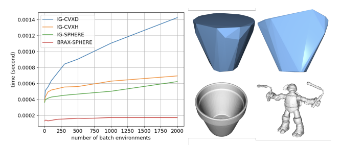
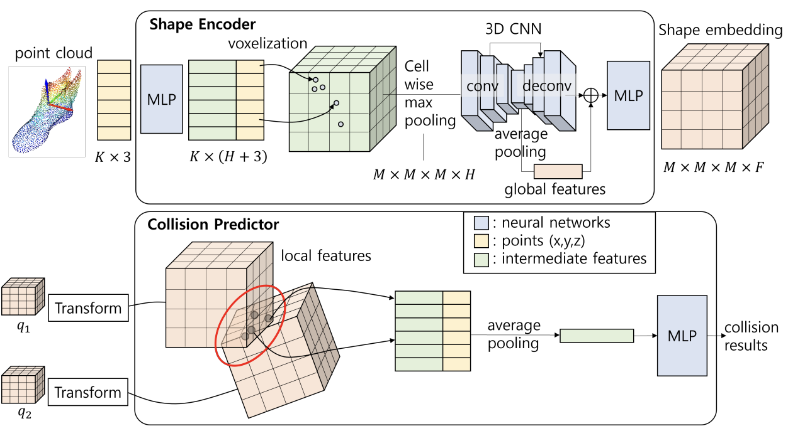
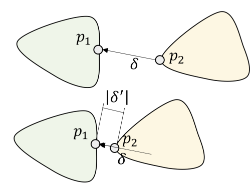
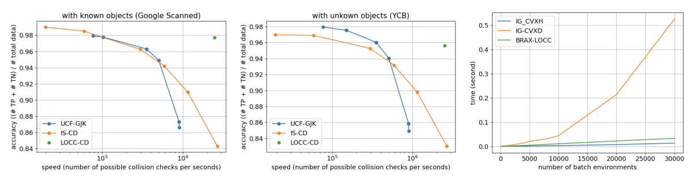

### 논문 리뷰

## Local object crop collision network for efficient simulation of non-convex objects in GPU-based simulators  

by Dongwon Son (KAIST), Beomjun Kim (KAIST)  

---

### **I. Introduction**  

GPU 기반 시뮬레이터는 수천 개의 환경을 병렬로 시뮬레이션할 수 있기 때문에 CPU 기반보다 빅데이터 생성 속도가 매우 빠르다. 하지만 현재의 GPU 기반 시뮬레이터인 IssacGym과 Brax는 Non-Convex 객체를 처리할 때 속도나 정확성, 일반성 면에서 한계가 있다. 또한, GJK 같은 기존의 CD 알고리즘은 Non-Convex 객체의 충돌을 처리할 때 Computation이 크게 증가한다. Convex Hull 같은 근사는 속도는 유지하지만, 정확도가 크게 떨어진다.  

본 논문은 LOCC 라는 새로운 CD 알고리즘을 제안한다. 데이터 기반 접근법을 사용하여, 정확도가 온라인이 아닌 오프라인에서의 데이터 품질에 따라 결정된다. 특히, 객체의 Global Shape이 아닌 충돌 지점의 Local Crop 부분만 학습해서 효율적이다. LOCC는 기존 알고리즘보다 Non-Convex 시뮬레이션에서 정확도를 유지하면서 5-10배 더 빠른 속도를 자랑한다.  

### **II. Related Works**  

**Collision detection using a Neural Network**  

최근에 NN을 활용해서 Shape을 나타내는 연구가 제안되었다. 주로 Query Point가 두 물체에 모두 속하면 Collision이라고 Detect 하는 방식인데, 이러한 접근은 Query Point 개수에 따라 정확도가 높아지는 것이므로, 아주 많은 Query Point 개수를 요구한다. 그리고 물체의 모양을 Explicit 하게 복원하는 것은 CD에서 불필요하다.  

데이터의 효율성과 속도를 높이기 위해 물체의 Point Cloud와 Pose, 그리고 Scene의 Point Cloud가 주어졌을 때, 물체와 Scene이 충돌하는지를 판단하는 방법을 제안하기도 하였다. 지금까지 방법들은 전체 Scene과 물체의 Representation을 학습해야 해서 비효율적이었다.  

기존 방식과 달리, LOCC는 충돌 부분만 Local Crop 해서 학습함으로써 데이터 효율성을 크게 개선한다. 이는 특히 Motion Planning 보다 Contact Resolution이 필요한 Physics Simulation에 적합하다.  

**Collision resolution using an OCN(Object Collision Net)**  

Contact Resolution의 목표는 충돌이 일어났을 때 Penetration이 아니라 Contact를 해결해서 물리 법칙이 적용되는 방향으로 움직이게 하는 것이다. 

이를 위해서는 Contact Points와 Contact Forces가 필요하다. Contact Points를 찾기 위해서는 OCN을 이용해서 어떤 Object Pose가 충돌을 일으키는지 탐지한다. 그 다음, 물체의 질량 중심에 작용하는 힘이랑 토크를 OCN의 그래디언트를 이용해서 계산한다. OCN의 그래디언트의 방향이 충돌을 해소하는 방향이라는 Intuition이 활용되었다. 이후 Point Isolation 기법으로 Contact Points를 탐지한 후, 경로 최적화를 통해 Contact Constraints를 만족하도록 충돌을 해결한다. 그러나 이런 연구들은 나사 조이기 같은 특정 작업에서만 효과적이었다.  

**Analytical collision detection methods and their usage in GPUs**  

**GJK (Gilbert-Johnson-Keerthi)**: 대표적인 Collision Detection Algorithm으로, Convex Object에 대해 빠르게 작동한다. Non-Convex 일 경우 Convex Decomposition이 필요하기 때문에 Computation Cost가 크게 증가한다. GPU에서 If문 때문에 효율적이지 않다.  

**SAT(Seperate Axis Theorem)**: Convex Object를 다양한 축에 투영시켜서 겹치는지 확인한다. GPU에서 효율적으로 구현할 수 있지만, 복잡한 Non-Convex를 처리하는 데 한계가 있다.  

**LOCC**는 기존의 GJK나 SAT 처럼 Convex Decomposition 없이 NN 기반으로 단순한 Feed Forward 계산을 통해 충돌을 예측한다. Non-Convex Object를 처리할 때 속도와 정확성, 일반성 면에서 뛰어나다.  

### **III. Local Object Crop Collision Network**  

이 논문에서는 두 물체의 Mesh와 Pose를 이용해 직접적으로 충돌 여부를 결정한다. Computational Flow는 다음과 같다.  

LOCC에는 두 가지 모듈이 있다. Shape Encoder와 Collision Predictor이다. 

**Shape Encoder**  
물체의 Mesh가 주어지면 K개의 점을 Sampling 해서 Point Cloud를 생성한다. Shape Encoder에서는 이 점들을 MLP에 통과시켜서 $K \times H$ 크기의 Features를 얻는다. H가 MLP의 Output Dimension 인 것이다. 각 물체의 Mesh에 대해 AABB(Axis-Aligned Bounding Box)를 계산하고, 이를 $M \times M \times M$ 크기의 Voxel Grid를 정의하고 매핑한다. 그러면 $M \times M \times M \times H$의 Feature가 나오게 된다. 이후 Cell-wise Max-Pooling과 3D CNN을 통과시켜서 $M \times M \times M \times F$ 크기의 Feature를 얻는다. F가 각 셀의 Feature Dimension이 된다. Skip Connection은 Global Feature를 Local Cell에 Broadcast 하는 역할이다. 이를 통해 Global과 Local Feature를 모두 인코딩할 수 있다.  

**Collision Predictor**  

물체의 Pose를 이용해서 Shape Embedding의 OBB(Oriented Bounding Box)를 얻는다. 이후 Colliding Cells의 Feature를 Select한다. 이때, Select 하는 방법은 물체의 OBB의 Cell 중앙이 다른 물체에 속하는지를 보면 된다. 이 방법의 단점은 Cell의 일부가 속할 때 중앙이 속하지 않으면 False Negative가 생길 수 있다는 것이다. 이에 Margin을 더해서 False Negative를 없앤다. False Positive가 생길 수는 있지만, 실험 해봤을 때 Performance에 영향이 없었다고 한다. Selected Cells는 Average Pooling 후에 Collision Predictor MLP를 통과하여 충돌 여부를 예측한다. 

A. Dataset preparation and training  

YCB나 Google ScanNet 같은 데이터 셋을 이용한다. 형식은 ${(x_1^{(i)}, x_2^{(i)}, q_1^{(i)}, q_2^{(i)}, y^{(i)})}$ 이다. $x_1$과 $x_2$는 Mesh를 의미하고, $q_1$과 $q_2$는 Pose, y는 Collision Label이다. 

이런 데이터를 생성하는 나이브한 방법은 두 물체를 Object Set에서 무작위로 Sampling 하고, Pre-defined Bound 내에서 Uniform 하게 Pose를 설정한 뒤 Collision 여부를 평가하는 것이다. 그러나 이 방법으로는 객체가 서로 너무 멀거나 완전히 겹치는 경우가 많이 생성되고, 비교적 복잡한 (살짝 겹치는) 사례에 대해 학습이 제대로 이뤄지지 않을 수 있다.  

이에 다양한 겹침 정도(Overlapping Volume)을 생성하기 위해 아래 그림처럼 두 물체의 최단 거리 벡터 $\delta$를 계산하고, 이 벡터의 방향으로 물체를 이동시켜 가면서 겹침 정도를 조정한다. $\vert \delta' \vert$는 $N(0, 0.020)$에서 Sampling 한다. 

**Loss Function**  

$$
\sum_{(d, y) \in \mathcal{D}} \text{BCE}\left(f^{CP}\left(f^{SE}(d)\right), y\right) + \alpha \left\|f^{SE}(d)\right\|^2  
$$

$f^{SE}$는 Shape Encoder, $f^{CP}$는 Collision Predictor이다. Binary Cross Entropy와 정규화 항이 사용된다.  

**Data Augmentation**  

데이터 포인트 $\{x_1^{(i)}, x_2^{(i)}, q_1^{(i)}, q_2^{(i)}, y^{(i)}\}
$에서 회전 행렬 R을 랜덤하게 Sampling 해서 두 물체에 적용한다 (같은 R). 이때 Mesh에는 $R$, Pose에는 $R^{-1}$ 를 적용한다. 이렇게 해야 Mesh가 회전했을 때 Pose로 그것을 상쇄하여 원래의 상대적 위치를 유지하기 때문이다. 새로운 데이터 포인트는 $\{R \cdot x_1^{(i)}, R \cdot x_2^{(i)}, R^{-1} \circ q_1^{(i)}, R^{-1} \circ q_2^{(i)}, y^{(i)}\}$가 된다. 이때 회전 후에도 데이터 레이블 y는 변하지 않는다. 회전 후에도 $\{x, q\}$와 $\{R \cdot x, R^{-1} \circ q\}$가 동일한 3D 공간 부피를 차지하기 때문이다. 

### **IV. Experiments**  

---
용어 정리:  

1. AABB는 Axis-Aligned Bounding Box의 약자로, 3D 공간에서 객체를 감싸는 최소 크기의 축 정렬된 직육면체를 의미한다.  
2. OBB는 Oriented Bounding Box의 약자로, 3D 공간에서 객체를 감싸는 회전 가능한 직육면체를 의미한다. AABB와 유사하지만, 객체의 방향에 맞게 자유롭게 회전할 수 있다.  

---
2024/12/29