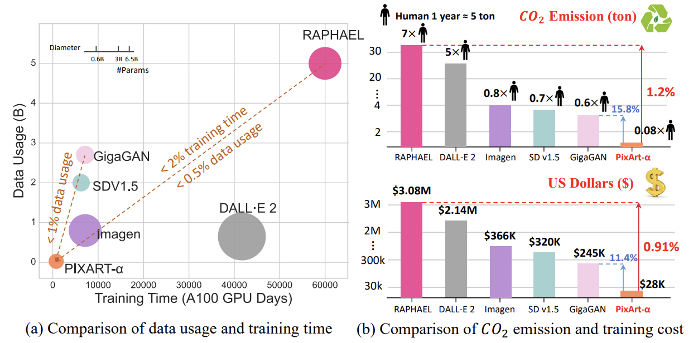
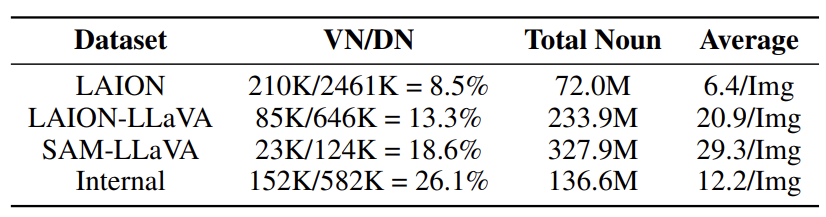
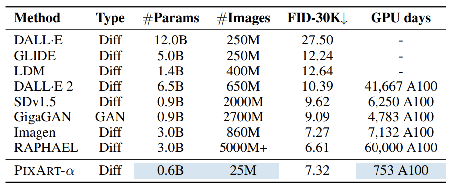
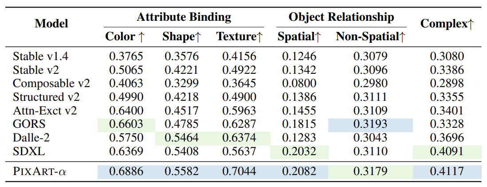
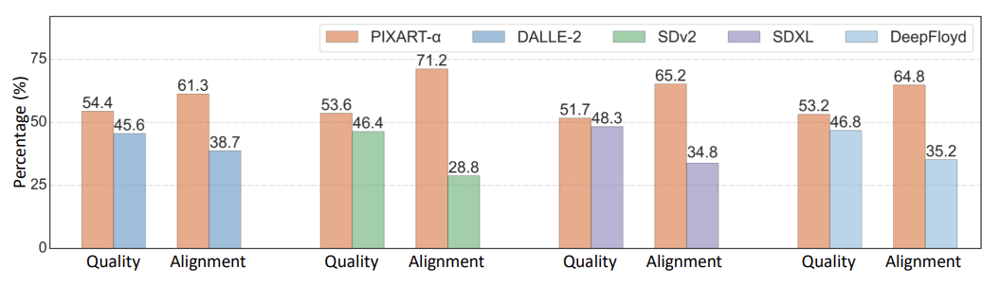
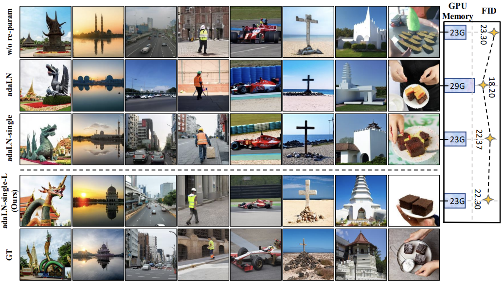

### 논문 리뷰  

## PIXART-α: FAST TRAINING OF DIFFUSION TRANSFORMER FOR PHOTOREALISTIC TEXT-TO-IMAGE SYNTHESIS

---

### **1. Introduction**    

Stable Diffusion v1.5를 훈련하는 데에는 6,000 A100 GPU일이 필요하고 약 32만 달러의 비용이 든다. 최근에 나온 더 큰 모델인 RAPHAEL은 훈련에 6만 A100 GPU일과 약 308만 달러가 필요하다. 또한 훈련 과정에서 많은 양의 이산화탄소가 배출되기 때문에 환경에도 부정적인 영향을 미친다. 따라서 이 논문에서는 이러한 자원 소모를 줄이면서도 높은 품질의 이미지 생성기를 개발할 수 있는 방법을 제시한다.  



위 그림을 보면 RAPHAEL과 비교했을 때 PIXART-α가 얼마나 효율적인지 직관적으로 알 수 있다. RAPHAEL의 2% 미만의 훈련 시간과 0.5% 미만의 데이터 사용량을 갖고 있으며, 이산화탄소 배출량은 1.2%, 훈련 비용은 0.91% 밖에 되지 않는다.  

---

### **2. Method**  

**2.1 Motivation**  

T2I 훈련이 느린 이유는 훈련 파이프라인과 데이터 때문이다. 훈련에는 다음의 세 단계가 필요한데, 이들을 한번에 처리하려고 하기 때문이다.  

1. Capturing Pixel Dependency: 픽셀 레벨에서 의존성과 분포 파악하기
2. Alignment between Text and Image: 텍스트와 이미지를 정교하게 매칭하기
3. Aesthetic Quality: 미적 퀄리티 높이기

따라서 PIXART-α는 위 과정을 3가지 단계로 나누어서 처리한다.  
  

**2.2 Training Strategy Decomposition**  
  

**Stage 1: Pixel dependency learning**  

클래스-조건 이미지 생성 모델이 상대적으로 가볍기 때문에 이미지의 픽셀 분포를 학습할 때 이를 사용한다. 주로 ImageNet에서 사전 학습된 모델을 사용하여 훈련을 시작한다.  

**Stage 2: Text-image alignment learning**  

클래스-조건 기반에서 텍스트-이미지 생성으로 전환할 때의 가장 어려운 점은 텍스트와 이미지 사이의 정확한 정렬을 이루는 것이다. 이를 위해 정보 밀도가 높은 텍스트-이미지 데이터 쌍을 사용한다. 이 데이터에는 많은 개념들이 텍스트와 이미지에 모두 포함되어 있기 때문에 기존 데이터보다 더 적은 학습 데이터로도 효율적인 정렬 학습이 가능하다.  

**Stage3: High-resolution and aesthetic image generation**  

높은 퀄리티의 데이터로 파인 튜닝하는 단계이다. 이전 단계에서 학습된 기초 지식을 바탕으로 빠르게 수렴하는 모습을 보였다.  


**2.3 Efficient T2I Transformer**  

PIXART-α 모델은 Diffusion Transformer(DiT)를 기본으로 사용하며, 이를 텍스트-이미지 생성 작업에 맞게 몇 가지 설계가 추가되었다. 


**Cross-Attention Layer**  

Self-Attention과 FFN 사이에 Multi-Head Cross-Attention 모듈을 추가하여서 언어 모델로부터 추출한 텍스트 임베딩을 효과적으로 반영할 수 있다. 사전 학습된 가중치를 활용할 수 있도록 초기 출력 레이어를 0으로 초기화한다. 

```
크로스 어텐션에서 출력 레이어(가중치)를 0으로 초기화하는 이유:  

모델이 처음부터 텍스트 조건을 강하게 반영하지 않고, 점진적으로 학습하면서 텍스트 조건을 반영하도록 하기 위함이다.  
이 방식은 모델이 기존에 학습한 정보(클래스-조건 모델의 가중치)와 새로운 정보를 균형 있게 결합할 수 있게 해준다.  
이 초기화는 훈련의 시작 단계에서 이루어진다.  
추론 시점에서는 크로스 어텐션이 이미 훈련된 가중치를 활용해 텍스트 조건을 완전히 반영한다. 
```

**AdaLN-single**  

DiT에서 파라미터의 상당 부분인 27%를 차지하는 AdaLN 모듈을 최적화하여, 시간 임베딩만을 남기고 클래스 임베딩을 사용하지 않는다. 이를 통해 각 블록별로 독립적으로 조정할 수 있는 파라미터를 줄여 메모리 사용량을 절감하고, 더 적은 파라미터로 효율적인 훈련한다.  

```
클래스 임배딩이 필요하지 않은 이유:  
첫번째 단계에서 클래스-조건 모델에 사전 학습된 모델을 사용하기 때문에 이미 클래스 조건 기반의 지식을 사용하여 자연스러운 이미지를 생성할 수 있다.  
```

**Re-parameterization**  

기존 모델(클래스-조건 모델)의 가중치를 새로운 모델 구조(텍스트-이미지 생성)에 맞게 조정하여 사용할 수 있도록 설계하여 ImageNet에서 학습된 자연 이미지 분포의 지식을 텍스트-이미지 생성 모델에 초기화 값으로 사용한다. 기존 클래스 조건을 사용하지 않고, 대신 시간 조건과 텍스트 조건을 사용하여 새로운 모델에서 기존 가중치를 효과적으로 활용한다. 이로 인해 기존에 학습된 정보를 유지하면서 새로운 작업을 효율적으로 수행할 수 있다.

**2.4 Dataset Construction**  

기존 텍스트-이미지 데이터셋(LAION)은 텍스트와 이미지 간의 정보 밀도가 낮고, 다양한 개체들이 제대로 설명되지 않는 문제점이 있었다. 이런 문제로 인해 모델이 텍스트와 이미지 간의 일관된 정렬을 학습하는 데 어려움이 있었다. 이를 해결하기 위해, 최신 비전-언어 모델인 LLaVA를 사용하여 자동 라벨링된 고정보 데이터셋을 만든다. 이 데이터셋은 텍스트와 이미지 간의 개념 밀도가 높아 더 많은 개념을 학습할 수 있게 해주며, 효율적인 텍스트-이미지 정렬 학습을 가능하게 한다.

특히 LAION과 같은 기존 데이터셋의 텍스트 설명이 부정확하고 부분적이며, 다양한 개체들에 대한 정보가 부족한 반면, LLaVA를 활용한 자동 라벨링 기법은 텍스트 설명의 정보 밀도를 높여 모델이 더 적은 반복 학습으로 더 많은 개념을 효과적으로 학습할 수 있게 도와준다.  



위 표를 보면 LLaVa로 라벨링된 데이터셋은 Valid Noun의 비율과 밀도가 높아지는 것을 볼 수 있다. Internal Dataset은 비공개 데이터셋을 의미한다. Valid Noun은 10번 이상 등장한 Distinct Noun을 의미한다.  

---

### **3. Experiment**  

**Training Details**  
T5 large 언어 모델(Flan-T5-XXL)을 텍스트 인코더로 사용하며, DiT-XL/2 (Diffusion Transformer)를 기본 네트워크로 활용했다. VAE로 사용하여 이미지를 잠재 공간에서 인코딩했다.  

훈련 시간: 모델은 64개의 V100 GPU로 약 26일간 훈련되었으며, AdamW 옵티마이저와 일정한 learning rate (2e-5)을 사용했다.  


**Evaluation Metrics**  

FID (Frechet Inception Distance): 생성된 이미지와 실제 이미지의 분포 차이를 평가하는 지표로, 이미지의 품질을 측정한다.  
T2I-CompBench: 텍스트-이미지 생성 모델의 구성 능력을 평가하는 벤치마크로, 속성 연결, 객체 관계, 복잡한 구성을 평가한다.  
User Study: 실제 사용자들이 생성된 이미지의 품질을 평가한 결과이다.

**Fidelity Assessment**  

PIXART-α는 MSCOCO 데이터셋에서 FID 점수가 7.32로 측정되었다. 훈련 시간과 데이터 사용량이 매우 적음에도 불구하고, 기존 모델들과 비교해 높은 성능을 기록한 것이다. RAPHAEL과 같은 모델은 더 많은 자원을 사용했지만, PIXART-α는 전체 자원의 2% 미만을 사용하면서도 거의 비슷한 수준의 FID 성능을 달성했다.  




**Alignment Assessment**  
T2I-CompBench 벤치마크에서 PIXART-α는 속성 바인딩, 객체 관계, 복잡한 구성과 같은 다양한 평가 지표에서 우수한 성능을 보였다. 특히 텍스트-이미지 정렬 학습을 통해 텍스트와 이미지 간의 일관성을 잘 유지하였다.  



**User Study**  
사용자 선호도 조사에서는 PIXART-α가 Stable Diffusion, DALL·E 2, DeepFloyd와 같은 최신 모델들을 능가하는 이미지 품질과 텍스트-이미지 일치율을 보여주었다. 7.2% 높은 이미지 품질 개선과 42.4% 더 높은 텍스트-이미지 정렬 정확도를 기록했다.  




**Ablation Study**  
Ablation Study를 통해 각 구성 요소가 모델 성능에 미치는 영향을 분석했다. 특히 adaLN-single 기법을 통해 GPU 메모리 사용량을 약 21% 절감하면서도 FID 성능에 미치는 영향은 미미하다는 점이 확인되었다.  

re-parameterization을 사용하지 않은 모델은 FID 성능이 떨어지고 이미지 왜곡이 발생했지만, re-parameterization 기법을 적용한 모델은 성능이 크게 개선되었다.



---

2024/9/22
