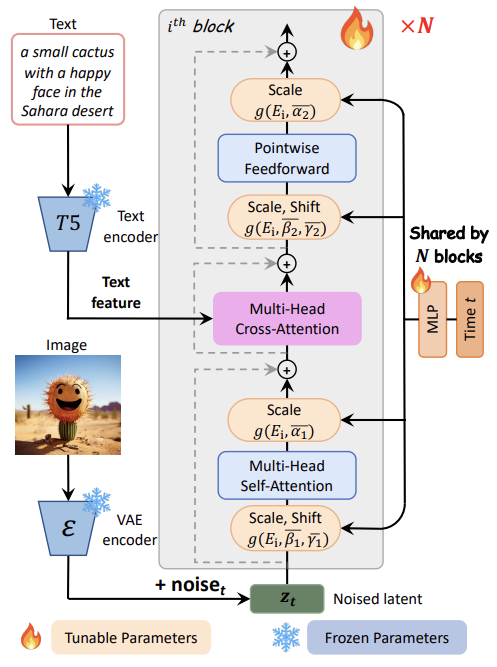

### 논문 리뷰  

## PIXART-α: FAST TRAINING OF DIFFUSION TRANSFORMER FOR PHOTOREALISTIC TEXT-TO-IMAGE SYNTHESIS

---

### **1. Introduction**    

Stable Diffusion v1.5를 훈련하는 데에는 6,000 A100 GPU일이 필요하고 약 32만 달러의 비용이 든다. 최근에 나온 더 큰 모델인 RAPHAEL은 훈련에 6만 A100 GPU일과 약 308만 달러가 필요하다. 또한 훈련 과정에서 많은 양의 이산화탄소가 배출되기 때문에 환경에도 부정적인 영향을 미친다. 따라서 이 논문에서는 이러한 자원 소모를 줄이면서도 높은 품질의 이미지 생성기를 개발할 수 있는 방법을 제시한다.  


위 그림을 보면 RAPHAEL과 비교했을 때 PIXART-α가 얼마나 효율적인지 직관적으로 알 수 있다. RAPHAEL의 2% 미만의 훈련 시간과 0.5% 미만의 데이터 사용량을 갖고 있으며, 이산화탄소 배출량은 1.2%, 훈련 비용은 0.91% 밖에 되지 않는다.  

---

### **2. Method**  

**2.1 Motivation**  

T2I 훈련이 느린 이유는 훈련 파이프라인과 데이터 때문이다. 훈련에는 다음의 세 단계가 필요한데, 이들을 한번에 처리하려고 하기 때문이다.  

1. Capturing Pixel Dependency: 픽셀 레벨에서 의존성과 분포 파악하기
2. Alignment between Text and Image: 텍스트와 이미지를 정교하게 매칭하기
3. Aesthetic Quality: 미적 퀄리티 높이기

따라서 PIXART-α는 위 과정을 3가지 단계로 나누어서 처리한다.  
  

**2.2 Training Strategy Decomposition**  
  

**Stage 1: Pixel dependency learning**  

클래스-조건 이미지 생성 모델이 상대적으로 가볍기 때문에 이미지의 픽셀 분포를 학습할 때 이를 사용한다. 또한, ImageNet에서 사전 학습된 모델을 사용해 훈련을 시작하기 때문에 훈련 효율도 높아진다.  

**Stage 2: Text-image alignment learning**  

클래스-조건 기반에서 텍스트-이미지 생성으로 전환할 때의 가장 어려운 점은 텍스트와 이미지 사이의 정확한 정렬을 이루는 것이다. 이를 위해 정보 밀도가 높은 텍스트-이미지 데이터 쌍을 사용한다. 이 데이터에는 많은 개념들이 텍스트와 이미지에 모두 포함되어 있기 때문에 기존 데이터보다 더 적은 학습 데이터로도 효율적인 정렬 학습이 가능하다.  

**Stage3: High-resolution and aesthetic image generation**  

높은 퀄리티의 데이터로 파인 튜닝하는 단계이다. 이전 단계에서 학습된 기초 지식을 바탕으로 빠르게 수렴하는 모습을 보였다.  


**2.3 Efficient T2I Transformer**  

PIXART-α 모델은 Diffusion Transformer(DiT)를 기본으로 사용하며, 이를 텍스트-이미지 생성 작업에 맞게 몇 가지 설계가 추가되었다. 



**Cross-Attention Layer**  

Self-Attention과 FFN 사이에 Multi-Head Cross-Attention 모듈을 추가하여서 언어 모델로부터 추출한 텍스트 임베딩을 효과적으로 반영할 수 있다. 사전 학습된 가중치를 활용할 수 있도록 초기 출력 레이어를 0으로 초기화한다. 

```
크로스 어텐션에서 출력 레이어(가중치)를 0으로 초기화하는 이유는 모델이 처음부터 텍스트 조건을 강하게 반영하지 않고, 점진적으로 학습하면서 텍스트 조건을 반영하도록 하기 위함이다. 이 방식은 모델이 기존에 학습한 정보(클래스-조건 모델의 가중치)와 새로운 정보를 균형 있게 결합할 수 있게 해준다. 이 초기화는 훈련의 시작 단계에서 이루어진다. 추론 시점에서는 크로스 어텐션이 이미 훈련된 가중치를 활용해 텍스트 조건을 완전히 반영한다. 
```

**AdaLN-single**  


**Re-parameterization**  

