논문 리뷰  

2024 ACM/IEEE 51st Annual International Symposium on Computer Architecture (ISCA)  

## Tender: Accelerating Large Language Models via Tensor Decomposition and Runtime Requantization  

Jungi Lee, Wonbeom Lee, Jaweoong Sim  

---

HyperAccel에서 인턴하면서 처음으로 리뷰해본 논문이다.  

PPT Slide: [Tender](https://github.com/seoyoonkims/seoyoonkims.github.io/blob/main/docs/pdf/Tender_PPT.pdf)  

### **I. Introduction**  

LLM이 최근에 굉장히 성공을 거두고 있지만 엄청난 양의 연산과 메모리 리소스들을 필요로 하면서 Quantization을 통해 해결하려는 노력이 많이 이뤄지고 있다. Weight과 Activation을 모두 낮은 비트의 정수로 Quantize 하면 행렬 연산을 가속하고 정수 연산 유닛의 높은 throughput을 유지할 수 있다. 또한, 메모리 capacity와 bandwidth 면에서도 이득을 볼 수 있다.
하지만, CNN이나 작은 트랜스포머 모델과는 달리 모델 사이즈가 6.7B이 넘어가면 Outlier들이 많아져서 Quantization의 범위를 늘리기 때문에 성능이 떨어지게 된다.

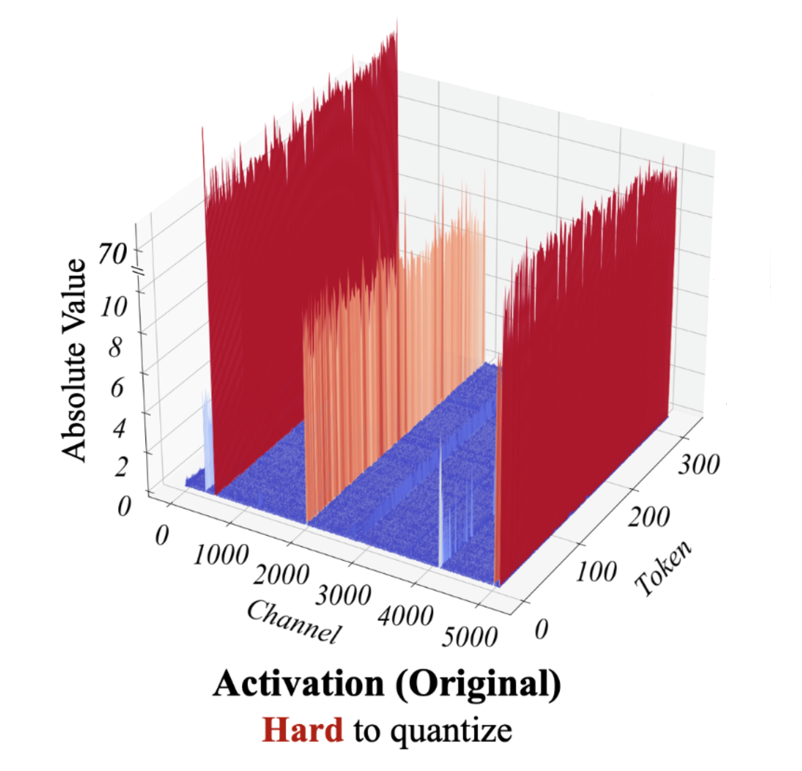

그래서 지금까지 이를 해결하기 위한 다양한 노력들이 있었다. 대부분의 소프트웨어 적인 방법들은 복잡한 알고리즘으로 인한 오버헤드 때문에 추론 시간을 눈에 띄게 줄이지 못하거나, 4 bit 같은 Low-bit precision에서 Quantization Loss가 상당해지는 문제점이 있다.
알고리즘-하드웨어 co-design 같은 경우에는 mixed-precision 및 복잡한 연산 유닛을 필요로 하거나, 커스텀 데이터 타입을 필요로 해서 일반적인 하드웨어에서는 지원이 안되는 문제점이 있다.  

Tender는 이중에서 알고리즘-하드웨어 co-design에 해당하는 해결책을 제시하고 있다. 이때, Mixed Precision이나 복잡한 연산 유닛, 그리고 Custom 데이터 타입 없이 LLM을 효과적으로 가속시킬 수 있는 방법에 대해 이야기하고 있다.  

**Tender의 주요 컨셉**  
Activation Tensor를 채널을 따라서 여러 개의 Subtensor들로 나눈다. Outlier들이 주로 채널을 따라 존재하기 때문에 Channel Dimension으로 나누면 Outlier들을 효과적으로 분리할 수 있게 된다. 그후, 각각의 Subtensor들은 다른 Scale Factor를 이용해서 Quantize가 되고 기존의 Tensor나 Row 단위로 Quantization 할 때에 비해 에러가 줄어든다. 하지만, 채널마다 Scale Factor를 다르게 하는 것은 행렬 계산을 하고 부분합을 구할 때 계속 Re-scaling과 Re-quantization이 필요하므로 Scale Factor 간의 관계가 2의 거듭제곱이 되도록 해서 소수 계산을 간단한 Shiter Logic으로 구현한다. 이렇게 하면 소수 연산이 필요했던 Re-quantization이 없어지고 Mixed-Precision이나 Custom Datatype도 필요가 없어진다.  

---
### **II. Background**  

**Transformer**  

앞에서 Activation과 Weight이라는 용어가 등장했는데, 트랜스포머의 경우에는 인풋에 해당하는 X가 Activation, 가중치에 해당하는 W가 Weight이라고 보면 된다. 여기서 주목할 점은 Activation들은 행 단위로 계산이 되고, Weight들은 대부분 열 단위로 계산이 된다는 점이다.  

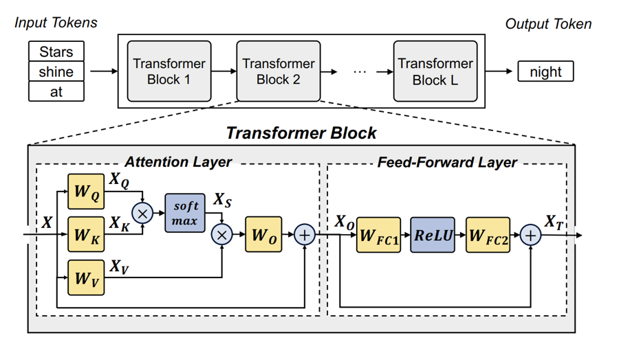  

$$
X_Q = XW_Q; X_K = XW_K; X_V = XW_V  
$$  

$$
X_S = softmax(X_Q {X_K}^T)  
$$

$$
X_O = X_S X_V W_O + X  
$$

$$
X_T = ReLU(X_O W_{FC1}) W_{FC2} + X_O  
$$

**Outliers in LLMs**  

논문에서는 Outlier들의 존재로 Quantization이 까다롭다는 점을 반복해서 이야기하고 있다. 선행 연구 결과를 보면 Post-Training Quantization의 방법으로 LLM의 Weights들을 효과적으로 Quantize 할 수 있는 반면에, Activation의 경우에는 Outlier들 때문에 Quantization이 어렵다.  

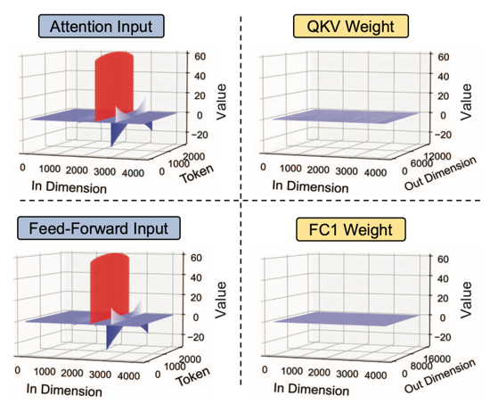  

이 그림은 Activation Tensor와 Weight Tensor의 값들을 보여주고 있는데, In Dimension은 인풋 토큰의 차원을 나타내고, Token은 토큰 개수를 나타낸다. Activation Tensor에는 특정 인풋 Dimension, 즉 채널은 따라서 Outlier들이 존재하고 있다. Weight의 경우에는 상대적으로 비슷한 값들이 분포하고 있는 것을 볼 수 있다.  

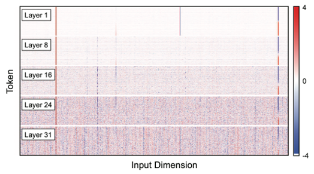  
어텐션 인풋 텐서의 히트맵이다. 여기서도 역시 선들은 수직적으로 나타나고, 몇 개의 고정된 채널에 존재하는 것을 볼 수 있다.  

$$
s=\frac{x_{max}}{2^{b-1}-1};  x_q = round(\frac{x_f}{s})  
$$

Quantizaiton은 위와 같은 식을 통해서 진행이 된다. 여기서 b는 bit width를 뜻한다. 예를 들어 INT8로 Quantization을 한다고 하면 b는 8이 된다. 그리고 실제 값을 Scale Factor로 나눈 뒤 rounding 한 값을 사용한다.  

**Quantization Granuarity**  

Tensor를 어떻게 분할해서 Quantization을 하느냐에 따라서 여러가지 Granuarity로 나뉜다. Per-tensor 같은 경우에는 Tensor안의 모든 원소들이 같은 Quantization Parameter들을 공유하게 되고, Per-row나 Per-column의 경우에는 각각 같은 row와 column 안에 속하는 원소들이 동일한 Parameter을 공유한다. 이 논문에서는 Per-row와 Per-token을 같은 뜻으로 사용하고, Per-column과 Per-channel을 같은 의미로 사용하고 있다. 그래서 앞에서 Outlier들이 채널을 따라서 존재한다는 것은 Tensor에서 Column을 따라서 존재한다고 보면 된다.  

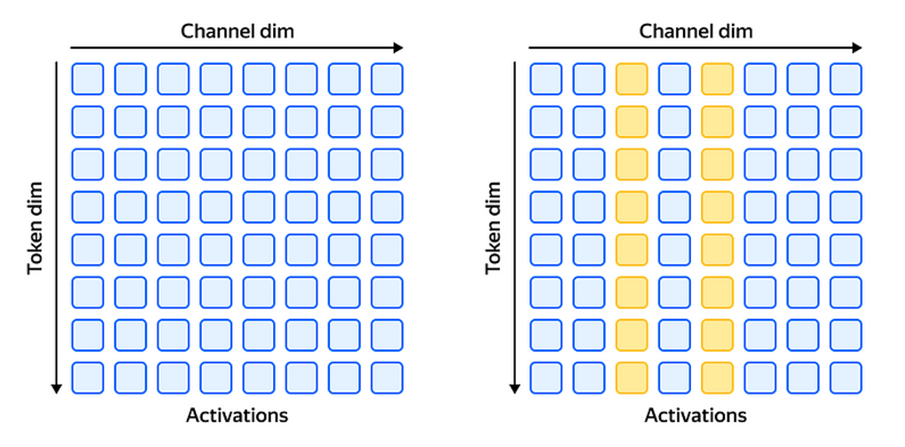  

**Challenges in Quantizing LLMs**  

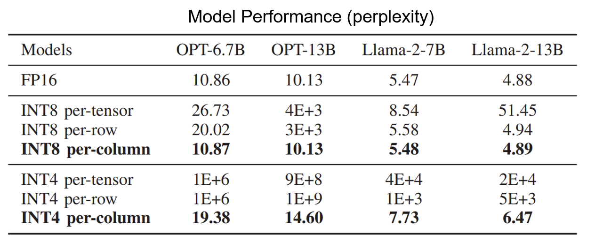  

이 테이블은 서로 다른 Granularity에 따른 Perplexity를 보여준다. Outlier들이 채널을 따라 존재하므로 채널마다 Scale Factor를 다르게 지정해주는 Per-column Quantization이 예상처럼 가장 좋은 성능을 보이고 있다. 하지만 Per-column Quantization은 행렬 계산을 할 때 다음 원소로 넘어갈 때마다 계속 Re-scaling이 필요해서 Floating Point 연산을 필요로 하게 되고, 현대 GPU나 TPU의 정수 파이프라인 구현에 Underutilization 같은 문제점을 일으킨다.  

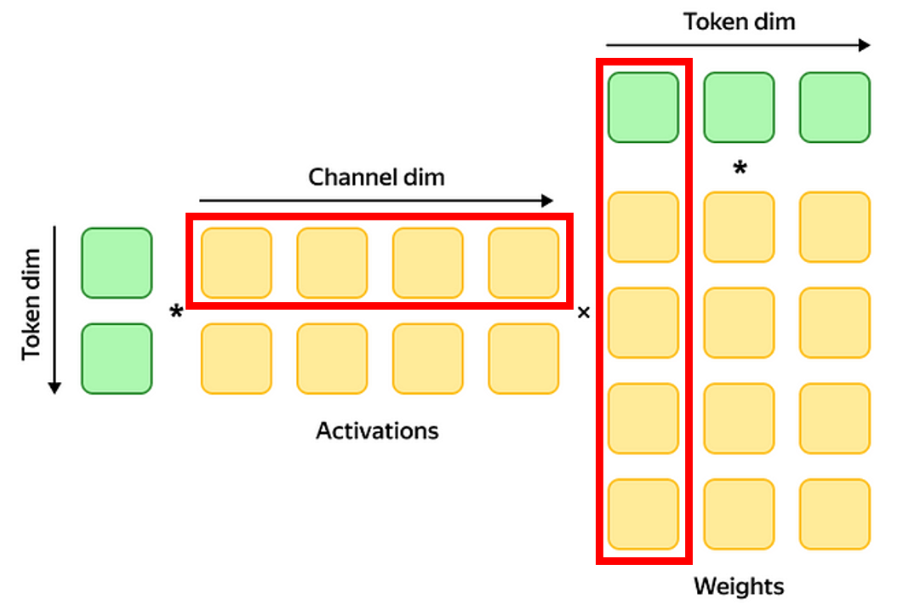  

그래서 대부분의 선행 연구들은 Activation을 Quantize 할 때는 Row마다 Quantization 하는 방식을 선택하고, Weight에 대해서는 Column마다 Quantization 하는 방식을 적용하고 있다. 하지만 이렇게 하면 Outlier들을 효과적으로 분리하지 못하기 때문에 Tender는 Column을 따라서 Tensor를 분리하는 방법을 제안한다.  

**Challenges and Opportunities**  

$$
P_i = \frac{X_i \times W_i}{s_i s_w}  
$$  
$$
Y=\sum_{i=1}^G (s_i s_w) \cdot P_i  
$$  

직관적으로 정확도를 높이기 위해서 Column을 따라서 Tensor를 분해하되, 몇 개의 그룹으로 나누어서 진행할 수 있다. 그룹이 G개가 있다고 하면, 행렬 계산 시에 각 그룹에 해당하는 부분 합을 계산한 후 마지막에 그룹마다 각각의 Scale Factor를 곱해서 더하면 최종 행렬을 얻는다. 그렇지만 이렇게 마지막에 그룹마다 Scale Factor를 곱하면 이들을 더할 때마다 매번 소수 연산이 필요해서 정수 연산 유닛의 Utilization이 떨어진다. 

$$
A_1 = P_1  
$$  
$$
A_{i+1} = A_{i} \cdot \frac{s_i}{s_{i+1}} + P_{i+1}  
$$  
$$
Y = A_G \cdot (s_w s_G)  
$$

그래서 Tender는 마지막에 부분합들을 Scaling 해서 더해주는 것이 아니라 다음 그룹으로 넘어가기 전마다 Scaling을 해서 넘겨준다. 이때 현재 그룹과 다음 그룹 사이의 Scale Factor 간의 비율인 Rescaling Factor 라는 것을 곱해주게 되고 이것을 정수로 만들어서 기존에 부분합을 더할 때 필요했던 소수 연산의 필요성을 없앤다.  

$$
rescale factor = \frac{s_i}{s_{i+1}} = 2^g  
$$

이를 가능하게 하기 위해서 Tender는 비슷한 범위 안에 들어오는 채널들을 같은 Scale Factor를 공유하도록 그룹화하고 연산을 진행해야 한다. 미리 말하자면 Tender는 Rescale Factor를 2의 거듭제곱으로 설정해서 오직 시프트 로직으로만 기존의 소수 연산을 대체한다.  

## **III. Algorithmic Implementation**  

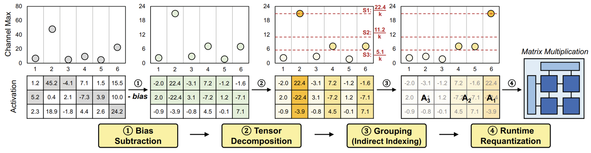  

**1. Bias Subtraction**  
각 채널에서 Bias를 빼서 영점을 맞춰주는 단계다. 각 채널에서 최댓값과 최솟값을 구하고, 이 둘의 평균을 빼 주면, 채널 내 최대 최소 값의 절댓값이 같아지므로 bit 사용을 최적화할 수 있다. 이때 Bias는 Calibration 때 미리 계산이 되어있는 값이다.  

$$
bias = (max + min)/2  
$$

**2. Tensor Decomposition**  
Tensor를 분해하는 단계이다. 이때 어떤 식으로 그룹화하고, 어떤 Scale Factor를 이용할지도 모두 Calibration 때 미리 계산된 값들을 사용한다. 따라서 아래 식에서 보이는 Rescale Factor인 알파와 그룹의 개수인 G는 모두 알고 있는 값이다.

$$
\frac{TMax}{\alpha^g} < CMax_i \le \frac{TMax}{\alpha^{g-1}}  
$$$

$$
rescale factor = \frac{TMax}{\alpha ^{g-1} (2^{b-1}-1)}  
$$

Tender는 Activation Tensor가 들어오면 첫번째로 각 채널 별 최댓값인 CMax 값을 구하고, 그 CMax 값들 중 가장 큰 값을 구해서 Tensor의 최댓값인 TMax 구한다. 그리고 채널 i 별로 아래의 부등식을 만족하는 g 값을 찾아서 해당 채널이 어떤 그룹에 속하게 될지를 결정한다. 그룹이 결정되면 각 채널들은 이 식과 같은 Scale Factor를 이용해서 Quantization 된다. 여기서 $\alpha = 2$ 로 설정하면 Rescaling이 Shifting이 된다.  

여기서 생길 수 있는 의문이 왜 큰 값들은 큰 threshold를 사용하고, 작은 값들은 작은 threshold를 사용하는지이다. Quantization 시에 threshold가 커질수록 Rounding 할 때 에러도 커지기 때문이다. Tender에서 말한 방법대로면 큰 값일수록 작은 g값을 부여하게 되므로 이 부등식의 범위가 커진다. 이 논문에서는 이에 대한 답으로 Q_err가 Absolute Maximum과 채널 수의 곱에 비례하는데 큰 스케일을 가진 채널들이 아주 적기 때문에 Q_err가 전체적인 정확도에 큰 영향을 미치지 않을 것이라고 대답한다.

$$
Q_{err} \propto Absolute Maximum \times Number of Channels  
$$

**3. Grouping (Indirect Indexing)**  
바로 앞에서 각 채널들이 어떤 그룹에 속하는지를 결정했다. 이 단계에서는 그 채널들의 순서를 가장 큰 값을 가진 채널부터 가장 작은 값을 가진 채널로 차례로 배치해서 그룹화를 한다. 이때 실제로 자리를 옮기는 것은 아니고 Indirect Indexing의 방법으로 순서를 바꾸게 되는데, 자세한 설명은 하드웨어 부분에 나온다.  

**4. Runtime Requantization**  
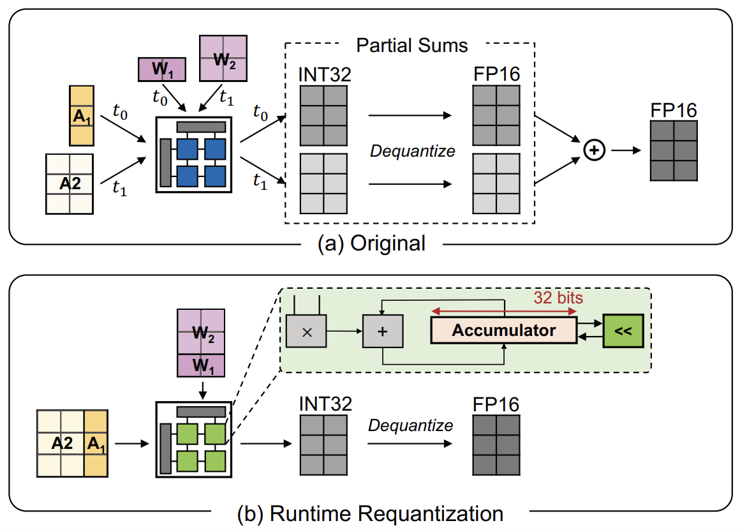  
Tensor 분해는 Quantization 에러를 줄일 수 있지만, 분해한 채널들 별로 행렬 계산을 하고, 나중에 합해줄 때 각각의 Scale Factor를 다 곱해서 De-quantize를 해준 후 더해야 하므로 Floating-Point 연산이 많아진다. 
그래서 Tensor는 이러한 오버헤드를 줄이기 위해서 그때 그때 부분합에 Re-quantize를 해주게 됩니다. 앞에서 Scale Factor를 2의 거듭제곱으로 설정하고 Tensor를 분해했기 때문에 다음 그룹의 계산으로 넘어가기 전에 1-bit만 Shift 해주면 된다. 따라서 Floating-Point 연산이 필요 없기 때문에 기존의 비효율성이 개선된다.  

**+ Optimization**  
앞선 네 가지의 과정 외에도 논문에서는 Optimization도 시행한다고 나와있다. Outlier들을 잘 보면 inter-channel variance만 갖고 있는 것이 아니라 intra-channel variance도 갖고 있기 때문에 채널 내에서도 Outlier들을 분리하면 더 좋은 성능을 낼 수 있다.  

Tender는 그래서 Row Chunking이라는 방법을 사용해서 채널 뿐만 아니라 Row 단위로도 Tensor를 분해하게 되고 바이어스와 Scale Factor들은 모두 Offline에서 보정된다. 원래 Activation Tensor를 계산할 때 행을 따라서 계산하기 때문에 Row Chunking은 별다른 Complexity를 요구하지 않는다. Row Chunking을 작게 쪼갤수록 성능은 좋아질 수 있지만, Systolic Array의 Dimension보다 작아지면 Underutilization이 일어나므로 Balance Point를 찾는 것이 중요하다. 이 논문에서는 Chunk Size를 256로 설정하였다.  

## **IV. Hardware Architecture**  

**1.Overview of Tender Architecture**  

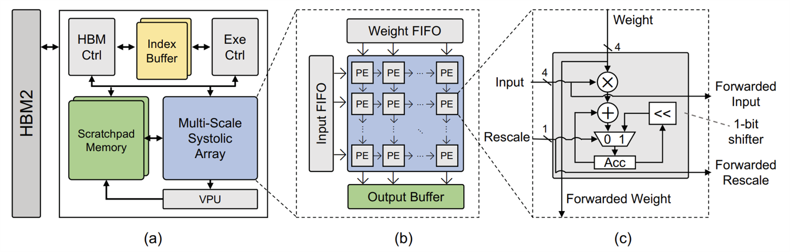  

이 그림이 Tender의 전반적인 구조를 보여준다. 메모리로는 HBM2랑 Scratchpad Memory, Output Buffer, 그리고 Index Buffer를 이용한다. HBM Controller가 온 칩 버퍼와 HBM2 사이의 데이터 전송을 담당한다. Execution Controller는 Scratchpad Memory에 주소를 보내서 온 칩 메모리에서 데이터를 읽어온 후 이를 Systolic Array로 전달한다. 그리고 Systolic Array에 컨트롤 신호를 보내서 어떤 연산을 할지 관리한다.  

**2. Multi-Scale Systolic Array (MSA)**  

데이터 연산은 Multi-Scale Systolic Array와 VPU에서 진행된다. 먼저 MSA는 가운데 그림과 같은 구조로 이루어져 있다. 각 PE (Processing Element)는 매 사이클마다 4-bit의 연산을 수행할 수 있는데 Tender에서는 64 x 64의 PE들이 2D Mesh 형태로 배열되어 있다. 그렇기 때문에 만약 Model Precision이 INT8이라면, 한 데이터를 입력 받는데 2개의 PE가 필요하므로 2 x 2 해서 4개의 PE가 필요하다.

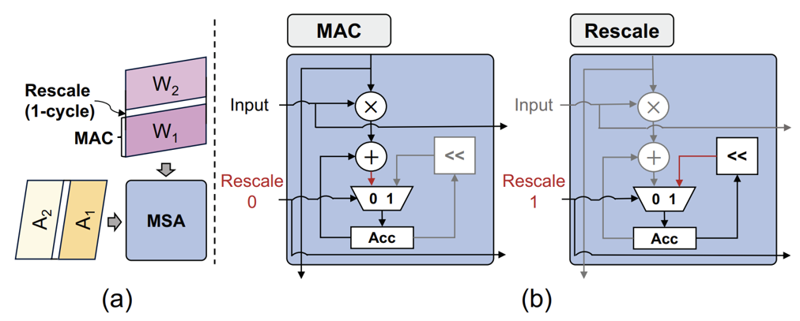  

MSA는 Output Stationary한 모듈이어서 부분합들이 각 PE에 저장된다. 일반적인 행렬 계산 시에는 평범한 MAC Operation을 진행하고, Rescale이 필요할 때는 1 cycle 동안 Accumulator Register를 왼쪽으로 한 칸 움직여서 Re-quantization을 진행한다. Rescale Signal을 알맞은 타이밍에 내보내기 위해서 Execution Controller가 모든 메타 데이터들을 저장하고 있다.  

**3. Vector Processing Unit (VPU)**  

심드(SIMD) 스타일의 Floating-Point Unit이고 Output Buffer에서 오는 INT32 데이터를 INT4나 INT8로 Scaling 하는 역할을 하고 선택적으로 활성화 함수들을 사용한다. 트랜스포머에서는 Softmax나 Layer Normalization도 수행한다. 계산이 끝나면 이를 Scratchpad Memory에 저장한다. VPU도 역시 미리 보정된 바이어스와 Scale Factor를 이용하고 이를 저장하기 위한 버퍼들도 내장되어 있다. VPU는 64개의 FPU와 내부 벡터 레지스터들로 구성된다.  

**4. Controllers & Index Buffer**  

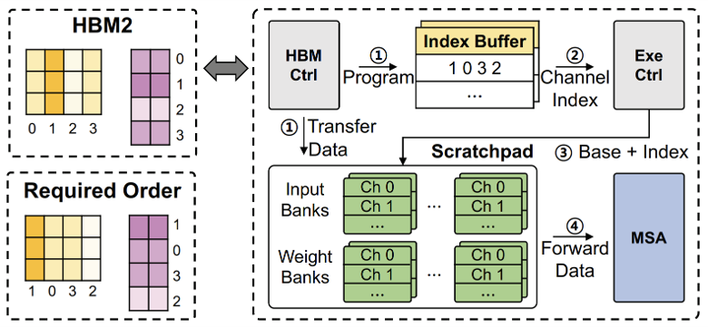  

Tender는 Tensor를 채널 별로 나눈 다음에 이를 Scale Factor가 큰 그룹부터 차례대로 연산을 실행해야 하므로 이를 위해서 Indirect Indexing을 이용한다. Calibration 단계 때 결정되는 연산 순서를 Index Buffer에 미리 저장해두면, Execution Controller가 이를 참조해서 Base와 Index로 구성된 주소를 Scratchpad Memory로 보내서 알맞은 데이터를 로드하고, 이 데이터를 MSA로 보내서 연산을 한다. HBM Controller는 HBM2에 있던 데이터를 Scratchpad Memory로 보내는 역할이다.  

**5. Scratchpad Memory & Output Buffer**  

Scratchpad Memory는 앞에서 Quantize된 input과 weight들이 저장되는 장소이다. Output Buffer에는 연산 결과가 저장되어 있다가 Rescaling을 위해서 VPU로 보내진다.  

## **V. Evaluation**  

**PTQ Performance on LLMs**  

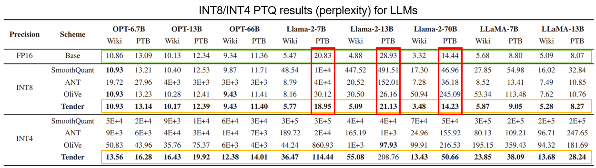  

여러가지 LLM 모델과 기존의 Quantization Scheme들을 이용해서 Perplexity를 비교한 결과이다. 초록 박스가 쳐진 부분이 FP16 Baseline인데, Tender는 이 Baseline과 거의 비슷한 Perplexity를 보이고 있다. 그리고 Llama-2 모델을 PTB Dataset으로 돌렸을 때는 Tender가 Baseline보다도 좋은 성능을 보이고 있다. INT8에서는 Quantization 에러가 상당히 작기 때문에 Quantization을 하면 Rounding을 할 때 불필요한 작은 값들이 제거되어 중요한 값에 집중한 결과라고 설명한다.  

표에서 굵은 글씨로 표현된 것이 해당 모델과 데이터 셋에서 가장 좋은 Perplexity를 나타내는데 거의 대부분의 경우에서 Tender가 가장 좋은 Perplexity를 보여준다. 그리고 특히 INT4 Precision일 때 다른 Scheme들보다 성능이 훨씬 좋은 것도 확인할 수 있다.  

**Sequence Length Sensitivity**  
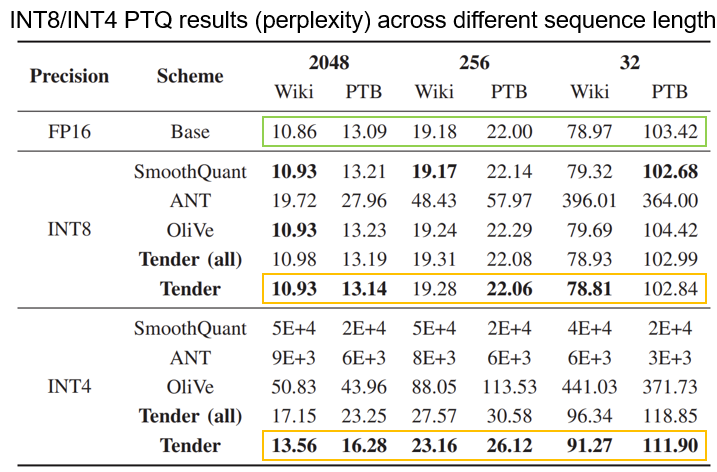  

시퀀스 길이에 대한 민감도를 보여준다. 여기서 Tender는 공정한 비교를 위해 Activation 사이에 있는 행렬 곱에 대해서는 Quantization을 적용하지 않은 Scheme이고 Tender(all)은 모든 행렬 곱에 대해 Quantization을 진행한 것이다.  
여기서도 역시 Tender가 대부분의 경우에서 가장 좋은 퍼포먼스를 보이고 있고, FP16에 가까운 Perplexity를 유지하고 있다. 그리고 Tender(all)의 경우에도 Activation 사이에 행렬 곱을 Quantize하지 않는 다른 Scheme보다 나은 성능을 보이고 있다. 따라서 Tender가 여러가지 시퀀스 시나리오에서 Outlier들을 처리하는데 가장 적합하다.  

**Quantization Accuracy on BERT (with GLUE benchmark)**  

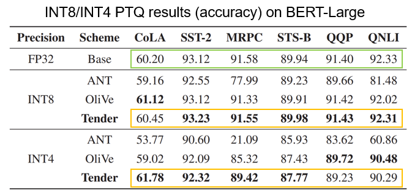  

Perplexity와 다르게 큰 값이 좋은 성능을 나타낸다. BERT-Large의 Outlier들은 다른 LLM 모델들보다 훨씬 작음에도 Tender가 가장 좋은 성능을 보이고 있다. 따라서 Tender의 알고리즘이 Encoder-only 모델이나 상대적으로 작은 모델에 대해서도 잘 작동하는 것을 확인할 수 있다.  

**Multi-scale Quantization**  

이 그래프는 Llama-2 모델에 PTB 데이터 셋을 적용한 후 Channel Decomposition 시에 그룹 수를 다르게 한 결과이다. 그룹의 수를 늘릴수록 성능이 급격하게 좋아지는 것을 볼 수 있다. 그래서 Tender처럼 Channel Decomposition을 해서 채널의 그룹 수를 늘리되, Re-scaling으로 인한 오버헤드를 줄여야 한다.  

**Tender Performance**  
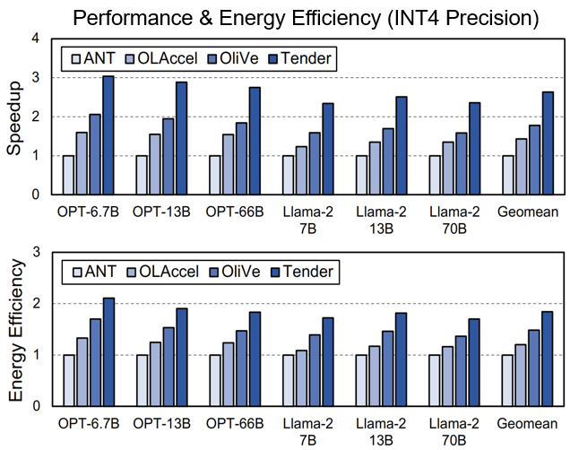

다른 하드웨어 가속기들과의 Speedup과 에너지 효율을 비교한 것이다. Tender가 ANT, OLAccel, OliVe에 비해 각각 2.63배, 1.84배, 1.48배 더 빠른 속도를 보이고 있고 에너지 효율은 각각 1.84배, 1.53배, 1.24배로 좋은 효율을 보이고 있다.  

## **VI.Conclusion**  

Tender는 Activation Tensor를 채널 단위로 분할해서 Outlier들을 효과적으로 분리하기 때문에 Quantization 에러를 최소화한다. 또한 Tensor는 기존의 Re-scaling 작업을 Shifter Logic으로 대체할 수 있는 방법을 제안함으로써 런타임 오버헤드 문제를 해결한다. 마지막으로 Tender는 기존의 PTQ에 비해 성능 또한 크게 향상시켜서 INT4 같이 아주 작은 비트로 Quantiztion 할 때도 좋은 퍼포먼스를 보여준다.

---
2024/07/21

