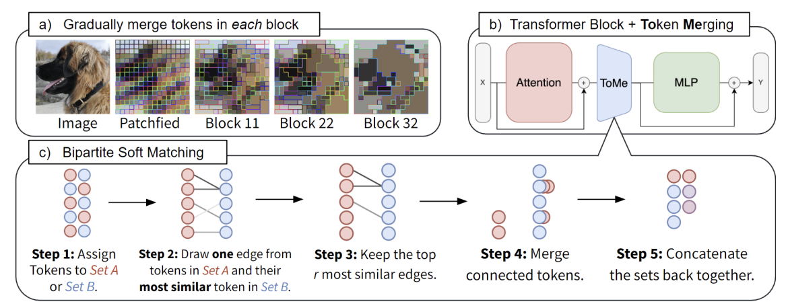
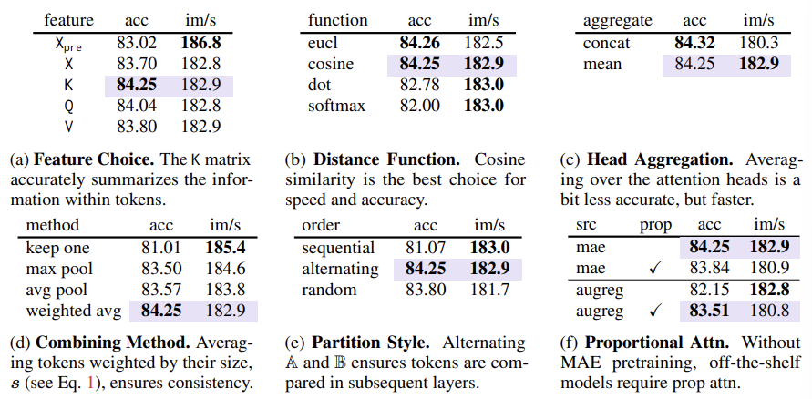
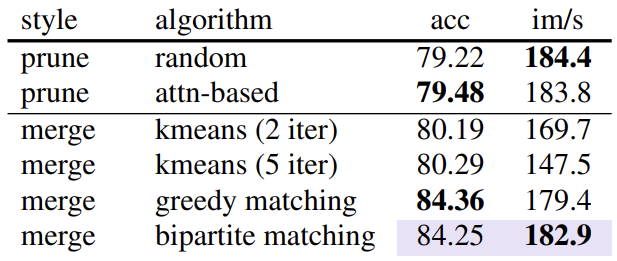
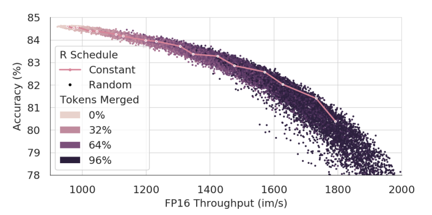
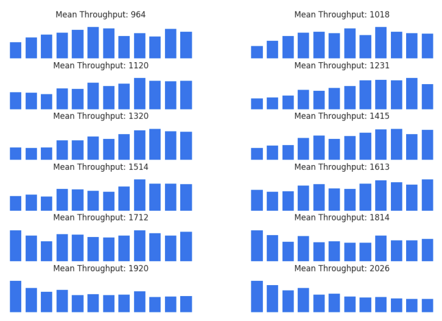

### 논문 리뷰  

## TOKEN MERGING: YOUR VIT BUT FASTER

---

### **1. Introduction**  
  
거대 모델을 작동시킬 때 속도를 높이기 위해 Pruning 기법이 사용되고 있지만, Pruning은 정보를 소실시키기 때문에 줄일 수 있는 토큰 개수에 제한이 있다.  

이 논문에서는 토큰을 Prune 하는 대신 Combine 하는 방법인 Token Merging(ToMe)을 제시한다. 이 방법은 Custom Matching 알고리즘 덕분에 Pruning 보다 속도가 빠르고 더 정확하다. 또한, 이 기법은 학습의 유무와 상관없이 잘 작동한다.  

---

### **2. Related Work**  
  
**Efficient Transformers**  
NLP와 컴퓨터 비전 분야에서 트랜스포머의 효율을 높이려는 연구가 많다. 주로 Fast-attention, Pruning, Domain Specific Module 등을 추가하여 성능을 향상시킨다.  

**Token Reduction**  
트랜스포머는 토큰 개수와 상관없이 잘 작동하기 때문에 NLP와 비전 트랜스포머에서 불필요한 토큰을 Pruning 하는 방법이 등장했다. 이러한 방법들은 재학습을 요구하지만, ToMe는 학습이 없어도 된다. 게다가 Pruning 방법은 dynamic 해서 토큰의 개수가 이미지나 문장마다 바뀌기 때문에 서로 다른 인풋을 Batch 처리할 수가 없다. 

**Combininb Tokens**  
대부분의 토큰 병합 방법들은 추가적인 학습을 요구하거나 비효율적인 방법(k-means clustering)을 사용한다. ToMe는 최소한의 연산 비용으로 토큰을 병합하고 기존의 방법들보다 합리적인 Speed-Accuracy Trade-off를 제공한다.  

---

### **Token Merging**  

ViT 모듈에 Token Merging Module을 넣어서 학습 없이 불필요한 토큰들을 합치고 Throughput을 높이는 것이 본 연구의 목표이다.  

**Strategy**  

트랜스포머의 각 블록마다 토큰을 병합해서 r개씩 줄인다. r은 비율이 아니라 고정된 토큰의 개수를 의미한다. 블록의 개수가 L개라면 총 rL개의 토큰을 병합하게 된다.  

r은 Speed-accuracy trade-off를 제공한다. 토큰을 많이 병합할수록 정확도는 떨어지지만 throughput은 높아지기 때문이다. 중요한 것은 인풋 이미지와 상관없이 토큰 개수를 줄인다는 점이다. 몇몇 Pruning 기법처럼 토큰 개수가 dynamic 하게 변하면 정확도는 올라갈 수 있지만 구현하는 것이 impractical 하고, Batching을 어렵게 한다.  
  

**Token Similarity**  

토큰의 유사도를 측정할 때 그들의 feature 간의 거리가 작을수록 유사하다고 판별할 수 있지만, 트랜스포머에서 그들은 overparameterized 되어 있어서 중요하지 않은 노이즈를 포함할 가능성이 있다.  

운이 좋게도 트랜스포머는 QKV 셀프 어텐션 레이어를 포함하고 있다. 구체적으로, Key는 이미 각 토큰의 정보를 잘 요약하기 때문에 토큰의 Key 값들을 Dot-product 해서 Cosine Similarity를 측정한다. 이는 4장에서 더 자세하게 나온다.  
  

**Bipartite Soft Matching**  

토큰을 r개 만큼 줄이는 작업을 L번 (블록 개수만큼) 반복해야 하기 때문에 런타임이 아주 짧아야 한다. 기존의 kmeans clustering이나 graph cuts 같은 방법은 그렇지 않다.  

이 논문의 솔루션은 다음과 같다. 일단 병렬 처리가 불가능한 방법을 피하면서 Merging을 점진적으로 할 수 있는 방법을 찾았다.  

1. 토큰을 비슷한 개수의 집합 A와 B로 나눈다.  
2. A에 있는 토큰마다 B에 있는 토큰 중 가장 유사한 토큰을 edge로 연결한다.  
3. 유사도가 가장 높은 r개의 edge만 남긴다. 
4. 연결된 토큰들을 하나로 합친다. (By Averaging Features)
5. 두 집합을 Concatenate 한다.  

이 방법은 토큰을 랜덤하게 없애는 것과 거의 속도 차이가 없고 코드 몇 줄로 구현할 수 있다.  
  

**Tracking Token Size**  

여러 개의 토큰이 합쳐져서 하나의 Key가 되면 Softmax에서 갖는 영향력이 작아진다. 그래서 Proportional Attention 이라는 다음의 식을 통해서 토큰 개수를 반영하도록 한다.  

$$
\mathbf{A} = softmax \left( \frac{\mathbf{QK}^T}{\sqrt{d}} + log \mathbf{s} \right)  
$$

**Training with Merging**  

기존 ViT 모델에 바로 넣을 수 있기 때문에 학습이 필요하지 않지만, ToMe를 넣어서 학습하면 정확도 하락을 방지하거나 학습 속도를 빠르게 할 수 있다. 학습시킬 때는 Pooling 처럼 취급하면 된다. Backpropagation도 Average Pooling과 같은 방법으로 진행된다.  

### **4. Image Experiments**  

**Token Similarity**  

Token Merging 시 최적의 방법을 찾기 위해 다음과 같이 실험을 진행하였다.  

(a) Key로 유사도를 비교할 때 정확도가 가장 높았다. Key가 토큰의 정보를 잘 요약한다고 볼 수 있다.  

(b) Cosine Similarity로 유사도를 측정했을 때 정확도와 스피드가 가장 높았다.  

(c) 어텐션 헤드마다 Averaging을 하는 것이 정확도는 살짝 떨어지지만 속도가 더 빨랐다.  
  

**Algorithmic Choices**  

(d) Merging 할 때 토큰의 크기 (병합된 패치 수)를 고려한 가중 평균을 사용하는 것이 가장 성능이 좋았다. 처음에는 크기가 동일하지만 계속 ToMe 같은 방법을 사용하다보면 어떤 토큰은 많은 패치를 표현하고 있기 때문이다. 

(e) A, B로 나눌 때 토큰을 번갈아가면서 배치하는 것이 가장 성능이 좋았다.  

**Proportional Attention**  

(f) MAE(Masked Autoencoder) 모델에서는 Prop Attn이 필요가 없지만, AugRed 같은 Supervised 모델에서는 필요하다.  
  

**Comparing Matching Algorithms**  

다양한 토큰 병합 알고리즘을 비교한 결과, Bipartite Matching 알고리즘이 성능과 속도 면에서 가장 뛰어나다. K-means 클러스터링은 속도가 느리고, Pruning은 정보 손실이 많다.  

**Selecting a Merging Schedule**  

r을 조정하는 방법도 실험했는데, Constant Schedule이 대체로 최적에 가까운 좋은 성능을 보였다. 각 점들은 15K개의 랜덤 Merging Schedule을 나타낸다.  

Appendix C의 Figure 7은 Figure 2의 랜덤 샘플 중 가장 성능이 좋았던 100개의 샘플의 평균 Merge 개수를 레이어 별로 구한 것이다. 

throughput이 낮을 때는 점점 Merging을 많이 하는 방식이 효과적이고, throughput이 높을 때는 일정한 r을 사용하는 것이 최적이다. Throughput이 더 높아지면 decreasing schedule이 잘 작동한다. 

따라서 처음에는 2r로 시작했다가 점점 0으로 줄여서 Total은 rL로 유지하는 Linear interpolation을 사용하기도 한다.  

---

2024/09/09

