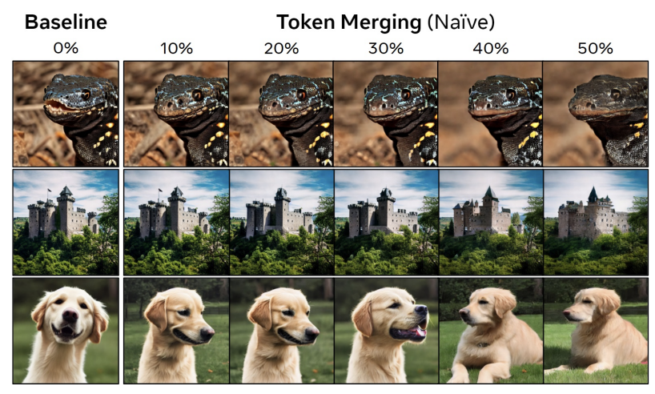
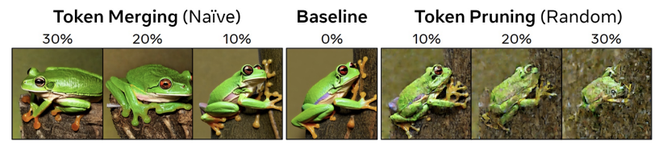
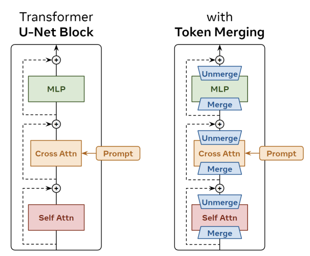

### 논문 리뷰  

## Token Merging for Fast Stable Diffusion

---

### **3. Token Merging for Stable Diffusion**  

ToMe는 Classification에서는 잘 작동하지만, Diffusion 같은 경우는 모든 토큰에 더해진 노이즈를 알아야하므로 Merging을 한 다음에 다시 Unmerging을 해주는 작업이 필요하다.  
  

**3.1 Defining Unmerging**  

Dense한 Prediction Task에서는 Merge 했던 토큰들을 다시 Unmerge 해주는 과정이 중요하다. 

아래 그림처럼 Token Merging이나 Pruning이 Naive하게 진행될 수록 그림의 퀄리티가 낮아지는 것을 볼 수 있다. 

  

이 연구에서는 가장 단순한 방법으로 Unmerging을 진행한다.

Merging은 다음과 같고,  

$$
x_{1, 2}^{\ast} = (x_1 + x_2)/2  
$$

Unmerging은 다음과 같다.  

$$
x_1^{'} = x_{1, 2}^{\ast}  x_2^{'} = x_{1, 2}^{\ast}  
$$

이렇게 하면 당연히 정보가 소실되지만, 어자피 토큰들이 다 비슷해서 에러가 작기 때문에 큰 문제가 없었다고 한다.  

**3.2 An Initial Naive Approach**  

이 방법은 Merge 한 후에 일부 연산을 진행하고 바로 Unmerge를 진행하기 때문에 ToMe보다 훨씬 Merge를 훨씬 많이 해야된다. 그래서 ToMe처럼 r개를 고정적으로 없애는 대신에 모든 토큰의 r%를 없앤다. 또한, 토큰 간의 유사도를 계산하는 것도 연산이 많이 필요하기 때문에 처음에 1번만 진행한다. 또한 ToMe에서는 유사도를 구할 때 Key를 이용하는 반면, 여기에서는 x 자체를 이용한다.  

---

### **4. Further Exploration**  

