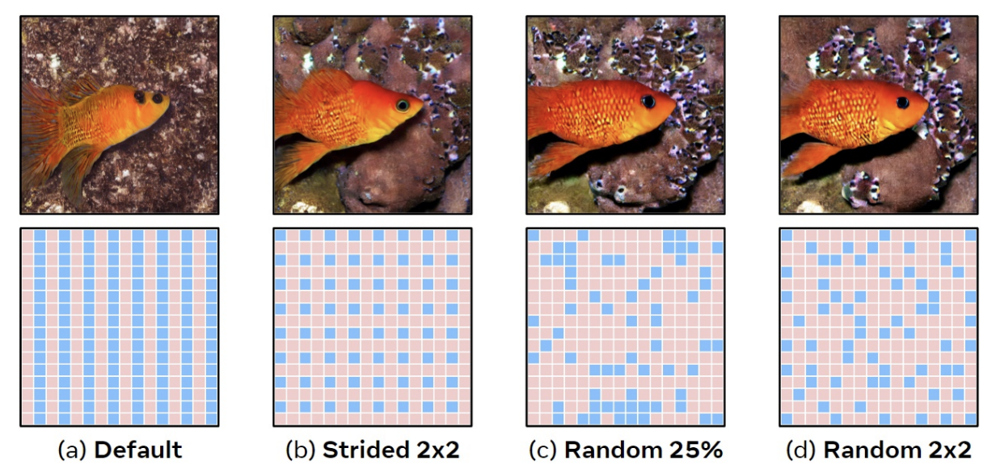
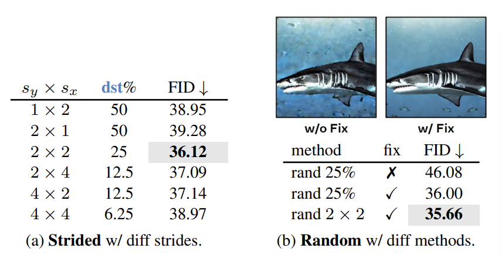

### 논문 리뷰  

## Token Merging for Fast Stable Diffusion

---

### **3. Token Merging for Stable Diffusion**  

ToMe는 Classification에서는 잘 작동하지만, Diffusion 같은 경우는 모든 토큰에 더해진 노이즈를 알아야하므로 Merging을 한 다음에 다시 Unmerging을 해주는 작업이 필요하다.  
  

**3.1 Defining Unmerging**  

Dense한 Prediction Task에서는 Merge 했던 토큰들을 다시 Unmerge 해주는 과정이 중요하다. 

아래 그림처럼 Token Merging이나 Pruning이 Naive하게 진행될 수록 그림의 내용이 조금씩 바뀌는 것을 알 수 있다. 

  

이 연구에서는 가장 단순한 방법으로 Unmerging을 진행한다.

Merging은 다음과 같고,  

$$
x_{1, 2}^{\ast} = (x_1 + x_2)/2  
$$

Unmerging은 다음과 같다.  

$$
x_1^{'} = x_{1, 2}^{\ast}  x_2^{'} = x_{1, 2}^{\ast}  
$$

이렇게 하면 당연히 정보가 소실되지만, 어자피 토큰들이 다 비슷해서 에러가 작기 때문에 큰 문제가 없었다고 한다.  

**3.2 An Initial Naive Approach**  

이 방법은 Merge 한 후에 일부 연산을 진행하고 바로 Unmerge를 진행하기 때문에 ToMe보다 훨씬 Merge를 훨씬 많이 해야된다. 그래서 ToMe처럼 r개를 고정적으로 없애는 대신에 모든 토큰의 r%를 없앤다. 또한, 토큰 간의 유사도를 계산하는 것도 연산이 많이 필요하기 때문에 처음에 1번만 진행한다. 또한 ToMe에서는 유사도를 구할 때 Key를 이용하는 반면, 여기에서는 x 자체를 이용한다.  

---

### **4. Further Exploration**  

**Experimental Details**  

Stable diffusion v1.5를 이용해서 ImageNet-1k 클래스에서 2000장의 $512 \times 512$ 이미지를 생성하였다. 50 PLMS와 7.5 cfg를 이용했다. 50 PLMS 확산 단계는 노이즈 제거를 50번의 단계에 걸쳐 수행하는 것이고, cfg는 주어진 프롬프트에 얼마나 강하게 반응할지를 결정하는 Hyperparameter이다. 이후 FID 스코어를 측정하였다. 속도는 단일 GPU에서 2,000개의 샘플을 생성하는 속도를 이용하였다.  

**4.1 A New Partitioning Method**  

src가 dst로 merge 된다고 보면 되는데, src와 dst를 partitioning 하는 방법에 따라 성능에 차이가 난다.

 

일단 src와 dst를 번갈아가며 놓으면 그림 (a)와 같은 현상이 벌어지게 되고 Merge를 했을 때 row가 절반으로 접힌 것 같은 효과가 난다. (b)의 경우 stride를 2로 놓고 샘플링을 한 것인데 이것도 regular grid이다. 그래서 randomness를 도입해서 (c)처럼 불규칙하게 샘플했는데, 이러면 한 구역에만 쏠릴 수 있어서 FID가 고정적이지가 않다. (d)와 같이 $2 \times 2$ 안에서 랜덤하게 1개를 샘플링한다.

위 표를 보면 $2 \times 2$ 안에서 랜덤하게 1개를 골랐을 때가 성능이 가장 좋았다. fix는 Batch마다 randomness를 고정시켰는지 여부를 나타내는데, 고정시켰을 때가 성능이 더 좋았다고 한다.  

  
**4.2 Design Experiments**  

