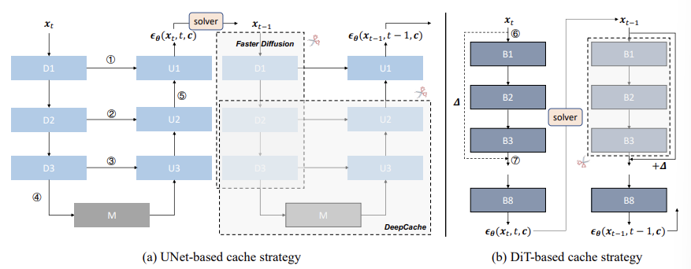
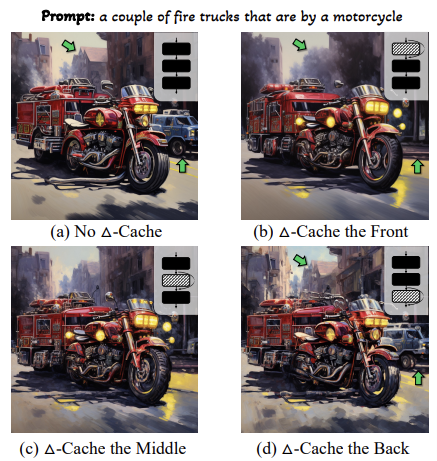
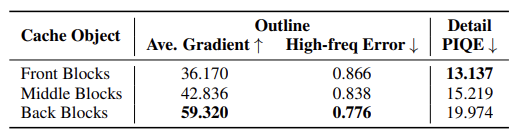
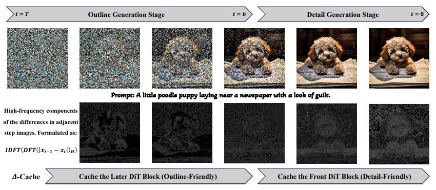
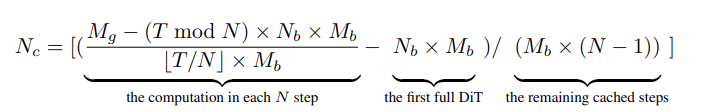

### 논문 리뷰  

## **∆-DiT: A Training-Free Acceleration Method Tailored for Diffusion Transformers**  

---

### **1. Introduction**  

디퓨전 모델은 뛰어난 생성 능력을 가지고 있지만, 반복적으로 노이즈를 제거하는 방식으로 인해 real-time performance가 떨어진다. 따라서 다양한 추론 가속화 프레임워크가 제시되고 있다.  

DiT의 블록 중에서 앞 부분은 이미지의 아웃라인을 잡는 데 중요하고, 뒷 부분은 디테일에 집중한다는 점을 발견하였다. 따라서 샘플링 초기 단계에서 DiT의 뒷 부분을, 나중 단계에서는 DiT의 앞 부분을 Cache하여 가속한다.  

---

### **2. Related Work**  

**Efficient Diffusion Model**  

디퓨전 모델의 real-time performance를 개선하기 위한 노력은 크게 3가지로 구분이 된다.  

1. 네트워크 최적화: pruning, quantization, distillation  
2. 샘플링 타임 최적화: Efficient ODE solver  
3. 네트워크 & 샘플링 타임 최적화: OMS-DPM, LCM

그러나 이전 방법들은 주로 U-Net 기반의 연구였기 때문에 DiT 모델에 초점을 맞춘 솔루션을 제공하는 것이 이 논문의 주제다.  

**Cache Mechanism**  

다시 사용될 데이터를 일시적으로 저장해서 프로세싱 속도를 높이는 기술이다. LLM에서는 KV Cache 기법이 널리 쓰이고 있다. 디퓨전에서도 Cache에 기반한 추론 가속화 기법들이 존재한다. DeepCache는 U-Net에서 Upsampling을 할 때 Feature Map을 만들어서 비슷한 인접 단계의 계산은 Cache로 대신하여 계산 속도를 높이는 방법을 사용한다. Faster Diffusion은 U-Net의 인코더와 Skip Connection 사이의 Feature Map을 캐싱하여 인접 단계에서 속도를 높인다. TGATE는 Cross-Attention의 Feature Map을 캐싱하여 Sampling 후반 단계를 가속화한다.  

그러나 DiT는 방향성이 없기 때문에 위의 방법들을 적용하면 정보를 잃어버릴 수 있고, 세밀한 모듈만을 캐싱하는 TGATE의 경우 가속화가 제한적이다. 따라서 Feature Offset을 Caching 하는 $\Delta$-Cache를 제안한다.  

---

### **3. Preliminary**  

자세한 설명은 Diffusion Models 포스트를 참고하면 될 것 같다.  

[Diffusion Models](https://seoyoonkims.github.io/docs/posts/Diffusion_Models/)

**Noise Diffusion State**  

핵심은 첨가된 노이즈를 예측하는 방향으로 학습이 진행된다는 것이다.  

$$
\mathcal{L}(\theta) = \mathbb{E}_{t, x_0 \sim q(x), \epsilon \sim \mathcal{N}(0,1)} 
\left[ \left\| \epsilon - \epsilon_\theta \left( \sqrt{\bar{\alpha}_t} x_0 + \sqrt{1 - \bar{\alpha}_t} \epsilon, t \right) \right\|^2 \right]
$$

$$\epsilon_\theta(x_t)$$는 $$f_{N_b} \left( f_{N_b-1} \left( \cdots f_1(x_t) \right) \right) = f_{N_b} \circ f_{N_b-1} \circ \cdots \circ f_1(x_t) = F_1^{N_b}(x_t)$$로 표현된다. $$f_n$$은 DiT의 $n-th$ 블록을 나타낸다. 주로 $N_b$는 28이다. 

**Denoising Stage**  

이 단계는 노이즈로부터 이미지를 생성하며, 이 논문에서 가속하려고 하는 부분이다.  

$$
x_{t-1} = \frac{1}{\sqrt{\alpha_t}} \left( x_t - \frac{\beta_t}{\sqrt{1 - \bar{\alpha}_t}} \epsilon_\theta(x_t, t) \right) + \sigma_t z
$$

많은 시나리오에서 $\epsilon_\theta(x_t, t, c)$를 사용한다. $c$는 Conditional control information으로 클래스나 텍스트의 임베딩으로 생각하면 된다.  

---

### **4. Stage-adaptive Inference Acceleration for Diffusion Transformers**  

**4.1 Tailored Cache Method for DiT**  
Feature을 재사용 하는 것은 training-free inference acceleration에서 중요한 전략이다.  

**Challenges**  

**Faster Diffusion**는 U-Net 아키텍쳐의 D1-D3 모듈의 **Output**을 캐싱하여 재사용한다. 다음 단계에서 D1-D3 모듈의 재계산을 생략할 수 있지만 $x_{t-1}$에 해당하는 정보를 잃어버리기 때문에 샘플링 단계 간의 연속적인 정보 흐름이 끊기고 결과적으로 성능이 떨어질 수 있다.
**DeepCache**는 5 위치에서 Output Feature Map을 캐싱하여 D2, D3, M, U3, U2의 계산을 생략한다. D1에서 U1으로 이어지는 경로를 통해 $x_{t-1}$의 정보가 유지되므로 Faster Diffusion보다 많은 정보를 보존한다.
**TGATE**는 D1-D3 및 U1-U3 내 Cross-Attention 모듈의 Output Feature Map를 세밀하게 캐싱하여 가속화가 제한적이다.  
  

**Method**  
$\Delta$-Cache는 Output Feature Map 간의 차이를 캐싱한다. 오른쪽 그림을 보면 7의 Output을 캐싱하는 대신 6과 7의 Output의 차이를 캐싱하고, 다음 단계에서 input에 그 차이값을 더해준다. 이를 통해 다음 단계의 B1-B3 계산을 생략하면서도, $x_{t-1}$의 정보를 $\Delta$를 통해 반영할 수 있다.  

따라서, DiT 블록의 정보 손실 문제를 해결하고 앞, 뒤, 중간 블록을 선택적으로 생략할 수 있어서 큰 유연성을 제공한다. 또한, 각 블록의 Output Feature Map의 스케일이 일정한 DiT에 적합하여 $\Delta$ 계산을 가능하게 한다.  

**4.2 Effect of DiT Blocks on Generation**  

**Qualitative**  
DiT 블록의 Front, Middle, Back 부분을 Caching 한 결과를 비교한 것이다. I는 28개의 블록 중에서 몇 번째 블록을 기준으로 Caching 할지를 결정한다. 이 실험에서는 $I = 1, 4, 7$이고 $N_c = 21$이므로 1을 Caching 해서 2-22를 계산하고, 4를 Caching 해서 5-25를 계산하고, 7을 Caching 해서 8-28을 계산한다.   

Front Blocks를 Caching하면 아웃라인의 정확도가 떨어진다. 반대로 Back Blocks를 Caching하면 디테일이 떨어진다. (a)와 비교했을 때 (b)는 파란색 차와 지붕의 아웃라인이 명확하지 않고 전체적으로 Smoother하다. (d)에서 아웃라인은 보존되었지만 (a)보다 pixel-level 디테일이 떨어진다.

**Quantatative**  

위 연구 결과를 검증하기 위해 MS-COCO2017 데이터셋에 대해서도 정량적인 검증을 수행했다. Outline 생성 능력은 Sobel Operator 기반으로 이미지의 Average Gradient를 측정하였고, DFT를 이용해 High Frequency 손실을 평가하였다. 디테일 표현 능력은 블라인드 이미지 품질 평가 지표인 PIQE를 사용하였다.

이 결과는 DiT 모델에서 앞 블록이 주로 아웃라인 생성과 관련이 있고, 후반부 블록이 디테일 표현과 밀접하다는 것을 추가적으로 확인시켜준다.  
  

**4.3 State-adaptive Acceleration Method for DiT**  

위쪽 그림은 타임 스텝에 따른 노이즈 제거 결과를 나타내고, 하단은 인접한 이미지 간의 차이에서 추출한 High Frequency 성분이다. High Frequency 신호는 각 시간 단계에서 모델이 집중하는 영역을 나타낸다.  

구체적으로, 이러한 High Frequency 성분은 이미지를 **DFT**를 통해 Frequency 영역으로 변환한 후, High Frequency 성분을 분리하여 **IDFT**를 사용해 다시 시간 도메인으로 변환한 것이다. 초기 샘플링 단계에서는 High Frequency 신호가 주로 아웃라인에 집중되며, 후기 샘플링 단계에서는 디테일에 집중되는 것을 볼 수 있다. 

Hyperparameter인 b는 outline generation stage와 detail generation stage의 경계를 나타낸다. $t \leq b$이면, $\Delta$-Cache를 뒷쪽 블록에 적용하고, $t > b$이면, 앞쪽 블록에 적용한다.  

$N$은 Cache Interval이고, $M_b$는 하나의 블록의 Computational Cost, $M_g$는 전체 Computational Cost이다. $N_b$는 DiT 블록의 개수이다. 일단, $N = \left\lceil \frac{T \times N_b \times M_b}{M_g} \right\rceil
$로 roughly하게 결정하고, N이 결정되면 실제로 Cache 할 블록의 수인 $N_c$를 결정한다.

## **5. Experiment**  

