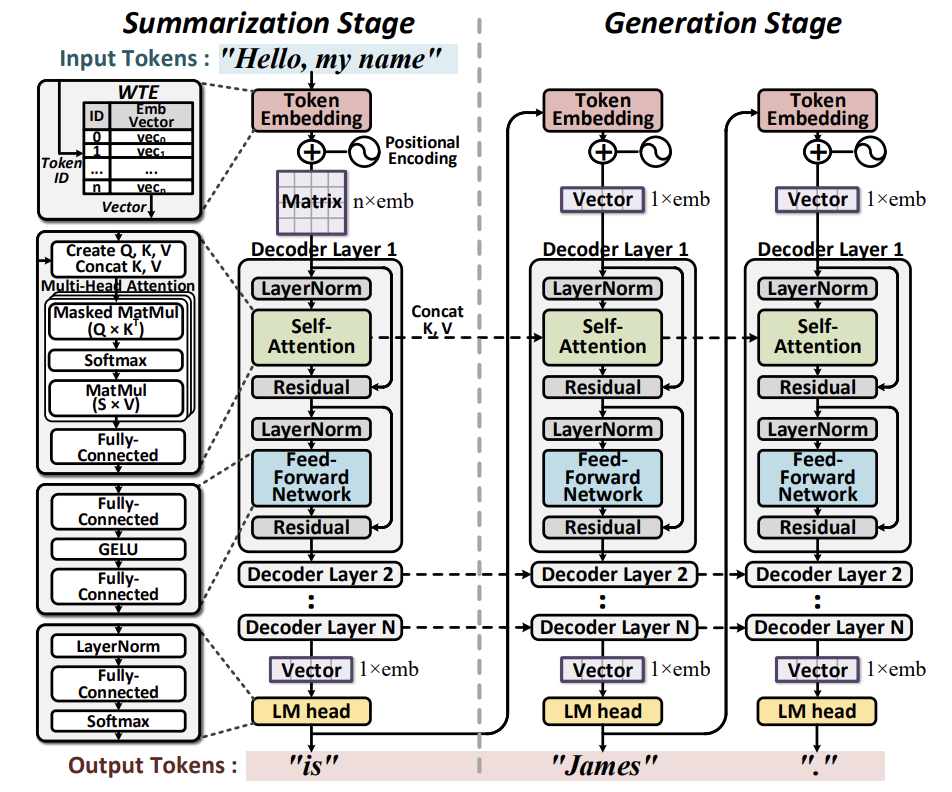
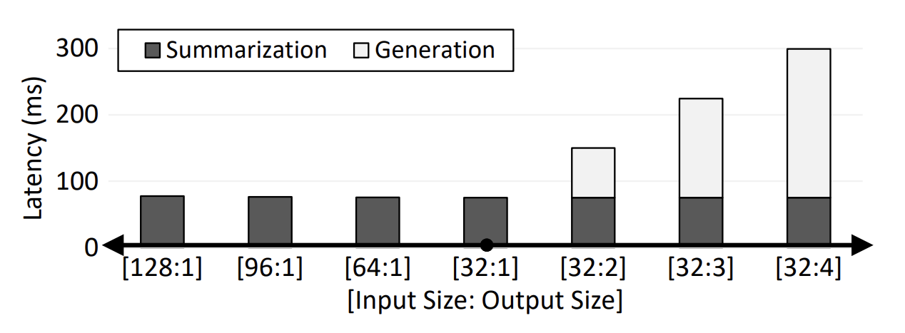
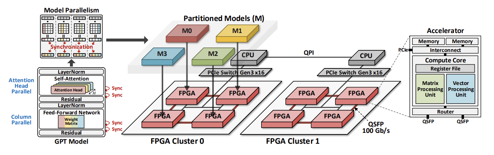
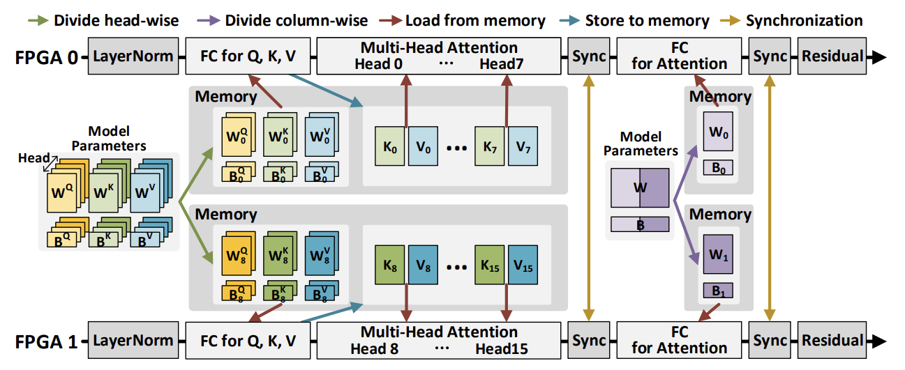

## Paper Review 1  

## DFX: A Low-latency Multi-FPGA Appliance for Accelerating Transformer-based Text Generation  

By Seongmin Hong(KAIST), Seungjae Moon(KAIST), Junsoo Kim(KAIST), Sungjae Lee(NAVER), Minsub Kim(NAVER), Dongsoo Lee(NAVER), and Joo-Young Kim(KAIST)  

---

### Abstract  

트랜스포머(Transformer)는 데이터 센터에서 자연어 처리(NLP)를 하는 데 널리 사용하는 딥러닝 언어 모델이다. 여러 트랜스포머 모델 중 GPT는 가장 주목할 만한 성과를 만들었다. 요약 단계에서 큰 사이즈의 인풋 텍스트를 처리한 후 생성 단계에서는 하나의 단어를 시간 순서대로 생성한다. GPU는 병렬 처리에 특화되어 있으므로 요약 단계에서는 잘 작동하지만 생성 단계에서는 텍스트 생성의 Sequential Characteristic 때문에 성능이 크게 떨어진다. 이로 인한 high latency 문제를 해결할 수 있는 효과적인 하드웨어 플랫폼이 필요하다.  

DFX는 Multi-FPGA 가속기인데, GPT-2 모델의 요약 및 생성 단계를 모두 low latency 및 high throughput으로 처리할 수 있다. DFX는 모델 병렬 처리 및 최적화된 데이터 흐름을 사용하며, 모델과 하드웨어를 인식하고 있어서 여러 장치 간의 작업을 동시에 빠르게 실행할 수 있다. DFX의 코어는 맞춤형 명령어들을 사용하며 GPT-2의 동작을 처음부터 끝까지 제공한다. 우리는 이 하드웨어 구조를 4개의 Xilinx Alveo U280 FPGA에 적용하였고 모든 HBM 채널과 계산 리소스들을 사용하여 하드웨어 효율을 높인다. DFX는 GPT-2 모델을 작동시켰을 때 NVIDIA V100 GPUs 대비 5.58배의 속도 향상과 3.99배의 에너지 효율 향상을 달성하였다. 또한, GPU appliance보다 비용 효율이 8.21배 높기 때문에 텍스트 생성 기술의 유망한 해결책이다.

---

### I. Introduction  

트랜스포머는 딥러닝 언어 모델로 인풋 데이터의 각 부분마다 중요도 가중치를 다르게 주는 어텐션 기법을 사용한다. RNN와 LSTM으로 회귀와 글로벌 디펜던시 문제를 해결하면서 사실상 텍스트 생성과 같은 자연어 처리의 표준 기법으로 자리 잡았다. 트랜스포머 모델 중 Generative Pre-trained Transformer (GPT)는 클라우드 서비스에 널리 이용되며 텍스트 생성에 주목할만한 성과를 거두고 있다.  

텍스트 생성 과정은 요약과 생성 단계로 나뉘는데, 언어 모델은 인풋 토큰으로부터 생성된 인풋 context를 이용하여 지속적으로 연속적인 아웃풋 토큰을 생성한다. 생성 단계는 각 iteration 마다 하나의 아웃풋 토큰을 생성하며 이전 단계의 아웃풋 토큰을 인풋으로 사용한다. 반면에 언어 모델은 iteraions 동안 Contextual Features를 저장한다. 현재의 서버 플랫폼에서는 택스트 생성에 GPU를 사용한다. GPU의 대량 병렬 계산 유닛은 인풋 토큰을 동시에 계산할 수 있게 하기 때문에 요약 단계에서 좋은 성능을 발휘한다. 그치만 Sequential Processing에는 맞지 않기 때문에 성능이 생성 단계에서는 성능이 저하된다.  

여러 개의 아키텍쳐가 트랜스포머를 가속시키기 위해 제안된 바 있다. 어텐션 메커니즘은 문맥 이해를 위한 행렬 곱과 소프트맥스로 구성되어 있고 연산적으로 가장 intensive 하기 때문에 주된 걱정거리였다. 그러나 언어 서비스는 트랜스포머의 전체적인 구조를 고려해야 한다. 데이터 센터가 위의 가속기 구조들을 채택하려면 서버 플랫폼이 추가적인 CPU나 연산 모듈을 필요로 해서 overhead가 늘어난다. 따라서 전체적인 GPT 작동을 수행할 수 있는 단일화되고 프로그램할 수 있는 아키텍쳐가 필요하다.  

본 논문에서는 DFX라는 Multi-FPGA 가속기를 제안한다. 이 가속기는 텍스트 생성에 최적화 되어있고 다양한 GPT 모델에 적용할 수 있다. Sequential Characteristic을 다루기 위해 DFX의 연산 코어는 단일 토큰 처리에 최적화 되어있다. 또한, 최대 HBM을 위해 GPT의 특성에 기반한 효과적인 Tiling Scheme과 dataflow를 사용한다. 증가하는 모델 사이즈를 다루기 위해 모델 병렬 처리를 하여 연산 코어의 피지컬 수를 늘리고 로드를 고르게 분배한다. GPT 모델은 지속적으로 변화하고 다른 언어 서비스로 확장할 수 있도록 FPGA 모델을 이용한다. FPGA 기반 가속기 ASIC 기반과 비교했을 때 다시 프로그래밍 할 수 있는 하드웨어를 최저 비용으로 제공한다.  

주요 기여
- GPU 같은 병렬 하드웨어에서 텍스트 생성은 텍스트 생성의 순차적 특성으로 인해 병목 현상이 발생하는 것을 확인한다.  
- 높은 하드웨어 활용도를 가진 GPT 추론 가속화에 최적화된 프로그래밍 가능한 맞춤형 코어를 설계한다.
- GPT에 기반한 tiling scheme과 dataflow로 full HBM을 이용하여 low latency와 high throughput을 달성한다.
- 최소한의 data synchronization과 최고의 병렬 처리를 달성하는 방향으로 Multi-FPGA 시스템에 모델 병렬 처리와 효율적인 네트워크를 적용해서 모델 파라미터를 고르게 분배한다.
- GPU 기반 플랫폼보다 몇배 더 적은 비용으로 몇배 더 좋은 성능과 효율을 내는 트랜스포머 기반 언어 서비스를 구동할 수 있는 Multi-FPGA 시스템을 만든다.  

---
### II. Background  
**A. GPT Language Model**  
  GPT는 자연어 처리에서 가장 높은 정확도를 보이는 트랜스포머 기반의 구조이다. 원시적인 트랜스포머는 인코더와 디코더 파트로 이루어져 있는데 각각 인풋과 아웃 시퀀스의 처리를 담당한다. 그러나 GPT는 텍스트 생성에 초점을 맞췄기 때문에 디코더만 가지고 있다. GPT가 인코더를 없앨 수 있었던 것은 인코더 대신 미리 훈련된 행렬을 사용하는 Token Embedding 이라는 방법을 사용하기 때문이다. 게다가, GPT의 모델 사이즈와 디코더 레이어 수는 더 높은 정확도와 토큰 생성의 정교함을 위해 더 많은 파라미터를 요구하면서 점점 증가하고 있다. 최근에 OpenAI는 GPT-3를 발표했는데 공공 도메인에서는 사용할 수 없다. 이 논문에서는 공공 도메인에서 사용가능 한 GPT-2 모델을 사용하였다. GPT-2 모델의 하드웨어 가속 전략은 Size만 늘리면 GPT-3에도 적용이 가능하다는 점에 주목한다.  

  GPT-2 Structure  
  디코더의 시작 부분에 위치한 Token Embedding은 인풋 단어들을 임베딩 벡터로 변환한다. 인풋 단어들은 Dictionary에 기반하여 Token ID로 변환된다. Pre-trained Matrices와 Word Token Embedding (WTE), 그리고 Word Position Embedding (WPE)는 Token ID와 인덱스 하여 대응되는 벡터를 얻는다. WTE는 토큰 관련 인코딩, WPE는 위치 관련 인코딩을 포함한다. LM head는 디코더의 마지막 부분에 위치하여 있고 Token Embedding과 반대되는 역할을 한다. 아웃풋 임베딩 벡터를 Token ID로 변환한다. 이 과정은 WTE의 transpose와의 행렬 곱을 요구하며, softmax를 적용하여 가장 높은 확률을 가진 Token ID를 선택한다. 선택된 Token ID가 생성된 단어를 나타낸다.  

  

  GPT-2는 Token Embedding과 LM head 사이에 N개(모델 사이즈가 결정)의 디코더 레이어를 가지고 있다. 하나의 디코더 레이어는 크게 4가지로 구분된다: Self-attention, Feed-forward Network, Layer Normalization, Residual. Self-attention은 디코더를 위한 어텐션 기법이고 트랜스포머의 주된 요소다. Query, Key, Value 행렬을 생성해서 어텐션 행렬을 구한다. Query는 현재 주어진 단어와 관련이 있고 Key와 Value는 전체 문맥의 흐름을 나타낸다. GPT-2는 H개의 독립적인 행렬 계산을 수행하기 위해 어텐션 가중치를 H개의 열로 나누는 멀티헤드 어텐션을 사용한다. H는 어텐션 헤드 개수를 나타내는 하이퍼 파라미터이며 모델 사이즈가 증가함에 따라 증가한다. 또 다른 중요한 동작은 Feed-forward Network인데, 이것은 DNN에서 흔히 사용된다. 이것은 두 개의 FC Layers와 GELU 활성화 함수로 이루어져 있다. Layer Normalization와 Residual은 Self-attention와 Feed-forward Network 주변에 위치하며 거대 모델을 fine-tune 하기 위함이다.  

  주어진 Context에 따라 토큰을 생성하기 위해서 GPT-2 모델은 요약 단계외 생성 단계를 포함한다. 요약 단계는 전체 Context를 인풋으로 받기 때문에 디코더의 인풋 차원은 n x emb 이다. n은 context의 토큰 길이(갯수)이다. 참고로 1.5B 모델의 emb = 1600이다. 임베딩 벡터는 디코더로 fed 되는데 가중치 행렬 사이즈가 emb x emb 거나 더 크며 아웃풋 행렬은 초기 디멘션과 크기가 같은 n x emb이다. 아웃풋 행렬의 마지막 행만 LM head에서 처리되고 첫번째 토큰이 생성된다. 맥락을 나타내는 Key와 Value 행렬도 요약 단계에서 생성된다. 생성 단계에서 이전에 생성된 토큰이 디코더에 들어가므로 인풋 디멘션이 1 x emb 이다. 토큰 생성은 이전의 문맥에 따라 결정되므로 생성 단계는 새 인풋의 context를 Key와 Value 행렬의 행에 appending 함으로써 row demension을 1씩 늘려서 업데이트한다. 예를 들어 "Hello, my name"이 context이고 input token length가 4이면 4 x emb Key and Value 행렬이 생성되고 요약 단계 때 첫번째 output token인 "is"가 생성된다. 만약 output token length가 3이면 2번의 iterations를 더 하게 되고 Key and Value 행렬의 행이 iteration 마다 1씩 늘어난다. 그러면 디코더에서 "James"와 "."가 차례로 출력된다. 최종적으로 생성된 토큰들이 합쳐져서 "Hello, my name is James."가 되는 것이다.  
  주어진 Context의 길이와 아웃풋 단어들의 길이는 요약 단계와 생성 단계에서 연산의 양에 영향을 주므로 workloads에 따라 걸리는 시간이 달라진다.  

  **GPT-2 Workload**  
  위 과정을 통해 GPT-2는 인풋 Context을 통해 단어와 문장을 생성할 수 있다. 몇몇 텍스트 생성 작업은 대화 시스템과 토픽 투 에세이 등을 지원한다. 작업에 따라 Context와 Generation 간의 비율이 달라진다. 예를 들어서 챗봇 서비스는 평균 인풋 토큰이 50인데 아웃풋 토큰도 50이라 비율이 1:1이다. 반면에, OpenAI의 기사 작성 작업은 인풋이 최대 50, 아웃풋이 최대 150까지 나올 수 있어서 그 비율이 50:1에서 1:150으로 다양하다. 질문-답 형식은 인풋이 아웃풋 보다 훨씬 길다. 데이터 센터에서 GPT-2는 요약 단계에서 만들어진 인풋 토큰보다 더 긴 아웃풋 토큰을 만들어내기 위해 사용된다.  

**B. Parallelism in Deep Learning**  

  NLP 모델을 훈련시키고 추론하는데 주로 GPU가 사용된다. 하나의 모델을 여러개의 Worker로 나누어 프로세스 하는데 여러 방법이 있지만, 여기서는 다음의 두가지 방법이 사용된다.  

  **Data Parallelism**  
  Data Parallelism은 batch를 여러개의 worker에 분산시키는 방법이다. 각 worker들은 각자의 batch data를 가지고 개인적으로 연산을 수행한다. 이것은 훈련에는 적합하지만 추론에는 적합하지 않다. 왜냐하면 추론에는 사용자의 요청이 반영된 싱글 사이즈의 batch나 batch가 아닌 인풋이 사용되기 때문이다.  

  **Model Parallelism**  
  Model Parallelism은 모델 파라미터를 여러 worker로 나눈 후 동시에 프로세스한다. 각 worker에 할당되는 양이 줄어들기 때문에 GPT-2나 BERT 같은 거대 모델에 적합하다. 가장 많이 사용되는 scheme은 pipelined parallelism과 intra-layer parallelism이다. 전자의 경우 하나의 worker만 group of operations을 수행하고 결과를 다른 operation을 수행하는 worker로 넘긴다. 전체 과정은 높은 throughput을 위해 파이프라인 되지만 latency는 줄어들지 않는다. 후자는 행렬 곱처럼 병렬 처리가 가능한 연산들을 여러 장치로 나눔으로써 실행 시간이 상당히 줄어든다. 반면 전체 아웃풋을 필요로 하는 연산이 나오면 그 전에 synchronization이 필요하여 performance가 synchronizations과 physical devices 수에 의존한다.  

### III. Motivation  

**A. Sequential Characteristic**  
  위에서 말한 것처럼 요약 단계는 여러 토큰을 동시에 처리해야 하고, 생성 단계는 연속적으로 처리해야 한다. 그래서 대량의 병렬처리 유닛과 높은 Bandwidth을 가지고 거대한 인풋 토큰을 처리하는 GPU는 생성 단계 때 성능이 저하된다. 생성 단계의 Sequential Process는 병렬화가 어렵고 연산이 GPU의 모든 거대 연산 유닛을 이용할만큼 intensive 하지 않다. 결과적으로 상당한 underutilization이 발생한다. 아래 그림은 각각의 아웃풋 토큰들이 평균 75.45 ms 정도로 latency를 크게 증가시키는 것을 보여준다. 반면 인풋 토큰들은 평균 0.02ms 정도 밖에 증가시키지 않았다. 텍스트 생성은 주로 긴 아웃풋 토큰을 내보내기 때문에 아키텍쳐를 개선해서 throughput을 유지하면서 생성단계의 속도를 높이는 것이 필요하다.  

  

  또한 batch size가 GPT-2 모델의 latency와 throughput에 미치는 영향도 조사하였다. 응용 레벨에서 데이터 센터가 다양한 사용자의 입력을 배치 처리하는 경우, 사용자로부터 입력을 수집하는데 걸리는 시간으로 인해 배치 크기가 증가하여 latency가 증가한다. 결과적으로 현재 데이터 센터들은 입력을 완전히 수집하지 않고 모델을 실행하는 것을 선호한다. 이 경우 주어진 배치에서 채워지지 않은 인풋 수에 따라 Utilization이 선형적으로 감소하므로, 적은 latency로 싱글 인풋 토큰을 처리할 수 있는 최적화된 datapath가 필요하다.  

**B. End-to-End Acceleration**  

  대부분의 이전 연구들은 트랜스포머의 어텐션 메커니즘만 목표로 두고 몇 개만 Feed-forward Network를 포함시켰다. 반면 GPT-2는 토큰 임베딩, layer normalization, residual, LM head 같은 추가적인 프로세스를 포함한다. 어텐션이 시간의 대부분을 차지하기 때문에 다른 프로세스들은 무시했던 것이다. 반면, 만약 GPT-2를 처음부터 끝까지 실행하게 되면 나머지 프로세스들도 호스트에 의해 완성되어야 한다. 모델이 디코더 층을 반복적으로 실행하기 때문에 호스트와 가속기 사이에 데이터 전송이 과도해져서 쉽게 병목현상으로 이어질 수 있다. 그러므로 전체적인 GPT-2 프로세스를 지원하는 가속기가 필요하다.  

  게다가 GPT-2는 GPU가 완성하기에 덜 최적화된 연산들이 포함되어 있다. 아래 그림은 Layer Normalization과 Residual에 사용된 연산의 비율이 전체의 0.11%에 불과함에도 시간은 22.8%로 GPU에서 아주 비효율적이라는 것을 보여준다. Domain-specific 가속기는 하드웨어가 이런 복잡한 연산에 특화되도록 한다. 그러므로 GPT-2에 최적화된 대체 가속기가 필요하다.  

**C. Parallel Computing**  

  GPT-2는 거대 모델 파라미터의 대량 연산을 요구하므로, 거대 모델을 여러개의 노드로 나누어 병렬 처리 하는 것이 바람직하다. GPT-2의 증가하는 디멘션으로 인해 하나의 장치는 메모리 BW와 용량 면에서 부족하다. 텍스트 생성에서는 latency 역시 중요하므로 여러 장치가 workload를 나누어 전체적인 실행 시간을 줄여아한다. 이런 부족함을 달래기 위해 병렬 연산을 최소한의 latency 증가로 극대화 할 수 있는 Model Parallelism와 Efficient Network를 채택하는 다중 장치 시스템이 필요하다.  

### IV. DFX Architecture  

**A. Architecture Overview**  

  DFX 구조는 FPGA에 기반한 거대 트랜스포머 언어 모델을 가속하기 위해 디자인되었다. 아래 그림처럼 DFX는 듀얼 소켓 CPU와 여러개의 FPGA들로 이루어진 서버 어플라이언스 아키텍쳐이다. 하나의 CPU와 4개의 동일한 FPGA로 구성된 클러스터가 독립적인 연산을 수행하는 시스템이 된다. 각 FPGA는 하나의 연산 코어를 갖고 있어서 클러스터 마다 4개의 코어를 갖게 된다. FPGA 들은 16 GB/s로 데이터를 전송할 수 있는 PCIe Gen3 Subsystem으로 호스트 CPU와 연결되어 있다. FPGA-to-FPGA 통신은 100 Gb/s의 전송 속도를 가진 QSFP transceiver로 이뤄진다. 각 FPGA가 두 개의 QSFP 포트들로 한정되어 있어서 네트워크 토폴로지 중 ring network가 선택되었다. 클러스터 당 4개의 FPGA만 선택했음에도 monetary 비용만 고려하면 scalable 하다.  
    

**B. Homogeneous Multi-FPGA Cluster**  

  거대 스케일의 언어 모델을 효과적으로 처리하게 위해서 Intra-Layer Parallelism을 적용했다. 최소한의 동기화 오버헤드로 Worker의 수에 비례하여 행렬 계산의 latency를 줄이기 위해 특정 Intra-Layer 분할 기법이 사용된다. 반대로, 파이프라이닝은 높은 latency를 발생시키는데, 그 이유는 모든 worker 들이 단일 인풋을 위해 각 연산을 완전히 실행하기 때문이다. 게다가 만약 텍스트 생성처럼 최종 아웃풋 결과가 다음 인풋이 되는 경우 두 scheme 간 latency 차이가 디코더 갯수에 따라 선형으로 증가할 것이다. 아래 그림을 보면, 멀티 헤드 어텐션을 위해서 가중치 행렬이 헤드 마다 나눠지고, FC layer를 위한 가중치 행렬이 column-wise 하게 나뉘어서 FPGA가 개인적으로 일할 수 있게 한다. 나눠진 행렬들은 주어진 코어에 해당하는 FPGA의 메모리 부분에 저장되고, 각 코어는 동일한 연산을 나눠진 모델 파라미터들을 이용해 병렬적으로 실행한다. 각 코어는 Subvector에 해당하는 최종 결과를 얻고, 각 Subvector 들은 동기화를 위해 ring network를 통해 다른 FPGA로 순환된다. 동기화가 끝나면 각 코어들은 완전한 vector를 얻게 되어 다음 벡터 연산을 진행하게 된다. 전반적으로 우리는 이 동기화가 셀프 어텐션과 Feed-forward Network 중간과 이후에 한번씩 필요하여 decoder layer 마다 총 4번이 필요하다. 따라서 데이터 동기화와 전송을 줄여서 각 FPGA는 동일한 연산을 동일한 하드웨어에서 진행하고 4개의 FPGA가 클러스터를 형성한다.  

  **Memory Mapping**  
  FPGA는 8 GB HBM과 32GB DDR를 장착하여 이론적인 최고 BW가 각각 460 GB/s와 38 GB/s이다. 가중치 행렬은 HBM에 저장된다. 반면, 인풋/아웃풋 토큰, 바이어스 벡터, 다른 모델 파라미터들은 몇 iteration에 한 번 이나 전체 decoder 단계에서 한 번 접근되기 때문에 DDR에 저장된다. DFX는 표준 half-precision floating-point (FP16) 모델 파라미터를 이용해서 추론 정확도를 유지한다.  

  

    

---
### 용어 정리
- FPGA는 프로그래밍이 가능한 반도체 장치로 많은 게이트와 논리 블록을 포함하여 다양한 하드웨어 기능을 구현하도록 연결할 수 있다. Multi-FPGA는 말 그대로 여러 개의 FPGA를 동시에 사용하는 시스템을 말한다.  

- Batch 처리는 데이터 센터가 다향한 사용자의 입력을 하나의 큰 데이터 덩어리로 처리한다는 것을 의미한다. 그렇기 때문에 데이터 수집과 처리에 필요한 시간이 달라질 수 있고, 이는 전체 시스템의 대기 시간과 처리량에 영향을 미칠 수 있다.  

- 멀티 헤드 어텐션은 전체 모델에서 동일한 입력에 대해 여러 어텐션 헤드가 동시에 동작한다. 각 헤드는 입력 데이터의 다른 특성을 포착하여 처리할 수 있게 한다.  
