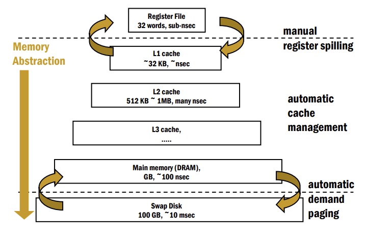
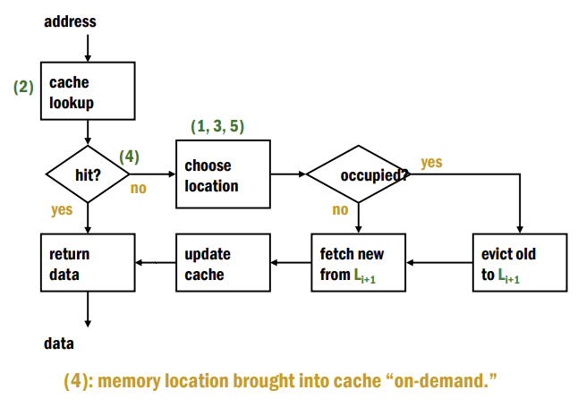
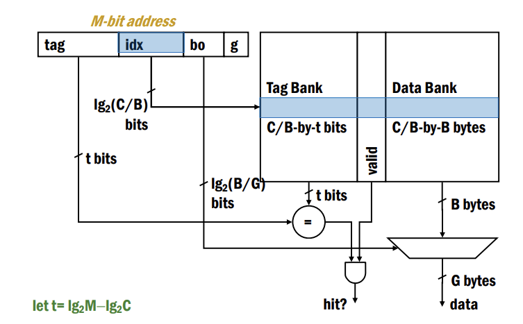

## Cache Architecture  

(작성 중)
---

**Why Caches?**  

32-bit 메모리 주소를 가진 컴퓨터에서 현실적으로 모든 프로그램이 4GB의 메모리를 1 cycle 안에 접근하는 것은 불가능하다. 

대부분의 컴퓨터는 여러 프로그램을 멀티 태스킹으로 실행할 뿐더러, 메모리 사이즈가 커질수록 접근 속도가 느려지기 때문이다.  

**Cache**는 이러한 문제점을 해결하고자 고안된 방법이다. 시스템 적으로 메모리 계층 구조를 사용해서 속도를 늘리고, 가상 메모리를 사용해 연속적이고 프라이빗한 (것 같은) 메모리를 제공한다. 

---

**Principles**  

Temporal Locality와 Spatial Locality에 기반해서 가장 최근에 이용된 데이터들, 즉 가까운 미래에 사용될 가능성이 높은 데이터들을 DRAM 보다 접근 속도가 빠른 캐시 메모리에 저장해서 속도를 높인다.   

- Temporal Locality: 프로그램은 같은 장소를 짧은 시간 내에 여러번 반복하는 경향이 있다. ex) loops  
- Spatial Locality: 프로그램은 근처에 있는 비슷한 메모리 주소를 참조하는 경향이 있다. ex) array

---

**Modern Memory Hierarchy**  

현대 컴퓨터의 메모리 계층이다. 레지스터 파일을 제외하면 모두 자동으로 관리되는 시스템이다. 위로 갈수록 접근 속도가 빠르고 용량은 적은 것을 볼 수 있다. 

---

**Cache Design Basics**  

캐시는 SRAM 기반이다. DRAM으로의 접근을 줄이는 것이 목적이지만, 크기가 DRAM 보다 훨씬 작기 때문에 Miss가 생길 수 밖에 없다. 따라서 데이터를 효율적으로 저장해야 Hit Ratio를 높일 수 있다.  

기본 작동 원리는 다음과 같다.  

Hit이면 바로 사용하면 되지만, Miss인 경우 더 하위 계층에서 데이터를 Fetch 해와야 한다. 

다음 파라미터들로 캐시가 디자인되는데, M은 메모리 사이즈, G는 접근 사이즈, C는 캐시의 사이즈를 뜻한다.  

$$
M = 2^m, G=2^g, C
$$

---

**Direct-Mapped Cache**  

