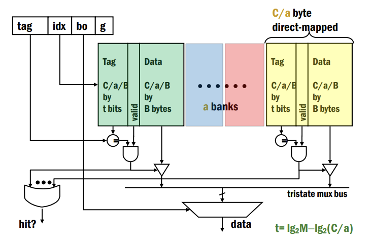
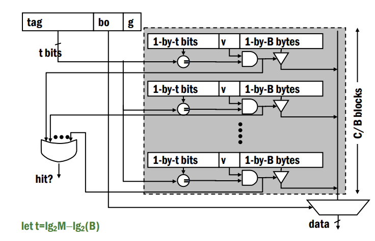

## Cache Architecture  

---

**Why Caches?**  

32-bit 메모리 주소를 가진 컴퓨터에서 현실적으로 모든 프로그램이 4GB의 메모리를 1 cycle 안에 접근하는 것은 불가능하다. 

대부분의 컴퓨터는 여러 프로그램을 멀티 태스킹으로 실행할 뿐더러, 메모리 사이즈가 커질수록 접근 속도가 느려지기 때문이다.  

**Cache**는 이러한 문제점을 해결하고자 고안된 방법이다. 시스템 적으로 메모리 계층 구조를 사용해서 속도를 늘리고, 가상 메모리를 사용해 연속적이고 프라이빗한 (것 같은) 메모리를 제공한다. 

---

**Principles**  

Temporal Locality와 Spatial Locality에 기반해서 가장 최근에 이용된 데이터들, 즉 가까운 미래에 사용될 가능성이 높은 데이터들을 DRAM 보다 접근 속도가 빠른 캐시 메모리에 저장해서 속도를 높인다.   

- Temporal Locality: 프로그램은 같은 장소를 짧은 시간 내에 여러번 반복하는 경향이 있다. ex) loops  
- Spatial Locality: 프로그램은 근처에 있는 비슷한 메모리 주소를 참조하는 경향이 있다. ex) array

---

**Modern Memory Hierarchy**  

현대 컴퓨터의 메모리 계층이다. 레지스터 파일을 제외하면 모두 자동으로 관리되는 시스템이다. 위로 갈수록 접근 속도가 빠르고 용량은 적은 것을 볼 수 있다. 

---

**Cache Design Basics**  

캐시는 SRAM 기반이다. DRAM으로의 접근을 줄이는 것이 목적이지만, 크기가 DRAM 보다 훨씬 작기 때문에 Miss가 생길 수 밖에 없다. 따라서 데이터를 효율적으로 저장해야 Hit Ratio를 높일 수 있다.  

기본 작동 원리는 다음과 같다.  

Hit이면 바로 사용하면 되지만, Miss인 경우 더 하위 계층에서 데이터를 Fetch 해와야 한다. 

다음 파라미터들로 캐시가 디자인되는데, M은 메모리 사이즈, G는 접근 사이즈, C는 캐시의 사이즈를 뜻한다.  

$$
M = 2^m, G=2^g, C
$$

---

### **Direct-Mapped Cache**  

Direct-Mapped Cache의 경우 같은 인덱스 자리에 여러 데이터가 매핑될 수 있기 때문에 이들을 구별하기 위해서 Tag가 필요하다. M bytes 메모리에 있는 데이터가 C bytes 메모리에 들어가므로 M/C개의 메모리 블록이 동일한 캐시 인덱스에 대응된다. 따라서 이들을 구별하기 위해서는 $log_2 (M/C)$ 만큼의 Tag 비트가 저장되어 있어야 한다. 다시 말하면, $2^{tag}$ 만큼의 주소 중에 하나만 캐시에 저장될 수 있다. 

캐시 용량이 C bytes이고, 한 블록의 용량이 B bytes이면, 캐시 라인의 수는 $C/B$개가 된다. 따라서 캐시 라인의 인덱스 비트는 $log_2 (C/G)$가 된다. B bytes인 한 블록은 G bytes의 Word로 구성되어 있으므로, 블록 인덱스 비트 $bo$는 $log_2 (B/G)$가 된다. $g$는 $log_2 (G)$이다. Tag 비트는 $log_2(M/C)$ 혹은 M-bit에서 나머지 비트들을 빼서 구할 수 있다. 랜덤한 두 주소가 주어졌을 때 캐시 충돌이 일어날 확률은 캐시 라인 개수의 역수인 $1/{C/B}$이다. 따라서 캐시 라인 수(블록 수)인 $C/B$가 커지면 충돌이 줄어들게 된다.  

블록 사이즈 B가 커지면 한 번에 많은 데이터를 로드하므로, Spatial Locality가 강한 상황에서 Prefetching의 효과가 좋을 수 있지만, 블록 수가 줄어들어서 충돌 가능성이 높아진다. 또한, 블록 사이즈가 크면 로드하는 데 Latency가 커지므로 필요한 Word를 먼저 로드해서 파이프라인에 공급하고 나머지를 로드하거나, 서브 블록들에 Valid Bit를 추가해서 Request가 날라온 서브 블록만 교체하는 방법 등이 있다.  

---

### **Set-Associative Cache**  

Direct-Mapped Cache의 각 메모리 블록은 캐시의 특정 인덱스 딱 한 곳에만 저장될 수 있었다. 구현은 간단하지만, 동일한 인덱스에 여러 메모리 블록이 매핑되면 충돌이 발생한다.  

Set-Associative Cache는 Direct-Mapped Cache를 여러 세트로 나눈 것이다. 같은 인덱스에 매핑되는 메모리 블록이 a개의 Bank 중 아무 곳에 저장될 수 있어서 충돌이 줄어든다.  

각 Bank는 C/a byte짜리 Direct-Mapped Cache과 같다. Tag는 이제 a에 대한 정보도 포함해야 하므로, $t=log_2 M - log_2 (C/a)$가 된다. $log_2 a$ 비트 만큼 늘어난 것을 볼 수 있다. 

Direct-Mapped Cache는 $C/B \times B$ 였다면 Set-Associative Cache는 $C/a/B \times B \times a$가 된 것이다.  

이제 인덱스가 주어지면 a개의 Bank를 Search 해서 일치하는 Tag를 찾아야 한다. 따라서 a-to-1 Multiplexer가 필요하다. 그리고 그 인덱스에 업데이트 요청이 들어오면 a개의 Bank 중에서 어떤 것을 업데이트 할 지 결정하는 Replacement Policy가 필요하다. 가장 옛날에 사용된 캐시를 날리는 Least Recently Used (LRU) 정책, Random 하게 날리는 정책 등이 있다.  

---

### **Fully Associative Cache**  

$a=C/B$인 Set Associative Cache라고 보면 된다. 인덱스 비트가 없어서 모든 메모리 블록이 아무 라인에나 저장될 수 있다. 매우 유연하지만 검색 비용도 매우 크고 느리다.  

Cache 구조가 $C/(C/B)/B \times B \times C/B = 1 \times B \times C/B$가 된다. Tag가 주어지면 모든 엔트리를 찾아서 데이터가 있으면 리턴한다. 모든 캐시 블록마다 Comparator가 필요하고 거대한 Multiplexer와 Wire가 필요하다.  

다행히도 a=4 정도인 Set-Associated Cache를 사용해도 성능에 문제가 없어서 Fully Associative Cache는 잘 사용하지 않는다.  

---

**Cache Misses**  

