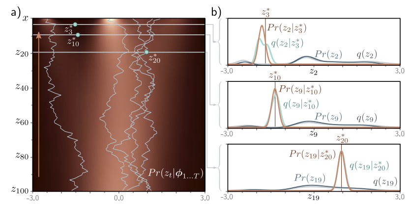
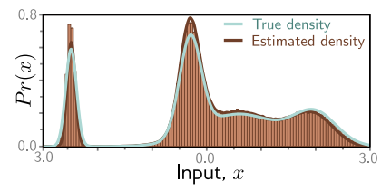
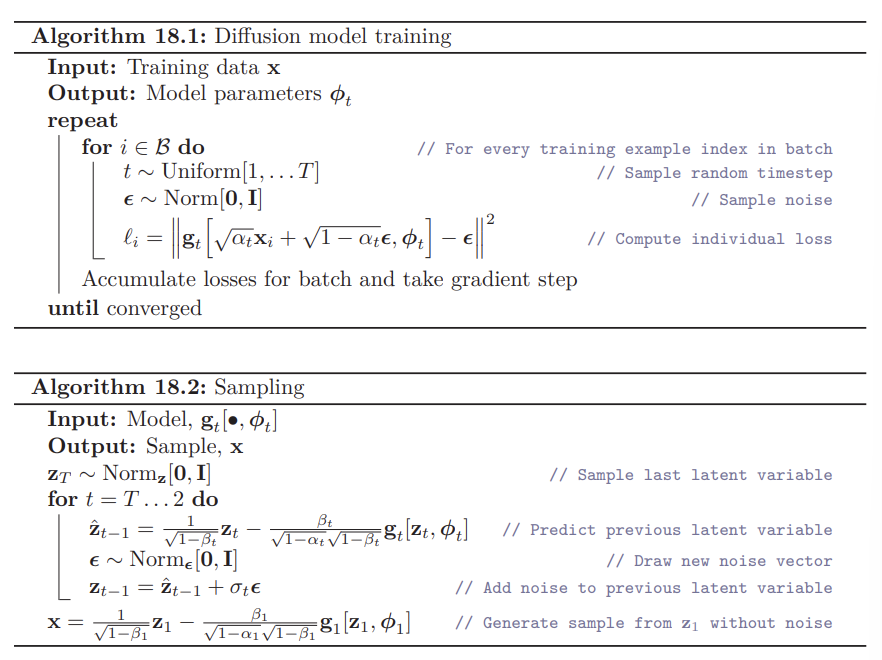
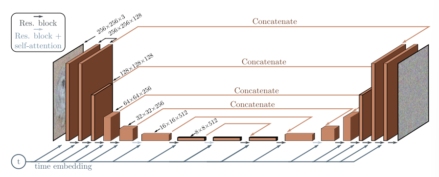
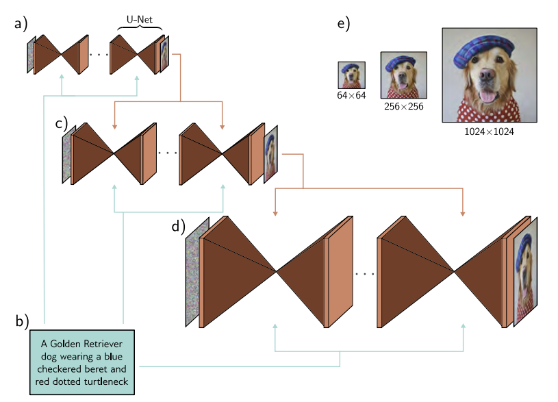

## **Diffusion Models**  

---

### **1. Overview**  

Diffusion Model은 Encoder와 Decoder로 구성된다. Encoder는 Pre-specified 되는 과정이고, Decoder가 Learnable 한 과정이다. 

  

Encoder(Forward, Diffusion Process)는 $\mathbf{x}$를 latent variable인 $\mathbf{z}_1, \mathbf{z}_2, ... , \mathbf{z}_T$에 Mapping 한다. White Noise를 첨가하는 과정이라고 보면 된다. 이를 충분히 반복하면 $q(\mathbf{z}_T \vert \mathbf{x})$와 $q(\mathbf{z}_T)$가 Standard Normal Distribution이 되고, Noise만 남은 상태가 된다.  

Decoder(Backward, Reverse Process)는 학습 가능한 네트워크로 Encoder의 역과정이다. Noise가 점차 제거되면서 데이터 샘플을 생성한다. 

---

### **2. Encoder (Forward Process)**  

$$
\mathbf{z}_1 = \sqrt{1-\beta_1} \cdot \mathbf{x} + \sqrt{\beta_1} \cdot \epsilon_1  
$$

$$
\mathbf{z}_t = \sqrt{1-\beta_t} \cdot \mathbf{z}_{t-1} + \sqrt{\beta_t} \cdot \epsilon_t  
$$

$\epsilon_t$는 Standard Normal Distribution에서 나온 Noise이다. $\beta_t \in [0, 1]$는 noise schdule을 위한 hyperparameter로, 노이즈가 섞이는 속도를 결정한다.  

$$
q(\mathbf{z}_1 \vert \mathbf{x}) = N_{\mathbf{z}_1} \left[ \sqrt{1-\beta_1}\mathbf{x}, \beta_1 \mathbf{I} \right]
$$

$$
q(\mathbf{z}_t \vert \mathbf{z}_{t-1}) = N_{\mathbf{z}_1} \left[ \sqrt{1-\beta_t}\mathbf{z}_{t-1}, \beta_t \mathbf{I} \right]  
$$

직전 단계의 변수에만 영향을 받는 Markov Chain이라고 볼 수 있다. 충분한 단계 T가 지나면, 원본 데이터의 특성은 사라지고 $q(\mathbf{z}_T \vert \mathbf{x}) = q(\mathbf{z}_T)$인 표준 정규 분포가 된다.  
  
Joint Distribution은 다음과 같다. 

$$
q(\mathbf{z}_{1...T} \vert \mathbf{x}) = q(\mathbf{z}_1 \vert \mathbf{x}) \prod\limits_{t=2}^{T} q(\mathbf{z}_t \vert \mathbf{z}_{t-1})
$$

결국은 위 그림처럼 $x$는 0에 수렴하고, $q(z_t \vert x)$는 mean이 0인 정규분포에 가까워진다. 
  

**2.1 Diffusion Kernel**  

$\mathbf{z}_t$ 를 계산하는 것은 t가 클 때 time-consuming 일 수 있다. 다행히도 $q(\mathbf{z}_t \vert \mathbf{x})$ 의 closed-form이 존재하고 initial data $\mathbf{x}$ 에서 바로 $\mathbf{z}_t$ 를 구하는 것이 가능하다. 이것을 diffusion kernel이라고 한다.

$$
\mathbf{z}_1 = \sqrt{1-\beta_1 \cdot \mathbf{x}} + \sqrt{\beta_1} \cdot \epsilon_1  
$$

$$
\mathbf{z}_2 = \sqrt{1-\beta_2 \cdot \mathbf{z}_{1}} + \sqrt{\beta_2} \cdot \epsilon_2  
$$

두번째 식을 첫번째 식에 대입하면, 다음을 얻는다.

$$
\mathbf{z}_2 = \sqrt{1-\beta_2} (\sqrt{1-\beta_1} \cdot \mathbf{x} + \sqrt{\beta_1} \cdot \epsilon_1) + \sqrt{\beta_2} \cdot \epsilon_2  
$$

$$
= \sqrt{1-\beta_2} (\sqrt{1-\beta_1} \cdot \mathbf{x} + \sqrt{1-(1-\beta_1)} \cdot \epsilon_1) + \sqrt{\beta_2} \cdot \epsilon_2  
$$

$$
= \sqrt{(1-\beta_2)(1-\beta_1)} \cdot \mathbf{x} + \sqrt{1-\beta_2 -(1-\beta_2)(1-\beta_1)} \cdot \epsilon_1 + \sqrt{\beta_2} \cdot \epsilon_2  
$$

서로 독립인 두 가우시안 분포의 합은 평균이 $\mu + \nu$, 분산이 $\sigma^2 + \tau^2$ 인 새로운 가우시안 분포가 된다는 점을 이용하면 다음이 쉽게 유도가 된다. 세번째 식에서 뒤에 두 항은 평균이 0이고 분산이 각각 $\sqrt{1-\beta_2 -(1-\beta_2)(1-\beta_1)}$, $\sqrt{\beta_2}$ 인 가우시안 분포이다. 따라서 두 분포를 더하면 평균이 0이고 분산이 $1-\beta_2 -(1-\beta_2)(1-\beta_1) + \beta_2 = 1 - (1-\beta_2)(1-\beta_1)$ 가 된다.

$$
\mathbf{z}_2 = \sqrt{(1-\beta_2)(1-\beta_1)} \cdot \mathbf{x} + \sqrt{1-(1-\beta_2)(1-\beta_1)} \cdot \epsilon  
$$

$\epsilon$은 표준 정규 분포이다. 위 과정을 반복하면 $\mathbf{z}_t$를 쉽게 구할 수 있다.

$$
\mathbf{z}_t = \sqrt{\alpha_t} \cdot \mathbf{x} + \sqrt{1-\alpha_t} \cdot \epsilon  
$$

$$
\alpha_t = \prod \limits_{s=1}^t 1-\beta_s  
$$

따라서 다음과 같이 확률 분포를 표현할 수 있다.

$$
q(\mathbf{z}_t \vert \mathbf{x}) = N_{\mathbf{z}_t} \left[ \sqrt{\alpha_t} \cdot \mathbf{x}, (1-\alpha_t) \mathbf{I} \right]  
$$

어떤 시작점인 $\mathbf{x}$에 대해서, $\mathbf{z}_t$는 Normally Distributed이며, 평균과 분산을 알 수 있다. 중간 과정을 생각하지 않아도 $q(\mathbf{z}_t \vert \mathbf{x})$로부터 샘플을 쉽게 생성할 수 있다. 
  

**2.2 Marginal Distributions**  

Marginal Distribution $q(\mathbf{z}_t)$는 가능한 Start Points인 $\mathbf{x}$의 분포가 주어졌을 때 $\mathbf{z}_t$를 관찰할 확률이다. Joint Distribution에서 $\mathbf{z}_t$를 제외하고 Marginalizing을 하면 $q(\mathbf{z}_t)$를 얻을 수 있다. 

$$
q(\mathbf{z}_t) = \int \int q(\mathbf{z}_{1...t}, \mathbf{x})d\mathbf{z}_{1...t-1} d\mathbf{x}  
$$

$$
= \int \int q(\mathbf{z}_{1...t} \vert \mathbf{x}) Pr(\mathbf{x}) d\mathbf{z}_{1...t-1} d\mathbf{x}  
$$

Diffusion Kernel $q(\mathbf{z}_t \vert \mathbf{x})$은 중간 단계를 스킵하므로 다음 식과 같다.  

$$
= \int q(\mathbf{z}_t \vert \mathbf{x}) Pr(\mathbf{x}) d\mathbf{x}  
$$

따라서 $Pr(\mathbf{x})$로부터 반복적으로 추출한 샘플을 Diffusion Kernel에 통과시키면, 결과는 Marginal Distribution인 $q(\mathbf{z}_t)$가 된다. $Pr(\mathbf{x})$를 모르기 때문에 Closed Form으로 나타낼 수는 없다.  

  

**2.3 Conditional Distribution**  

Bayes' rule을 적용하면 Conditional Probability를 다음과 같이 나타낼 수 있다.  

$$
q(\mathbf{z}_{t-1} \vert \mathbf{z}_t) = \frac{q(\mathbf{z}_{t} \vert \mathbf{z}_{t-1}) q(\mathbf{z}_{t-1})}{q(\mathbf{z}_t)}  
$$

Marginal Distribution인 $q(\mathbf{z}_{t-1})$가 intractable 하므로 위 식 또한 intractable 하다. 하지만 Numerically 하게 근사하여 구할 수는 있다.  

  

$$q(\mathbf{z}_{t-1} \vert \mathbf{z}_{t}^{\ast})$$는 Bayes' Rule을 통해 $$q(\mathbf{z}_{t}^{\ast} \vert \mathbf{z}_{t-1})q(\mathbf{z}_{t-1})$$에 Proportional 하다는 점을 이용해 계산한다. Marginal Density(회색선)과 $$q(\mathbf{z}_t^{\ast} \vert \mathbf{z}_{t-1})$$(갈색선)의 곱으로 $$q(\mathbf{z}_{t-1} \vert \mathbf{z}_{t}^{\ast})$$(하늘색)를 구한 것이다. 

  

**2.4 Conditional Diffusion Distribution**  

$$q(\mathbf{z}_{t-1} \vert \mathbf{z}_t)$$는 알 수 없지만, $$q(\mathbf{z}_{t-1} \vert \mathbf{x})$$는 알 수 있다는 점을 이용하여, $$q(\mathbf{z}_{t-1} \vert \mathbf{z}_t, \mathbf{x})$$를 Closed Form으로 나타낼 수 있다. 이 분포가 Decoder를 훈련시키는데 사용된다.

$$
q(\mathbf{z}_{t-1} \vert \mathbf{z}_t, \mathbf{x}) = \frac{q(\mathbf{z}_{t} \vert \mathbf{z}_{t-1}, \mathbf{x})q(\mathbf{z}_{t-1} \vert \mathbf{x})}{q(\mathbf{z}_{t} \vert \mathbf{x})}  
$$

$$
\propto q(\mathbf{z}_{t} \vert \mathbf{z}_{t-1}) q(\mathbf{z}_{t-1} \vert \mathbf{x})
$$

Diffusion Process는 Markov Chain이므로 
$$
q(\mathbf{z}_{t-1} \vert \mathbf{z}_t, \mathbf{x}) = q(\mathbf{z}_{t-1} \vert \mathbf{z}_t)  
$$ 
라는 점이 사용되었다.  

다음 식을 유도하려면 Gaussian Change of Variables Identity를 적용해야 한다.

$$
N_{\mathbf{v}}[\mathbf{Aw}, \mathbf{B}] \propto N_{\mathbf{w}} \left[(\mathbf{A}^T \mathbf{B}^{-1} \mathbf{A})^{-1} \mathbf{A}^T \mathbf{B}^{-1} \mathbf{v}, (\mathbf{A}^T \mathbf{B}^{-1} \mathbf{A})^{-1} \right]
$$

그 결과는 다음과 같다.  

$$
N_{\mathbf{z}_t} \left[ \sqrt{1-\beta_t} \cdot \mathbf{z}_{t-1}, \beta_t \mathbf{I} \right] N_{\mathbf{z}_{t-1}} \left[ \sqrt{\alpha_{t-1}} \cdot \mathbf{x}, (1-\alpha_{t-1}) \mathbf{I} \right]  
$$

$$
\propto N_{\mathbf{z}_t} \left[ \frac{1}{\sqrt{1-\beta_t}} \cdot \mathbf{z}_{t}, \frac{\beta_t}{1-\beta_t} \mathbf{I} \right] N_{\mathbf{z}_{t-1}} \left[ \sqrt{\alpha_{t-1}} \cdot \mathbf{x}, (1-\alpha_{t-1}) \mathbf{I} \right]  
$$

Second Gaussian Identity를 적용해서 위 식은 $\mathbf{z}_{t-1}$에 대해 표현할 수 있다.  

$$
N_{\mathbf{w}}[\mathbf{a}, \mathbf{A}] \cdot N_{\mathbf{w}}[\mathbf{b}, \mathbf{B}] \propto N_{\mathbf{w}} \left[(\mathbf{A}^{-1} + \mathbf{B}^{-1})^{-1} \mathbf{A}^{-1}a + \mathbf{B}^{-1}b, (\mathbf{A^{-1} + B^{-1}})^{-1} \right]
$$

그 결과는 다음과 같다.  

$$
q(\mathbf{z}_{t-1} \vert \mathbf{z}_t, \mathbf{x}) = N_{\mathbf{z}_{t-1}} \left[ \frac{1-\alpha_{t-1}}{1-\alpha_t} \sqrt{1-\beta_t}\mathbf{z}_t + \frac{\sqrt{\alpha_{t-1}}\beta_t}{1-\alpha_t}\mathbf{x}, \frac{\beta_t(1-\alpha_{t-1})}{1-\alpha_t}\mathbf{I} \right]  
$$

---

### **3. Decoder (Reverse Process)**  

$$\mathbf{z}_T$$ 에서부터 $$\mathbf{z}_{T-1}$$, ... , $$\mathbf{z}_1$$, $$\mathbf{x}$$방향으로 되돌아가면서 학습을 진행한다. 실제 $$q(\mathbf{z}_{t-1} \vert \mathbf{z}_t)$$는 복잡하기 때문에 Normal Distribution으로 근사한다.  

$$
Pr(\mathbf{z}_T) = N_{\mathbf{z}_T} \left [\mathbf{0, I} \right]  
$$

$$
Pr(\mathbf{z}_{t-1} \vert \mathbf{z}_t , \boldsymbol{\phi}_t) = N_{\mathbf{z}_{t-1}} \left [ \mathbf{f}_t[\mathbf{z}_t, \boldsymbol{\phi}_t], \sigma_t^2 \mathbf{I}  \right ]  
$$

$$
Pr(\mathbf{x} \vert \mathbf{z}_1, \boldsymbol{\phi}_1) = N_{\mathbf{x}} \left [ \mathbf{f}_1[\mathbf{z}_1, \boldsymbol{\phi}_1], \sigma_1^2 \mathbf{I}  \right ]  
$$

$$\mathbf{f}_t[\mathbf{z}_t, \boldsymbol{\phi}_t]$$ 는 Neural Network로 $$\mathbf{z}_t$$에서 $$\mathbf{z}_{t-1}$$로의 Mapping을 담당하는 정규 분포의 평균을 예측한다. $\sigma_t^2$ 항은 미리 결정되는 값이다. $\beta_t$는 hyperparameter이며, 0에 충분히 가까우면(그리고 time step T가 충분히 크면) 위의 근사가 합리적이라고 볼 수 있다. 

$$Pr(\mathbf{z}_T)$$ 에서 $$\mathbf{z}_T$$를 추출하고, $$Pr(\mathbf{z}_{T-1} \vert \mathbf{z}_T, \mathbf{\phi}_T)$$로 부터 $Pr(\mathbf{z}_{T-1})$를 추출하는 방법을 반복해서 Ancestral sampling으로 $Pr(\mathbf{x})$를 구하게 된다. 

---

### **4. Training**

Joint Distribution은 다음과 같다.  

$$
Pr(\mathbf{x}, \mathbf{z}_{1...T} \vert \boldsymbol{\phi}_{1...T}) = Pr(\mathbf{x} \vert \mathbf{z}_1, \boldsymbol{\phi}_1) \prod \limits_{t=2}^T Pr(\mathbf{z}_{t-1} \vert \mathbf{z}_t, \boldsymbol{\phi}_t) \cdot Pr(\mathbf{z}_T)  
$$

관찰된 데이터의 Likelihood는 Latent Variables에 대해 Marginalizing 함으로써 구할 수 있다.  

$$
Pr(\mathbf{x} \vert \boldsymbol{\phi}_{1...T}) = \int Pr(\mathbf{x}, \mathbf{z}_{1...T} \vert \boldsymbol{\phi}_{1...T})d\mathbf{z}_{1...T}  
$$

이 모델을 훈련시키기 위해 주어진 데이터 $\{\mathbf{x}_i\}$에 대해 log-likelihood를 최대화하는 파라미터 $\phi$ 를 찾는다. 

$$
\hat{\boldsymbol{\phi}}_{1...T} = \argmax_{\phi_{1...T}} \left[\sum\limits_{i=1}^I log\left[Pr(\mathbf{x}_i \vert \boldsymbol{\phi}_{1...T})\right]\right]  
$$

위의 Marginalization는 intractable하므로 Jensen's inequality를 이용해서 ELBO를 정의하고, $\boldsymbol{\phi}_{1...T}$를 최적화한다.  

**4.1 Evidence Lower Bound (ELBO)**  

ELBO를 유도하기 위해 다음과 같이 log-likelihood를 encoder distribution인 $q(\mathbf{z}_{1...T} \vert \mathbf{x})$ 로 나누고 Jensen's inequality를 적용한다. 이에 대한 설명은 VAE 포스트에 더 자세히 나와있다. 

$$
\log \left[ Pr(\mathbf{x}|\phi_{1 \dots T}) \right] = \log \left[ \int Pr(\mathbf{x}, \mathbf{z}_{1 \dots T}|\phi_{1 \dots T}) d\mathbf{z}_{1 \dots T} \right]
$$

$$
= \log \left[ \int q(\mathbf{z}_{1 \dots T}|\mathbf{x}) \frac{Pr(\mathbf{x}, \mathbf{z}_{1 \dots T}|\phi_{1 \dots T})}{q(\mathbf{z}_{1 \dots T}|\mathbf{x})} d\mathbf{z}_{1 \dots T} \right]
$$

$$
\geq \int q(\mathbf{z}_{1 \dots T}|\mathbf{x}) \log \left[ \frac{Pr(\mathbf{x}, \mathbf{z}_{1 \dots T}|\phi_{1 \dots T})}{q(\mathbf{z}_{1 \dots T}|\mathbf{x})} \right] d\mathbf{z}_{1 \dots T}
$$

따라서 ELBO는 다음과 같다.

$$
ELBO[\mathbf{\phi}_{1...T}] = \int q(\mathbf{z}_{1 \dots T}|\mathbf{x}) \log \left[ \frac{Pr(\mathbf{x}, \mathbf{z}_{1 \dots T}|\phi_{1 \dots T})}{q(\mathbf{z}_{1 \dots T}|\mathbf{x})} \right] d\mathbf{z}_{1 \dots T}
$$

**Simplifying the ELBO**  

$$
\log \left[ \frac{Pr(\mathbf{x}, \mathbf{z}_{1 \dots T}|\phi_{1 \dots T})}{q(\mathbf{z}_{1 \dots T}|\mathbf{x})} \right] = \log \left[ \frac{Pr(\mathbf{x}|\mathbf{z}_1, \phi_1) \prod_{t=2}^{T} Pr(\mathbf{z}_{t-1}|\mathbf{z}_t, \phi_t) \cdot Pr(\mathbf{z}_T)}{q(\mathbf{z}_1|\mathbf{x}) \prod_{t=2}^{T} q(\mathbf{z}_t|\mathbf{z}_{t-1})} \right]
$$

$$
= \log \left[ \frac{Pr(\mathbf{x}|\mathbf{z}_1, \phi_1)}{q(\mathbf{z}_1|\mathbf{x})} \right] + \log \left[ \frac{\prod_{t=2}^{T} Pr(\mathbf{z}_{t-1}|\mathbf{z}_t, \phi_t)}{\prod_{t=2}^{T} q(\mathbf{z}_t|\mathbf{z}_{t-1})} \right] + \log \left[ Pr(\mathbf{z}_T) \right]
$$

두번째 항의 분모에 다음 식을 대입한다.

$$
q(\mathbf{z}_t|\mathbf{z}_{t-1}) = q(\mathbf{z}_t|\mathbf{z}_{t-1}, \mathbf{x}) = \frac{q(\mathbf{z}_{t-1}|\mathbf{z}_t, \mathbf{x}) q(\mathbf{z}_t|\mathbf{x})}{q(\mathbf{z}_{t-1}|\mathbf{x})}
$$

이는 $\mathbf{z}_t$에 대한 모든 정보가  $$\mathbf{z}_{t-1}$$ 안에 함축되어 있기 때문에 $\mathbf{x}$가 필요하지 않다는 것을 나타낸다. 

$$
\log \left[ \frac{Pr(\mathbf{x}, \mathbf{z}_{1 \dots T}|\phi_{1 \dots T})}{q(\mathbf{z}_{1 \dots T}|\mathbf{x})} \right] 
= \log \left[ \frac{Pr(\mathbf{x}|\mathbf{z}_1, \phi_1)}{q(\mathbf{z}_1|\mathbf{x})} \right] + \log \left[ \frac{\prod_{t=2}^{T} Pr(\mathbf{z}_{t-1}|\mathbf{z}_t, \phi_t) \cdot q(\mathbf{z}_{t-1}|\mathbf{x})}{\prod_{t=2}^{T} q(\mathbf{z}_{t-1}|\mathbf{z}_t, \mathbf{x}) \cdot q(\mathbf{z}_t|\mathbf{x})} \right] + \log \left[ Pr(\mathbf{z}_T) \right]
$$

$$
= \log \left[ \frac{Pr(\mathbf{x}|\mathbf{z}_1, \phi_1)}{q(\mathbf{z}_1|\mathbf{x})} \right] + \log \left[ \frac{\prod_{t=2}^{T} Pr(\mathbf{z}_{t-1}|\mathbf{z}_t, \phi_t)}{\prod_{t=2}^{T} q(\mathbf{z}_{t-1}|\mathbf{z}_t, \mathbf{x})} \right] + \log \left[ \frac{Pr(\mathbf{z}_T)}{q(\mathbf{z}_T|\mathbf{x})} \right]
$$

$$
\approx \log \left[ Pr(\mathbf{x}|\mathbf{z}_1, \phi_1) \right] + \sum_{t=2}^{T} \log \left[ \frac{Pr(\mathbf{z}_{t-1}|\mathbf{z}_t, \phi_t)}{q(\mathbf{z}_{t-1}|\mathbf{z}_t, \mathbf{x})} \right]
$$

마지막 항은 $q(\mathbf{z}_t \vert \mathbf{x}) \approx Pr(\mathbf{z}_T) \approx N(0, I)$ 라는 점에서 $log[1] = 0$로 근사할 수 있다.  

최종적으로 간단해진 ELBO는 다음과 같다.

$$
\text{ELBO}[\phi_{1 \dots T}] 
= \int q(\mathbf{z}_{1 \dots T}|\mathbf{x}) \log \left[ \frac{Pr(\mathbf{x}, \mathbf{z}_{1 \dots T}|\phi_{1 \dots T})}{q(\mathbf{z}_{1 \dots T}|\mathbf{x})} \right] d\mathbf{z}_{1 \dots T}
$$

$$
\approx \int q(\mathbf{z}_{1 \dots T}|\mathbf{x}) \left( \log \left[ Pr(\mathbf{x}|\mathbf{z}_1, \phi_1) \right] + \sum_{t=2}^{T} \log \left[ \frac{Pr(\mathbf{z}_{t-1}|\mathbf{z}_t, \phi_t)}{q(\mathbf{z}_{t-1}|\mathbf{z}_t, \mathbf{x})} \right] \right) d\mathbf{z}_{1 \dots T}
$$

$$
= \mathbb{E}_{q(\mathbf{z}_1|\mathbf{x})} \left[ \log \left[ Pr(\mathbf{x}|\mathbf{z}_1, \phi_1) \right] \right] - \sum_{t=2}^{T} \mathbb{E}_{q(\mathbf{z}_t|\mathbf{x})} \left[ D_{KL} \left[ q(\mathbf{z}_{t-1}|\mathbf{z}_t, \mathbf{x}) || Pr(\mathbf{z}_{t-1}|\mathbf{z}_t, \phi_t) \right] \right]
$$
  

**4.3 Analyzing the ELBO**  

ELBO 식의 첫번째 항은 다음과 같이 정의된다. (3절 참고)

$$
Pr(\mathbf{x} \vert \mathbf{z}_1, \boldsymbol{\phi}_1) = N_{\mathbf{x}} \left [ \mathbf{f}_1[\mathbf{z}_1, \boldsymbol{\phi}_1], \sigma_1^2 \mathbf{I}  \right ]  
$$

모델 예측이 관측된 데이터를 잘 설명한다면 ELBO가 커질 것이다. VAE의 reconstruction 항과 같은 식임을 볼 수 있다.  

ELBO의 두번째 항에서 KL divergence는 $Pr(\mathbf{z}_{t-1} \vert \mathbf{z}_t, \phi_t)$와 $q(\mathbf{z}_{t-1} \vert \mathbf{z}_t, \mathbf{x})$ 간의 거리를 측정한다. 

$$
Pr(\mathbf{z}_{t-1}|\mathbf{z}_t, \phi_t) = \text{Norm}_{\mathbf{z}_{t-1}} \left[ f_t[\mathbf{z}_t, \phi_t], \sigma_t^2 \mathbf{I} \right] 
$$

$$
q(\mathbf{z}_{t-1}|\mathbf{z}_t, \mathbf{x}) = \text{Norm}_{\mathbf{z}_{t-1}} \left[ \left( \frac{(1-\alpha_{t-1})}{1-\alpha_t} \sqrt{1-\beta_t}\mathbf{z}_t + \frac{\sqrt{\alpha_{t-1}\beta_t}}{1-\alpha_t}\mathbf{x}, \frac{\beta_t(1-\alpha_{t-1})}{1-\alpha_t} \mathbf{I} \right) \right]
$$

두 정규분포의 KL divergence는 closed-form expression이 존재한다.  

$$
D_{KL} \left[ q(\mathbf{z}_{t-1}|\mathbf{z}_t, \mathbf{x}) || Pr(\mathbf{z}_{t-1}|\mathbf{z}_t, \phi_t) \right] = \frac{1}{2\sigma_t^2} \left\| \frac{(1-\alpha_{t-1})}{1-\alpha_t} \sqrt{1-\beta_t}\mathbf{z}_t + \frac{\sqrt{\alpha_{t-1}\beta_t}}{1-\alpha_t}\mathbf{x} - f_t[\mathbf{z}_t, \phi_t] \right\|^2 + C
$$

**Diffusion Loss Function**  

ELBO에 마이너스를 취하면 Loss Function이 된다. I는 데이터의 개수이다. 

$$
L[\phi_{1 \dots T}] = \sum_{i=1}^{I} \left( -\log \left[ \text{Norm}_{\mathbf{x}_i} \left( f_1[\mathbf{z}_{i1}, \phi_1], \sigma_1^2 \mathbf{I} \right) \right] \right)
$$

$$
+ \sum_{t=2}^{T} \frac{1}{2\sigma_t^2} \left\| \frac{1-\alpha_{t-1}}{1-\alpha_t} \sqrt{1-\beta_t} \mathbf{z}_{it} + \frac{\sqrt{\alpha_{t-1} \beta_t}}{1-\alpha_t} \mathbf{x}_i - f_t[\mathbf{z}_{it}, \phi_t] \right\|^2
$$

첫번째 항은 reconstruction term, 두번째 항은 target, mean of $$q(\mathbf{z}_{t-1} \vert \mathbf{z}_t, \mathbf{x})$$과 predicted $$\mathbf{z}_{t-1}$$ 사이의 거리이다.  

**4.5 Training Procedure**  

Loss Function은 각 Diffusion Time Step에 대해 네트워크를 훈련시키는데 사용된다. 예측한 $f_t[\mathbf{z}_{it}, \phi_t]$ 값과 데이터 $\mathbf{x}$가 주어졌을 때 가장 나올 확률이 큰 값과의 차이를 최소화한다. 

위에서 말했듯이 Ancestral Sampling으로 샘플을 생성할 수 있다. 왼쪽의 Estimated Marginal Densities 히트맵이 실제 Marginal Densities랑 비슷한 것을 확인할 수 있다. 그리고 점점 $$Pr(\mathbf{z}_{t-1} \vert \mathbf{z}_t)$$와 $$q(\mathbf{z}_{t-1} \vert \mathbf{z}_t)$$가 비슷해져가는 것도 확인할 수 있다. 또한, $Pr(\mathbf{z}_t)$와 $$q(\mathbf{z}_t)$ 도 비슷하다.  

각 수직 바들이 생성된 하나의 샘플이라고 보면 된다. 추정값과 실제 값이 비슷한 것을 볼 수 있다.  

  
### **5. Reparameterization of Loss Function**  

바로 위의 Loss Function으로도 Diffusion Model을 훈련시킬 수 있지만, 다른 방식으로 Parameterize 하면 더 좋은 성능을 보인다. Loss Function은 오리지널 데이터에 어떤 노이즈가 첨가되었는지 예측하도록 변형된다. 

**5.1 Reparameterization of Target**  

원래 디퓨전의 업데이트는 다음과 같았지만,  
$$
\mathbf{z}_t = \sqrt{\alpha_t} \cdot \mathbf{x} + \sqrt{1 - \alpha_t} \cdot \epsilon
$$

살짝 변형하면 Diffused 이미지에서 노이즈를 첨가한 형태로 표현된다.  
$$
\mathbf{x} = \frac{1}{\sqrt{\alpha_t}} \cdot \mathbf{z}_t - \frac{\sqrt{1 - \alpha_t}}{\sqrt{\alpha_t}} \cdot \epsilon
$$

이것을 기존 Loss Function에 대입하고 정리하면 다음과 같다.  

$$
\frac{(1 - \alpha_{t-1})}{1 - \alpha_t} \sqrt{1 - \beta_t} \mathbf{z}_t + \frac{\sqrt{\alpha_{t-1} \beta_t}}{1 - \alpha_t} \mathbf{x}
$$

$$
= \frac{(1 - \alpha_{t-1})}{1 - \alpha_t} \sqrt{1 - \beta_t} \mathbf{z}_t + \frac{\sqrt{\alpha_{t-1} \beta_t}}{1 - \alpha_t} \left( \frac{1}{\sqrt{\alpha_t}} \mathbf{z}_t - \frac{\sqrt{1 - \alpha_t}}{\sqrt{\alpha_t}} \epsilon \right)
$$

$\frac{\sqrt{\alpha_{t-1}}}{\sqrt{\alpha_t}} = \sqrt{1 - \beta_t}$ 라는 점을 이용하였다.  

$$
= \frac{(1 - \alpha_{t-1})}{1 - \alpha_t} \sqrt{1 - \beta_t} \mathbf{z}_t + \frac{\beta_t}{1 - \alpha_t} \left( \frac{1}{\sqrt{1 - \beta_t}} \mathbf{z}_t - \frac{\sqrt{1 - \alpha_t}}{\sqrt{1 - \beta_t}} \epsilon \right)
$$

$$
= \frac{1}{\sqrt{1 - \beta_t}} \mathbf{z}_t - \frac{\beta_t}{\sqrt{1 - \alpha_t} \sqrt{1 - \beta_t}} \epsilon
$$

최종 Loss Function은 다음과 같다.

$$
L[\phi_{1 \dots T}] = \sum_{i=1}^{I} \left( -\log \left[ \text{Norm}_{\mathbf{x}_i} \left( f_1[\mathbf{z}_{i1}, \phi_1], \sigma_1^2 \mathbf{I} \right) \right] \right)
$$

$$
+ \sum_{t=2}^{T} \frac{1}{2 \sigma_t^2} \left\| \left( \frac{1}{\sqrt{1 - \beta_t}} \mathbf{z}_{it} - \frac{\beta_t}{\sqrt{1 - \alpha_t} \sqrt{1 - \beta_t}} \epsilon_{it} \right) - f_t[\mathbf{z}_{it}, \phi_t] \right\|^2.
$$

**5.2 Reparameterization of Network**  

$f_t[\mathbf{z}_t, \phi_t]$를 새로운 모델 $\hat{\epsilon} = g_t[\mathbf{z}_t, \phi_t]$ 으로 대체할 수 있다. 이 모델은 $\mathbf{z}_t$를 만들기 위해 $\mathbf{x}$에 첨가된 노이즈 $\epsilon$을 예측한다. 

$$
f_t[\mathbf{z}_t, \phi_t] = \frac{1}{\sqrt{1 - \beta_t}} \mathbf{z}_t - \frac{\beta_t}{\sqrt{1 - \alpha_t} \sqrt{1 - \beta_t}} g_t[\mathbf{z}_t, \phi_t]
$$

$$
L[\phi_{1 \dots T}] = \sum_{i=1}^{I} \left( -\log \left[ \text{Norm}_{\mathbf{x}_i} \left( f_1[\mathbf{z}_{i1}, \phi_1], \sigma_1^2 \mathbf{I} \right) \right] \right) + \sum_{t=2}^{T} \frac{\beta_t^2}{(1 - \alpha_t)(1 - \beta_t) 2 \sigma_t^2} \left\| g_t[\mathbf{z}_{it}, \phi_t] - \epsilon_{it} \right\|^2
$$

$$
L[\phi_{1 \dots T}] = \sum_{i=1}^{I} \frac{1}{2\sigma_1^2} \left\| \mathbf{x}_i - f_1[\mathbf{z}_{i1}, \phi_1] \right\|^2 + \sum_{t=2}^{T} \frac{\beta_t^2}{(1 - \alpha_t)(1 - \beta_t) 2 \sigma_t^2} \left\| g_t[\mathbf{z}_{it}, \phi_t] - \epsilon_{it} \right\|^2 + C_i
$$

$\mathbf{x} \text{ and } f_1[\mathbf{z}_1, \phi_1]$를 대입하면,  

$$
\frac{1}{2\sigma_1^2} \left\| \mathbf{x}_i - f_1[\mathbf{z}_1, \phi_1] \right\|^2 = \frac{1}{2\sigma_1^2} \left\| \frac{\beta_1}{\sqrt{1-\alpha_1} \sqrt{1-\beta_1}} g_1[\mathbf{z}_{i1}, \phi_1] - \frac{\beta_1}{\sqrt{1-\alpha_1} \sqrt{1-\beta_1}} \epsilon_{i1} \right\|
$$

$$
L[\phi_{1 \dots T}] = \sum_{i=1}^{I} \sum_{t=1}^{T} \frac{\beta_t^2}{(1 - \alpha_t)(1 - \beta_t) 2\sigma_t^2} \left\| g_t[\mathbf{z}_{it}, \phi_t] - \epsilon_{it} \right
$$

$$
L[\phi_{1 \dots T}] = \sum_{i=1}^{I} \sum_{t=1}^{T} \left\| g_t[\mathbf{z}_{it}, \phi_t] - \epsilon_{it} \right
$$

$$
= \sum_{i=1}^{I} \sum_{t=1}^{T} \left\| g_t \left[ \sqrt{\alpha_t} \cdot \mathbf{x}_i + \sqrt{1 - \alpha_t} \cdot \epsilon_{it} \right] - \epsilon_{it} \right
$$

### **6. Implementation**  

위의 복잡했던 식들을 종합해보면 결국 다음의 직관적인 알고리즘을 얻을 수 있다.  

Training 알고리즘은 구현하기도 쉽고 노이즈만 다르게 하면 원하는 만큼 인풋 이미지를 재사용할 수 있다. 하지만, Sampling 알고리즘은 여러 Neural Network의 연속이기 때문에 시간이 많이 걸린다.  

---

**6.1 Application to Images**  

디퓨전 네트워크는 노이즈 이미지를 받은 후, 이 이미지에 어떤 노이즈가 단계 별로 첨가되었을지 예측하는 모델이다. 전형적인 U-Net 구조로 이미지를 매핑하는데, 조건부 확률 $q(\mathbf{z}_t \vert \mathbf{z})$를 사용하기 때문에 타임 스탬프 T가 커졌을 때 Sampling 속도가 느려지는 문제가 있다.  

**Conditional Generation**  

Label 처럼 데이터와 관련된 정보들을 추가적으로 넣어주는 것이다. 

**1. Classifier Guidance**  

$$\mathbf{z}_t$$에서 $$\mathbf{z}_{t-1}$$로의 매핑에 c에 대한 정보를 추가하여 $$Pr(c \vert \mathbf{z}_t)$$를 통해 c에 가까워지도록 하는 것이다.  

**2. Clssifier-free Guidance**  

$Pr(c \vert \mathbf{z}_t)$를 학습하는 대신 메인 모델인 $$g_t[\mathbf{z}_{t}, \phi_t, c]$$에 포함되도록 하는 것이다. 주로 임베딩의 형태로 U-Net의 레이어로 들어가게 되는데, 모델은 Conditional & Unconditional Objectives으로 랜덤하게 학습되기 때문에 GAN과 같은 효과를 얻어서 성능이 매우 좋아진다.  

---
2024/09/06

