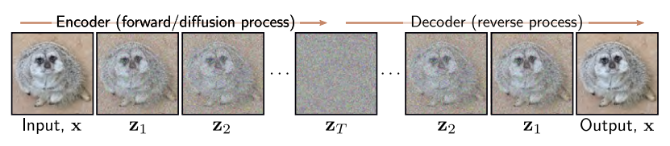
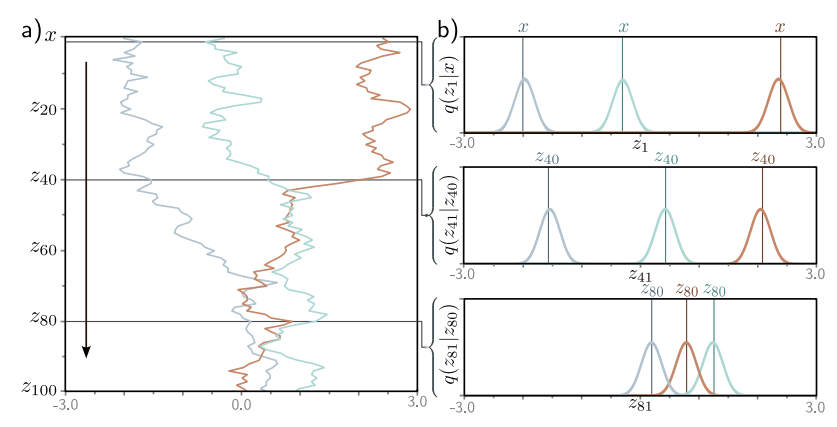
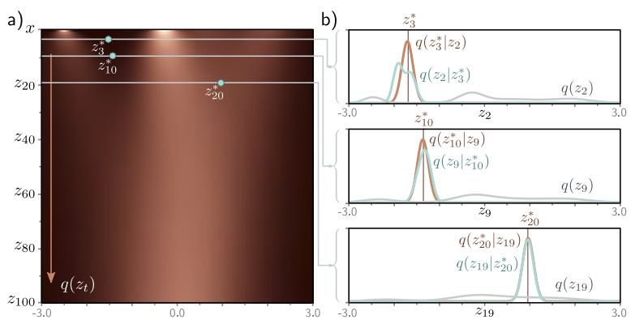

## **Diffusion Models**  

---

**1. Overview**  

Diffusion Model은 Encoder와 Decoder로 구성된다. Encoder는 Prespecified인 과정이고, Decoder가 Learnable한 과정이다. 

  

Encoder(Forward, Diffusion Process)는 $\mathbf{x}$를 latent variable인 $\mathbf{z}_1, \mathbf{z}_2, ... , \mathbf{z}_T$에 Mapping 한다. White Noise를 첨가하는 과정이라고 보면 된다. 충분히 반복하면 $q(\mathbf{z}_T \vert \mathbf{x})$와 $q(\mathbf{z}_T)$가 Standard Normal Distribution이 되고, Noise만 남은 상태가 된다.  

Decoder(Backward, Reverse Process)는 학습 가능한 네트워크로 Encoder의 역과정이다. Noise가 점차 제거되면서 데이터 샘플을 생성한다. 

---

**2. Encoder (Forward Process)**  

$$
\mathbf{z}_1 = \sqrt{1-\beta_1 \cdot \mathbf{x}} + \sqrt{\beta_1} \cdot \epsilon_1  
$$

$$
\mathbf{z}_t = \sqrt{1-\beta_t \cdot \mathbf{z}_{t-1}} + \sqrt{\beta_t} \cdot \epsilon_t  
$$

$\epsilon_t$는 Standard Normal Distribution에서 나온 Noise이다. $\beta_t \in [0, 1]$는 noise schdule을 위한 hyperparameter로, 노이즈가 섞이는 속도를 결정한다.  

$$
q(\mathbf{z}_1 \vert \mathbf{x}) = N_{\mathbf{z}_1} \left[ \sqrt{1-\beta_1}\mathbf{x}, \beta_1 \mathbf{I} \right]
$$

$$
q(\mathbf{z}_t \vert \mathbf{z}_{t-1}) = N_{\mathbf{z}_1} \left[ \sqrt{1-\beta_t}\mathbf{z}_{t-1}, \beta_t \mathbf{I} \right]  
$$

직전 단계의 변수에만 영향을 받는 Markov Chain이라고 볼 수 있다. 충분한 단계 T가 지나면, 원본 데이터의 특성은 사라지고 $q(\mathbf{z}_T \vert \mathbf{x}) = q(\mathbf{z}_T)$인 표준 정규 분포가 된다.  
  
Joint Distribution은 다음과 같다. 

$$
q(\mathbf{z}_{1...T} \vert \mathbf{x}) = q(\mathbf{z}_1 \vert \mathbf{x}) \prod\limits_{t=2}^{T} q(\mathbf{z}_t \vert \mathbf{z}_{t-1})
$$

결국은 위 그림처럼 $x$는 0에 수렴하고, $q(z_t \vert x)$는 mean이 0인 정규분포에 가까워진다. 

**2.1 Diffusion Kernel**  

$\mathbf{z}_t$ 를 계산하는 것은 t가 클 때 time-consuming 일 수 있다. 다행히도 $q(\mathbf{z}_t \vert \mathbf{x})$ 의 closed-form이 존재하고 initial data $\mathbf{x}$ 에서 바로 $\mathbf{z}_t$ 를 구하는 것이 가능하다. 이것을 diffusion kernel이라고 한다.

$$
\mathbf{z}_1 = \sqrt{1-\beta_1 \cdot \mathbf{x}} + \sqrt{\beta_1} \cdot \epsilon_1  
$$

$$
\mathbf{z}_2 = \sqrt{1-\beta_2 \cdot \mathbf{z}_{1}} + \sqrt{\beta_2} \cdot \epsilon_2  
$$

두번째 식을 첫번째 식에 대입하면, 다음을 얻는다.

$$
\mathbf{z}_2 = \sqrt{1-\beta_2} (\sqrt{1-\beta_1} \cdot \mathbf{x} + \sqrt{\beta_1} \cdot \epsilon_1) + \sqrt{\beta_2} \cdot \epsilon_2  
$$

$$
= \sqrt{1-\beta_2} (\sqrt{1-\beta_1} \cdot \mathbf{x} + \sqrt{1-(1-\beta_1)} \cdot \epsilon_1) + \sqrt{\beta_2} \cdot \epsilon_2  
$$

$$
= \sqrt{(1-\beta_2)(1-\beta_1)} \cdot \mathbf{x} + \sqrt{1-\beta_2 -(1-\beta_2)(1-\beta_1)} \cdot \epsilon_1 + \sqrt{\beta_2} \cdot \epsilon_2  
$$

서로 독립인 두 가우시안 분포의 합은 평균이 $\mu + \nu$, 분산이 $\sigma^2 + \tau^2$ 인 새로운 가우시안 분포가 된다는 점을 이용하면 다음이 쉽게 유도가 된다. 세번째 식에서 뒤에 두 항은 평균이 0이고 분산이 각각 $\sqrt{1-\beta_2 -(1-\beta_2)(1-\beta_1)}$, $\sqrt{\beta_2}$ 인 가우시안 분포이다. 따라서 두 분포를 더하면 평균이 0이고 분산이 $1-\beta_2 -(1-\beta_2)(1-\beta_1) + \beta_2 = 1 - (1-\beta_2)(1-\beta_1)$ 가 된다.

$$
\mathbf{z}_2 = \sqrt{(1-\beta_2)(1-\beta_1)} \cdot \mathbf{x} + \sqrt{1-(1-\beta_2)(1-\beta_1)} \cdot \epsilon  
$$

$\epsilon$은 표준 정규 분포이다. 위 과정을 반복하면 $\mathbf{z}_t$를 쉽게 구할 수 있다.

$$
\mathbf{z}_t = \sqrt{\alpha_t} \cdot \mathbf{x} + \sqrt{1-\alpha_t} \cdot \epsilon  
$$

$$
\alpha_t = \prod \limits_{s=1}^t 1-\beta_s  
$$

따라서 다음과 같이 확률 분포를 표현할 수 있다.

$$
q(\mathbf{z}_t \vert \mathbf{x}) = N_{\mathbf{z}_t} \left[ \sqrt{\alpha_t} \cdot \mathbf{x}, (1-\alpha_t) \mathbf{I} \right]  
$$

어떤 시작점인 $\mathbf{x}$에 대해서, $\mathbf{z}_t$는 Normally Distributed이며, 평균과 분산을 알 수 있다. 중간 과정을 생각하지 않아도 $q(\mathbf{z}_t \vert \mathbf{x})$로부터 샘플을 쉽게 생성할 수 있다. 

**2.2 Marginal Distributions**  

Marginal Distribution $q(\mathbf{z}_t)$는 가능한 Start Points인 $\mathbf{x}$의 분포가 주어졌을 때 $\mathbf{z}_t$를 관찰할 확률이다. Joint Distribution에서 $\mathbf{z}_t$를 제외하고 Marginalizing을 하면 $q(\mathbf{z}_t)$를 얻을 수 있다. 

$$
q(\mathbf{z}_t) = \int \int q(\mathbf{z}_{1...t}, \mathbf{x})d\mathbf{z}_{1...t-1} d\mathbf{x}  
$$

$$
= \int \int q(\mathbf{z}_{1...t} \vert \mathbf{x}) Pr(\mathbf{x}) d\mathbf{z}_{1...t-1} d\mathbf{x}  
$$

Diffusion Kernel $q(\mathbf{z}_t \vert \mathbf{x})$은 중간 단계를 스킵하므로 다음 식과 같다.  

$$
= \int q(\mathbf{z}_t \vert \mathbf{x}) Pr(\mathbf{x}) d\mathbf{x}  
$$

따라서 $Pr(\mathbf{x})$로부터 반복적으로 추출한 샘플을 Diffusion Kernel에 통과시키면, 결과는 Marginal Distribution인 $q(\mathbf{z}_t)$가 된다. $Pr(\mathbf{x})$를 모르기 때문에 Closed Form으로 나타낼 수는 없다.  

**2.3 Conditional Distribution**  

Bayes' rule을 적용하면 Conditional Probability를 다음과 같이 나타낼 수 있다.  

$$
q(\mathbf{z}_{t-1} \vert \mathbf{z}_t) = \frac{q(\mathbf{z}_{t} \vert \mathbf{z}_{t-1}) q(\mathbf{z}_{t-1})}{q(\mathbf{z}_t)}  
$$

Marginal Distribution인 $q(\mathbf{z}_{t-1})$가 intractable 하므로 위 식 또한 intractable 하다. 하지만 Numerically 하게 근사하여 구할 수는 있다.  

  

$$q(\mathbf{z}_{t-1} \vert \mathbf{z}_{t}^{\ast})$$는 Bayes' Rule을 통해 $$q(\mathbf{z}_{t}^{\ast} \vert \mathbf{z}_{t-1})q(\mathbf{z}_{t-1})$$에 Proportional 하다는 점을 이용해 계산한다. 회색 선은 Marginal Density 이다. 

**2.4 Conditional Diffusion Distribution**  

$$q(\mathbf{z}_{t-1} \vert \mathbf{z}_t)$$는 알 수 없지만, $$q(\mathbf{z}_{t-1} \vert \mathbf{x})$$ 는 알 수 있다는 점을 이용하여, $$q(\mathbf{z}_{t-1} \vert \mathbf{z}_t, \mathbf{x})$$ 를 Closed Form으로 나타낼 수 있다. 이 분포가 Decoder를 훈련시키는데 사용된다.

$$
q(\mathbf{z}_{t-1} \vert \mathbf{z}_t, \mathbf{x}) = \frac{q(\mathbf{z}_{t} \vert \mathbf{z}_{t-1}, \mathbf{x})q(\mathbf{z}_{t-1} \vert \mathbf{x})}{q(\mathbf{z}_{t} \vert \mathbf{x})}  
$$

$$
\propto q(\mathbf{z}_{t} \vert \mathbf{z}_{t-1}) q(\mathbf{z}_{t-1} \vert \mathbf{x})
$$

Diffusion Process는 Markov Chain이므로 
$$
q(\mathbf{z}_{t-1} \vert \mathbf{z}_t, \mathbf{x}) = q(\mathbf{z}_{t-1} \vert \mathbf{z}_t)  
$$ 
라는 점이 사용되었다.  

다음 식을 유도하려면 Gaussian Change of Variables Identity를 적용해야 한다.

$$
N_{\mathbf{v}}[\mathbf{Aw}, \mathbf{B}] \propto N_{\mathbf{w}} \left[(\mathbf{A^T B^{-1} A})^{-1} \mathbf{A^T B^{-1} v}, (\mathbf{A^T B^{-1} A})^{-1} \right]
$$

그 결과는 다음과 같다.  

$$
N_{\mathbf{z}_t} \left[ \sqrt{1-\beta_t} \cdot \mathbf{z}_{t-1}, \beta_t \mathbf{I} \right] N_{\mathbf{z}_{t-1}} \left[ \sqrt{\alpha_{t-1}} \cdot \mathbf{x}, (1-\alpha_{t-1}) \mathbf{I} \right]  
$$

$$
\propto N_{\mathbf{z}_t} \left[ \frac{1}{\sqrt{1-\beta_t}} \cdot \mathbf{z}_{t}, \frac{\beta_t}{1-\beta_t} \mathbf{I} \right] N_{\mathbf{z}_{t-1}} \left[ \sqrt{\alpha_{t-1}} \cdot \mathbf{x}, (1-\alpha_{t-1}) \mathbf{I} \right]  
$$

Second Gaussian Identity를 적용해서 위 식은 $\mathbf{z}_{t-1}$에 대해 표현할 수 있다.  

$$
N_{\mathbf{w}}[\mathbf{a}, \mathbf{A}] \cdot N_{\mathbf{w}}[\mathbf{b}, \mathbf{B}] \propto N_{\mathbf{w}} \left[(\mathbf{A^{-1} + B^{-1}})^{-1} \mathbf{A^{-1}a + B^{-1}b}, (\mathbf{A^{-1} + B^{-1}})^{-1} \right]
$$

그 결과는 다음과 같다.  

$$
q(\mathbf{z}_{t-1} \vert \mathbf{z}_t, \mathbf{x}) = N_{\mathbf{z}_{t-1}} \left[ \frac{1-\alpha_{t-1}}{1-\alpha_t} \sqrt{1-\beta_t}\mathbf{z}_t + \frac{\sqrt{\alpha_t}\beta_t}{1-\alpha_t}\mathbf{x}, \frac{\beta_t(1-\alpha_{t-1})}{1-\alpha_t}\mathbf{I} \right]  
$$

---

**3. Decoder (Reverse Process)**

`ooo`