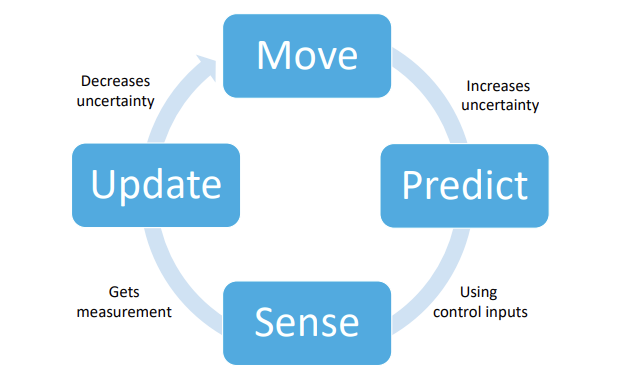
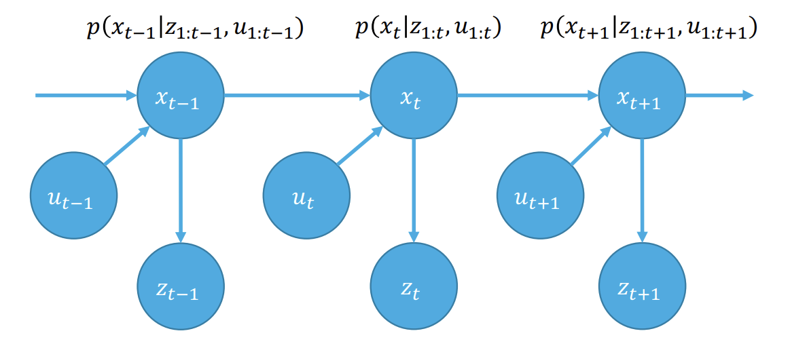
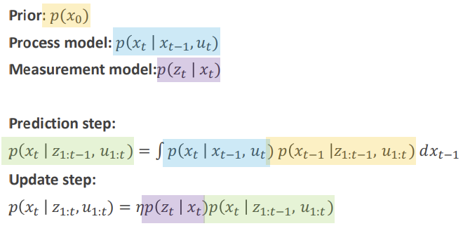
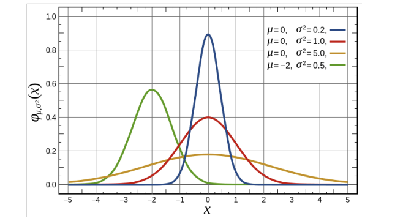
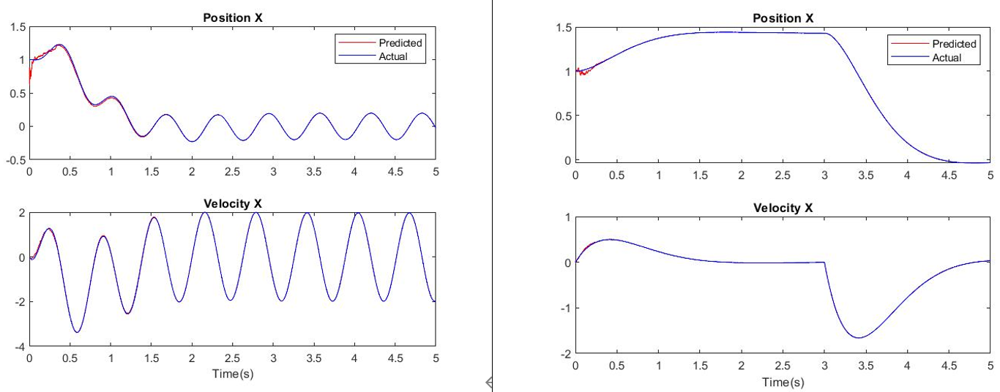

## Kalman Filter

### 칼만 필터 원리 및 구현

---

**칼만 필터**는 루돌프 칼만이 개발한 제어 알고리즘으로, 노이즈가 포함된 관측값을 바탕으로 선형 시스템의 상태를 추정하는 재귀 필터이다.  

칼만 필터의 컨셉만 읽고 싶은 분들은 I, II는 건너뛰어도 좋다.  

---

### **I. Bayes' Filter**  
  
**Markov Property**  

$$
p(x_{t+1} \vert x_{0:t}) = p(x_{t+1} \vert x_t)  
$$

즉, 해당 시점에서 미래를 예측하는데 필요한 정보들만 갖고 있으면 완전한 상태가 된다. 과거의 정보나 독립적인 정보들은 필요하지 않다. 




제어 시스템은 Move, Predict, Sense, Update의 반복이라고 볼 수 있다. 물체가 움직이면 불확실성이 커지고, 현재 상태와 이전 관측값을 토대로 다음 상태를 예측한다. 센서를 이용해서 관측값을 얻으면 불확실성을 없애는 방향으로 업데이트를 진행한다.



위 그림에서 Markov Assumtion을 적용하면 모델을 간단하게 나타낼 수 있다. $x_t$는 현재 상태, $u_t$는 제어 입력, $z_t$는 관측 값을 나타낸다.  

---

**Prior**  

초기 상태에 대한 사전 확률 분포를 나타낸다. 즉, 로봇이 처음 시작한 위치를 특정 범위 내 위치에 존재할 확률로 나타낸다. 

$$
p(x_0)  
$$  

**Process model**  

시간 t에서의 상태 $x_t$가 이전 상태 $x_{t-1}$과 제어 입력 $u_t$에 의해 결정된다는 것을 나타낸다. 로봇이 이전 위치에서 얼마나 움직였는지에 따라 새로운 위치를 추정하는 것이다. 하지만 그 움직임에는 불확실성이 포함될 수 있기 때문에 확률로 표현한다. 

$$
p(x_t \vert x_{t-1}, u_t)  
$$

**Measurement model**  

시간 t에서의 측정값 $z_t$는 현재 상태 $x_t$에 의해 결정된다. 센서에 노이즈가 포함되기 때문에 확률로 표현한다. 로봇이 카메라를 이용해 자신의 위치를 측정하면, 현재 상태에서 측정된 데이터와 실제 상태의 관계를 설명하는 것이다.  

$$
p(z_t \vert x_t)  
$$  


**Prediction Step**   

Process Model과 이전 상태 Prior의 곱을 이전 상태에 대해 Marginalize 한 것이다.  

$$
p(x_t \vert z_{1:t-1}, u_{1:t}) = \int p(x_t, x_{t-1} \vert z_{1:t-1}, u_{1:t}) \, dx_{t-1}
$$

$$
= \int p(x_t \vert x_{t-1}, z_{1:t-1}, u_{1:t}) p(x_{t-1} \vert z_{1:t-1}, u_{1:t}) \, dx_{t-1}
$$

$$
= \int p(x_t \vert x_{t-1}, u_t) p(x_{t-1} \vert z_{1:t-1}, u_{1:t}) dx_{t-1}  
$$

**Update Step**  

현재 상태의 Prior에 Measurement Model을 곱하고 Marginal Distribution으로 나눈 것이다. 

$$
p(x_t \vert z_{1:t}, u_{1:t}) = \frac{p(z_t \vert x_t, z_{1:t-1}, u_{1:t}) p(x_t \vert z_{1:t-1}, u_{1:t})}{p(z_t \vert z_{1:t-1}, u_{1:t})}  
$$

$$
= \eta p(z_t \vert x_t) p(x_t \vert z_{1:t-1}, u_{1:t})  
$$

$\eta$ 는 Marginal Distribution 이다.  

$$
p(x \vert w, v) = \frac{p(w \vert x, v) p(x \vert v)}{p(w \vert v)}
$$ 

라는 점이 사용되었다. 

**정리**  



---

### **II. Gaussian Random Variables**  

**Multivariate Normal Distribution**  



$$
p(x) = \frac{1}{(2\pi)^{n/2} \sqrt{\det(\Sigma)}} 
\exp\left( -\frac{1}{2} (x - \mu)^T \Sigma^{-1} (x - \mu) \right)
$$

$$
\text{where } \mu \in \mathbb{R}^n \text{ and } \Sigma \in \mathbb{R}^{n \times n}  
$$

**Fact 1: Jointly Normal Random Vectors**  

$x$가 multivariate gaussian random variable이면 $$x = \begin{bmatrix} x_1 \\ x_2 \end{bmatrix}$$ 에서 $x_1, x_2$도 모두 gaussian random variable 이다. $x_1, x_2$를 jointly gaussian 이라고 한다.  

**Fact 2: Sum of Independent Gaussians**  

$x, y$가 독립 가우시안 분포이면 $z=x+y$ 역시 가우시안 분포이며 $\mu_z = \mu_x+\mu_y$이고 $\Sigma_z=\Sigma_x+\Sigma_y$이다.  
  

**Fact 3: Affine Transformations**  

$x \sim N(\mu_x, \Sigma_x)$, $y=Ax+b$ 이면 $y \sim N(\mu_y, \Sigma_y)$이고, $\mu_y = A \mu_x + b$, $\Sigma_y = A \Sigma_x A^T$ 이다.  


**Fact 4: Conditional Distributions**  

$$
\mu_{x_1 \vert x_2} = \mu_1 + \Sigma_{12} \Sigma_{22}^{-1} (x_2 - \mu_2)  
$$

$$
\Sigma_{x_1 \vert x_2} = \Sigma_{11} - \Sigma_{12} \Sigma_{22}^{-1} \Sigma_{21}  
$$ 

---

### **III. Kalman Filter**  

**Assumptions**  

- Prior는 가우시안 분포를 따른다.  

$$
p(x_0) \sim N(\mu _0, \sigma _0)
$$

- Process model $p(x_t \vert x_{t-1}, u_t)$는 노이즈가 첨가된 선형 가우시안 분포를 따른다.  

$$
x_t = A_t x_{t-1} + B_t u_t + n_t  
$$

$$
n_t \sim N(0, Q_t)  
$$

- Measurement model $p(z_t \vert x_t)$은 노이즈가 첨가된 선형 가우시안 분포를 따른다.

$$
z_t = C_t x_t + v_t  
$$

$$
v_t \sim N(0, R_t)  
$$

**Prediction**  

$$
x_t = A_t x_{t-1} + B_t u_t + n_t, n_t \sim N(0, Q_t)
$$

$$
\hat{\mu}_t = A \mu_{t-1} + B u_t
$$

$$
\hat{\Sigma}_t = A \Sigma_{t-1} A^T + Q
$$

**Update**  

$$
z_t = C_t \bar{x}_t + v_t, \quad v_t \sim N(0, R_t)
$$

$$
x_t = \bar{x}_t 
$$

$$
\begin{bmatrix} x_t \\ z_t \end{bmatrix} = \begin{bmatrix} I & 0 \\ C & I \end{bmatrix} \begin{bmatrix} \bar{x}_t \\ v_t \end{bmatrix}
$$

이는 Jointly Gaussian Distribution 이므로,  

$$
\mu = \begin{bmatrix} \hat{\mu}_t \\ C \hat{\mu}_t \end{bmatrix}  
$$

$$
\Sigma = \begin{bmatrix} I & 0 \\ C & I \end{bmatrix} \begin{bmatrix} \hat{\Sigma}_t & 0 \\ 0 & R \end{bmatrix} \begin{bmatrix} I & C^T \\ 0 & I \end{bmatrix} = \begin{bmatrix} \hat{\Sigma}_t & \hat{\Sigma}_t C^T \\ C \hat{\Sigma}_t & C \hat{\Sigma}_t C^T + R \end{bmatrix}
$$

$z_t$가 관측되고 나면 $\mu_{t}$는 $\mu_{x_t \vert z_t}$로 업데이트 되어야 한다. $\Sigma_{t}$의 경우도 마찬가지이다.  

$$
\mu_{x_t \vert z_t} = \hat{\mu}_t + \hat{\Sigma}_t C^T (C \hat{\Sigma}_t C^T + R)^{-1} (z_t - C \hat{\mu}_t) 
$$

$$
\Sigma_{x_t \vert z_t} = \hat{\Sigma}_t - \hat{\Sigma}_t C^T (C \hat{\Sigma}_t C^T + R)^{-1} C \hat{\Sigma}_t
$$

위 식에서 Kalman Gain $K_t$를 다음과 같이 정의할 수 있다.  

$$
K_t = \hat{\Sigma}_t C^T (C \hat{\Sigma}_t C^T + R)^{-1}
$$

Perfect Sensor ($R=0$)의 경우 $K_t = C^{-1}$, $\mu_t = C^{-1}z_t$, $\Sigma_t = 0$이 되고, Horroble Sensor ($R \to \infty$)의 경우 다음과 같아지는 것을 볼 수 있다.  

$$
K_t = \hat{\Sigma}_t C^T (C \hat{\Sigma}_t C^T + R)^{-1} \to 0
$$

$$
\mu_t = \hat{\mu}_t + K_t (z_t - C \hat{\mu}_t) \to \hat{\mu}_t
$$

$$
\Sigma_t = \hat{\Sigma}_t - K_t C \hat{\Sigma}_t \to \hat{\Sigma}_t
$$

$K_t$로 간단히 나타내면 다음의 최종 결과를 얻는다.  

$$
\mu_t = \hat{\mu}_t + K_t (z_t - C \hat{\mu}_t)
$$

$$
\Sigma_t = \hat{\Sigma}_t - K_t C \hat{\Sigma}_t
$$

---

### **IV. MATLAB 구현**  

Prediction Step:

```
function [covarEst,uEst] = pred_step(uPrev,covarPrev,ut,dt)

m = 0.5; k = 3.5; b = 2;

A = [0 1; -k/m -b/m];
B = [0; 1/m];
Q = [1; 1];
I = eye(2);
Ad = I + A*dt;
Bd = B*dt;

uEst = Ad*uPrev + Bd*ut;
covarEst = Ad*covarPrev*transpose(Ad) + Q*dt;

end
```

Update Step:

```
function [uCurr,covarCurr] = upd_step(z_t,covarEst,uEst)

C = [1 0];
Rp = 1;
K = covarEst*transpose(C)*inv(C*covarEst*transpose(C)+Rp);
uCurr = uEst + K*(z_t - C*uEst);
covarCurr = covarEst - K*C*covarEst;

end
```

Kalman Filter:

```
clear all; % Clear variables
close all;
clc;

datasetNum = 1; % 1 or 2

[Sampled_gt, MeasuredData, Impulse, sampledTime] = init(datasetNum);

% Measuring position
Z = MeasuredData(1,:); %all the measurements that you need for the update

% Set initial condition
uPrev = vertcat(Sampled_gt(:,1)); % Copy the true Initial state
covarPrev = eye(2); % Covariance constant
savedStates = zeros(2, length(sampledTime)); 
prevTime = 0; %previous time step in real time

for i = 1:length(sampledTime)
    %Getting acceleration and input force for prediction step
    ut = Impulse(i);
    
    dt= sampledTime(i)-prevTime;
    prevTime = sampledTime(i);
    z_t=Z(i);
    
    %Getting Prediction Step
    [covarEst,uEst] = pred_step(uPrev,covarPrev,ut,dt);
     
    %Getting Updated Step
    [uCurr,covar_curr] = upd_step(z_t,covarEst,uEst);
    
    %Saving the new State
    savedStates(:,i) = uCurr;
    
    %updating for next iteration
    uPrev = uCurr;
    covarPrev = covar_curr;  
    
end

plotData(savedStates, sampledTime, Sampled_gt, 1, datasetNum);
```

이런 식으로 짜고 DataSet만 적절히 넣어주면 된다.  
  

**Results**  



관측 값을 이용해서 예측한 경로와 실제 경로가 거의 일치하는 것을 볼 수 있다. 


---

뉴욕대학교 Giuseppe Loianno 교수님의 ROB-UY3303 Robot Motion and Planning 강의 자료를 기반으로 작성되었음  

---

2024/09/18
