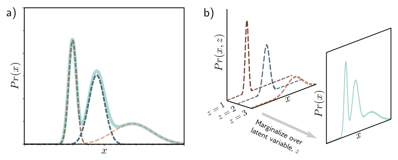
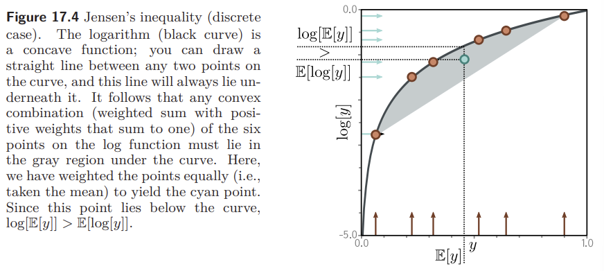
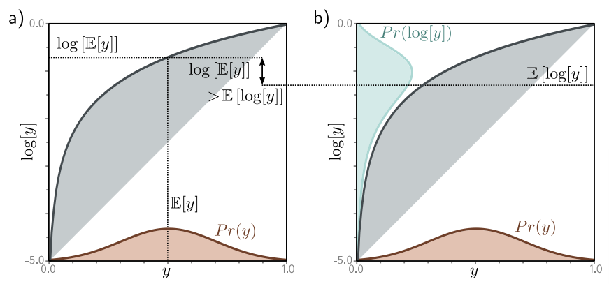
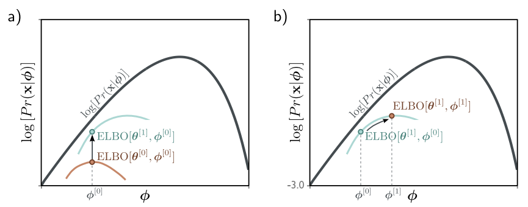

Understanding Deep Learning 책의 17장을 정리한 것이다.  

**Variational Autoencoders**  

**1. Latent Variable Models**  

Latent variable models는 $Pr(\mathbf{x})$ 대신에 latent variable $\mathbf{z}$를 이용하여 $Pr(\mathbf{x}, \mathbf{z})$ 를 표현함으로써 $Pr(\mathbf{x})$ 를 간접적으로 나타낸다.

$$
Pr(\mathbf{x}) = \int Pr(\mathbf{x} ,\mathbf{z})d\mathbf{z}
$$

Conditional probability로 풀어서 작성하면 아래 식처럼 된다.

$$
Pr(\mathbf{x}) = \int Pr(\mathbf{x} \vert \mathbf{z})Pr(\mathbf{z})d\mathbf{z}
$$

$Pr(\mathbf{x})$가 복잡하면 $Pr(\mathbf{x} \vert \mathbf{z})$ 와 $Pr(\mathbf{z})$ 로 간접적으로 나타내는 것이 상대적으로 간단할 수 있다.  

**Mixture of Gaussians**  

$$
Pr(z = n) = \lambda _n  
$$

$$
Pr(x \vert z = n) = N_x [\mu _n, {\sigma _n}^2]  
$$

잠재변수 $z$는 discrete 하게 주어지는 값이므로 가능한 값들을 모두 더해서 marginalize 할 수 있다. 주어진 $z$ 값에 따라 $x$의 분포는 평균이 $\mu _n$이고 분산이 $(\sigma _n)^2$인 정규분포를 따른다. 

$$
Pr(x) = \sum\limits_{i=1}^N Pr(x, z=n)  
$$

$$
= \sum\limits_{i=1}^N Pr(x \vert z=n) \cdot Pr(z=n) = \sum\limits_{i=1}^N \lambda_n \cdot N_x [\mu _n, {\sigma _n}^2]  
$$

이를 통해 복잡한 multi-modal 확률 분포를 간단한 likelihood와 prior로 나타낼 수 있다.  

---

**2. Nonlinear Latent Variable Model**  

Nonlinear latent variable model에서는 data $\mathbf{x}$ 와 latent variable $\mathbf{z}$ 모두 continuous 이고 multivariate이다. 

$$
Pr(\mathbf{z}) = N_\mathbf{z}[\mathbf{0}, \mathbf{I}]  
$$

복잡한 분포를 여러 가우시안의 Weighted Sum으로 설명할 수 있으므로, discrete latent variable $\mathbf{z}$ 를 도입하여 하나의 가우시안 분포인 Joint Probability $Pr(x, z)$ 를 Marginalize 함으로써 Pr(x)를 구하는 것이다.  

$$
Pr(\mathbf{x} \vert \mathbf{z}, \boldsymbol{\phi}) = N_\mathbf{x} [\mathbf{f}[\mathbf{z}, \boldsymbol{\phi}], \sigma^2 \mathbf{I}]  
$$

$\mathbf{f}[\mathbf{z}, \boldsymbol{\phi}]$ 은 deep network parameter $\boldsymbol{\phi}$ 로 표현되고, 데이터의 중요한 특징을 설명한다. 나머지 설명되지 않는 부분들은 노이즈 $\sigma^2 \mathbf{I}$에 포함된다.  

잠재 변수 $\mathbf{z}$ 에 대해 marginalizing 하면 $Pr(\mathbf{x} \vert \boldsymbol{\phi})$ 를 얻을 수 있다.

$$
Pr(\mathbf{x} \vert \boldsymbol{\phi}) = \int Pr(\mathbf{x} \vert \mathbf{z}, \boldsymbol{\phi}) \cdot Pr(\mathbf{z}) d\mathbf{z}
= \int N_\mathbf{x} [\mathbf{f}[\mathbf{z}, \boldsymbol{\phi}], \sigma^2\mathbf{I}] \cdot N_\mathbf{z} [\mathbf{0}, \mathbf{I}] d\mathbf{z}  
$$

**Generation**  

Ancestral sampling으로 샘플 $\mathbf{x}^{\ast}$을 생성해낼 수 있다. Prior $Pr(z)$로부터 $\mathbf{z}^{\ast}$ 추출하고 $\mathbf{f}[z^{\ast}, \boldsymbol{\phi}]$에 통과시켜 $Pr(\mathbf{x} \vert z^{\ast}, \boldsymbol{\phi})$의 mean을 구한다. Variance는 $\sigma^2 \mathbf{I}$로 고정된 값이다. 이것으로부터 $\mathbf{x}^{\ast}$를 추출한다. 이 과정을 반복하면 $Pr(\mathbf{x} \vert \boldsymbol{\phi})$를 얻을 수 있다.  

       

---

**3. Training**  

모델을 학습시키려면 log-likelihood를 maximize 하는 $\boldsymbol{\phi}$을 찾아야 하지만, 이것은 intractable 하기 때문에 ELBO를 이용한다.  

$$
z = \argmax_\phi [\sum\limits_{i=1}^I log[Pr(\mathbf{x}_i \vert \boldsymbol{\phi})]]  
$$

where:  

$$
Pr(\mathbf{x}_i \vert \boldsymbol{\phi}) = \int N_\mathbf{x} [\mathbf{f}[\mathbf{z}, \boldsymbol{\phi}], \sigma^2\mathbf{I}] \cdot N_\mathbf{z} [\mathbf{0}, \mathbf{I}] d\mathbf{z}  
$$

**Evidence Lower Bound (ELBO)**  

ELBO는 주어진 log-likelihood 보다 항상 같거나 작은 함수이다. ELBO를 최대화 하여 원래 log-likelihood를 간접적으로 최대화 하는 $\boldsymbol{\phi}$를 찾는 것이다. ELBO는 다른 파라미터 $boldsymbol{\theta}$ 에 의존할 수 있다. ELBO를 정의할 때 Jensen's inequality가 필요하다.  

**Jensen's Inequality**  

Concave Function에 대해 데이터의 기댓값이 항상 데이터의 함숫값의 기댓값보다 같거나 크다는 것이다.  

1) discrete case  

2) continuous case  

Concave Function이면 어떤 점들을 이어도 함수보다 밑에 위치하게 된다. 로그 함수는 concave function이므로 다음 식이 항상 성립할 것을 알 수 있다.  

$$
log[E[y]] > E[log[y]]  
$$

$$
log[\int Pr(y)ydy] \geq \int Pr(y)log[y]dy  
$$

Pr(y)에 대한 제한이 없으므로, y에 대한 새로운 확률 분포를 나타내는 random variable h[y]에 대해서도 성립할 것을 알 수 있다.  
$$
log[\int Pr(y)h[y]dy] \geq \int Pr(y)log[h[y]]dy  
$$

 $log[Pr(\mathbf{x} \vert \boldsymbol{\phi})]$ 는 $\boldsymbol{\phi}$ 의 함수이므로 아래 그림처럼 x축에 해당하는 $\boldsymbol{\phi}$ 에 따라 값이 변한다. 반면 ELBO는 $\boldsymbol{\phi}$ 와 $\boldsymbol{\theta}$ 의 함수이므로, 두 파라미터를 조정하면서 최적의 ELBO 값을 찾아야 한다. 

**Deriving the bound**  

이제 Log-likelihood의 lower bound를 유도하기 위해 Jensen's inequality를 이용한다. 먼저 잠재변수 $\mathbf{z}$에 대한 임의의 확률 분포인 $q(\mathbf{z})$를 도입한다.  

$$
log[Pr(\mathbf{x} \vert \boldsymbol{\phi})] = log[\int Pr(\mathbf{x, z} \vert \boldsymbol{\phi})d\mathbf{z}] = log[\int q(\mathbf(z))\frac{Pr(\mathbf{x, z} \vert \boldsymbol{\phi})}{q(\mathbf{z})}]d\mathbf{z}  
$$

위의 Jensen's inequality 식에서 $Pr(y)$가 $q(\mathbf{z})$에 해당하고 나머지가 $h[y]$ 라고 보면 이해가 쉽다.  

$$
log[\int q(\mathbf{z})\frac{Pr(\mathbf{x, z} \vert \boldsymbol{\phi})}{q(\mathbf{z})}d\mathbf{z}] \geq \int q(\mathbf{z}) log[\frac{Pr(\mathbf{x, z} \vert \boldsymbol{\phi})}{q(\mathbf{z})}]d\mathbf{z}  
$$

이 부등식에서 오른쪽 부분이 ELBO라고 보면 된다. $q(\mathbf{z})$가 $\boldsymbol{\theta}$ 를 파라미터로 가지므로 ELBO는 다음과 같다.  

$$
ELBO[\boldsymbol{\theta}, \boldsymbol{\phi}] = \int q(\mathbf{z} \vert \boldsymbol{\theta}) log[\frac{Pr(\mathbf{x, z} \vert \boldsymbol{\phi})}{q(\mathbf{z} \vert \boldsymbol{\theta})}]d\mathbf{z}  
$$

---

**4. ELBO properties**  