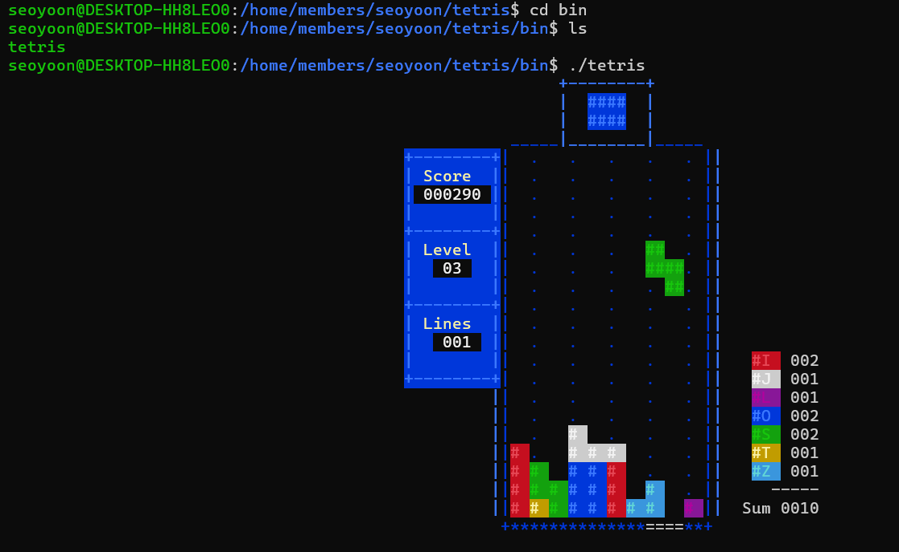

## 테트리스 데비안 패키지 만들기  

> Ubuntu 22.04 LTS  

  

**1. vitetris 소스 파일 다운로드**  

[Download](https://developers.redhat.com/blog/2019/03/18/rpm-packaging-guide-creating-rpm#ascii_based_tetris_game) 에 가서 소스 파일을 다운로드 한다.

```
tar -xzf vitetris-0.57.tar.gz
```
압축을 풀어준다.

**2. 필요한 툴 설치**  

```
sudo apt-get update
sudo apt-get install dpkg-dev debhelper
```


**3. DEB 패키지 디렉토리 구조 생성**  

```
cd vitetris-0.57
mkdir debian
cd debian
```


**필수 요소**   
- debian/control: 제어 파일로 패키지에 대한 중요 정보를 제공한다.  

```
Source: vitetris
Section: games
Priority: optional
Maintainer: Seoyoon <seoyoonkims@kaist.ac.kr>
Build-Depends: debhelper-compat (= 13), gcc
Standards-Version: 3.9.8
Homepage: https://www.victornils.net/tetris/

Package: vitetris
Architecture: any
Depends: ${shlibs:Depends}, ${misc:Depends}
Description: ASCII based tetris game
 vitetris is a multiplayer ASCII-based Tetris game
```

- debian/rules: 빌드 및 설치 과정을 정의한다.  

```
#!/usr/bin/make -f
%:
	dh $@

override_dh_auto_configure:
	# No configure step needed

override_dh_auto_build:
	$(MAKE)

override_dh_auto_install:
	$(MAKE) install DESTDIR=$(CURDIR)/debian/vitetris
```

```dh```는 ```debhelper```, ```$@```는 현재 타겟을 의미한다. ```%```는 모든 타겟을 의미하므로, ```make build```가 호출되면 모든 타겟에 대해 ```dh build```가 실행된다.  
```override_dh_auto_build``` 타겟은 ```dh_auto_build```의 기본 동작을 덮어쓴다. ```$(MAKE)``` 명령을 실행하여 빌드 과정을 수행하며, Makefile에 정의된 빌드 규칙을 따른다.  
```override_dh_auto_install``` 타겟은 ```dh_auto_install```의 기본 동작을 덮어쓴다. ```$(MAKE) install``` 명령을 실행하여 설치 과정을 수행한. 설치 경로는 ```DESTDIR=$(CURDIR)/debian/vitetris```로 지정되어 있다. 이 경로는 패키지 빌드 과정에서 임시 설치 경로로 사용된다.  


- debian/changelog: 패키지의 변경 사항을 기록한다.    

```
vitetris (0.57-1) unstable; urgency=low

  * Initial release.

 -- Seoyoon Kim <seoyoonkims@kaist.ac.kr>  Mon, 01 Jul 2024 00:00:00 +0000
 ```

**4. 경로 설정**  

- config.mk 파일에 가서 prefix를 수정하면 원하는 곳에 설치되도록 할 수 있다.  

```
prefix = $(HOME)/tetris
# prefix = /usr/local
```

기본으로 /usr/bin에 설치되도록 설정되어 있는데, 이를 /home/tetris로 바꿔주었다.  


- Makefile의 install에서 다음 코드를 추가하여 설치 전에 /home/tetris 디렉토리가 생성되도록 한다.

```
install: $(PROGNAME)
	$(INSTALL) -d $(DESTDIR)$(prefix)
```

```
bindir = $(prefix)/bin
datarootdir = $(prefix)/share
docdir     = $(datarootdir)/doc/vitetris
pixmapdir  = $(datarootdir)/pixmaps
desktopdir = $(datarootdir)/applications
datadir = $(datarootdir)/allegro
```

prefix만 수정해주면 나머지는 자동으로 수정된다.  
바이너리 파일은 bindir인 /home/tetris/bin에 생성될 것이다.  


**5. 소스 빌드 및 패키지화**  

```
cd ..
dpkg-buildpackage -us -uc
```

debian/rules를 참고하여 빌드 및 임시 경로에 설치 과정 시뮬레이션을 한다.  
권한 문제가 생기면 ```chmod 777 <파일명>``` 해준다.  
빌드에 성공하면 ../에 vitetris_0.57-1_amd64.deb가 생성된다.  


**6. 패키지 설치**  

```
sudo dpkg -i vitetris_0.57-1_amd64.deb
```

설치되고 나면, home/bin에 실행파일이 생긴 것을 확인할 수 있다.  

- dpkg -i package.deb의 역할
1. 패키지 파일 열기  
2. 파일 압축 해제 및 복사  
패키지에 포함된 파일들을 시스템의 적절한 위치에 복사한다.
3. 설치 스크립트 실행  
preinst, postinst, prerm, postrm 등을 실행한다.  
4. 설치 상태 업데이트
시스템의 패키지 데이터베이스에 새로 설치된 패키지 정보를 업데이트한다.  


**파일 계층 구조**  

```
home/tetris/  
│   ├── bin/  
│   │   └── tetris               (installed from $(prefix)/bin)  
│   ├── share/  
│   │   ├── applications/  
│   │   │   └── vitetris.desktop  (installed from $(desktopdir))  
│   │   ├── doc/  
│   │   │   └── vitetris/  
│   │   │       ├── README        (installed from $(docdir))  
│   │   │       └── licence.txt   (installed from $(docdir))  
│   │   └── pixmaps/  
│   │       └── vitetris.xpm      (installed from $(pixmapdir))  
```

Makefile로 패키지를 빌드할 때, ```$(CURDIR)/debian/vitetris```는 빌드 시의 임시 경로이고, 이 경로 내부의 파일 구조는 실제 시스템에 설치될 경로를 그대로 반영한다. 빌드 과정이 끝나고 패키지가 생성된 후 ```dpkg``` 또는 ```apt```를 사용하여 설치하면, 이 임시 경로의 구조가 실제 시스템 경로로 대체된다.  