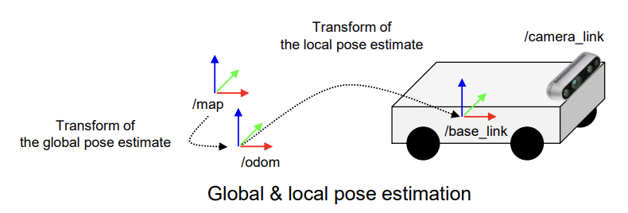

## KAIST EE405A AI-based Autonomous Rover  
### 지능기반 자율주행 로버 개발  

---

  


**Set Up**  
> Ubuntu 20.04 LTS   
> ROS1 Noetic   
> NVIDIA Jetson Orin Nano (Main PC)  
> Hiwonder ArmPI Pro (Robot)  
> Intel Realsense (Sensor)  

---
**Overall Architecture**  

  


---
**1. Localization**  

  Localization is a transformation between fixed global frame of a map and dynamic local body frame or the robot.  

- ORB SLAM  
  **SLAM**(Simultaneous Localization and Mapping)은 Robot이 주행하면서 자신의 위치를 추정하고 스스로 지도를 생성하는 기술이다. Visual SLAM은 카메라로 Feature Points를 찍어서 그 점들의 위치 변화를 통해 지도를 만든다. IMU 데이터를 기반으로 시작 위치로부터 현재 위치를 계산하고 Kalman Filter로 잡음을 제거하여 정확한 위치를 파악한다. RGB image, Depth image, ORB Odometry 등 주행에 필요한 여러가지 topic들을 publish 한다.


- Tag Localization  
  Map과 Tag 사이의 Transformation은 이미 알고 있기 때문에 Robot이 카메라로 Tag를 인식하면 ORB SLAM으로부터 얻은 Robot의 base link coordinate인 local position(/odom)을 global position인 map coordinate으로 **Transform** 할 수 있다. 3D Rotation by Quaternions 및 Homogeneous Transformation Matrices를 이용하여 /tf topic을 publish 한다.

 


---
**2. Object Detection**  
- YOLO v5  
  3D printing 한 지뢰를 Robot이 인식할 수 있도록 labelme로 지뢰를 라벨링 하여 데이터를 학습시켰다. Class 당 150장 정도의 사진을 이용하였다. 300 epochs를 학습시켰는데 12시간 정도 걸렸다.

  ```
    $ python train.py --data custom.yaml --epochs 300 --weights 'yolo5n.pt' --cfg yolov5n.yaml --batch-size 128”
  ```

 

  Realsense 카메라를 켜고 YOLO를 launch 한 결과이다. Class별로 지뢰가 잘 Detect 되는 것을 볼 수 있다. Detect된 Target의 정보는 Bounding Box의 형태로 publish 된다.

  


- Target Position Estimation  
  YOLO가 publish 한 Target의 Bounding Box 정보와 ORB SLAM이 publish한 Depth Image를 토대로 Target의 3D 좌표를 계산한다.  


**3. Mission Planner**
- Node-link Generator  
  Node는 Robot이 방문할 수 있는 map 상의 점이다. Heuristic Value를 더해서 Goal node를 지정할 수 있다. Link는 두 노드를 잇는 Collision free straight path이다. Goal point와 가장 가까운 노드를 Goal node로 지정하고 Dijkstra, A\*, RRT\* 등의 알고리즘으로 최적의 경로를 찾는다. 아래는 ORB SLAM3를 이용하여 Map과 Node-link를 생성한 결과이다. Visualization에는 rviz 프로그램을 사용하였다.  

  
  Youtube Link: <https://youtu.be/wnNi2hI_0C0>


- Global Path Planner  
  Node-link Generator가 만든 csv file과 Mission Planner로부터 받은 Goal Point 정보를 바탕으로 target으로 가는 최적의 경로를 Dijkstra 알고리즘으로 찾아낸다. 로봇의 현재 위치와 가장 가까운 노드가 Start Node가 되고 target과 가장 가까운 노드가 Goal Node가 된다. Goal Node에 도착하면 새로운 path가 생성된다. path는 nav_msgs::Path 형식으로 publish 된다. 

  ```
    pub_global_path = nh_.advertise<nav_msgs::Path>("/graph_planner/path/global_path", 1);
    pub_node_points = nh_.advertise<sensor_msgs::PointCloud2>("/graph_planner/points/node_points", 1);
  ```

- Mission Planner  


**4. Motion Planner**
- Manipulator Mission Planner  

- Local Path Planner  


**5. Control**
- Manipulator Controller  

- Mobile Robot Controller  


