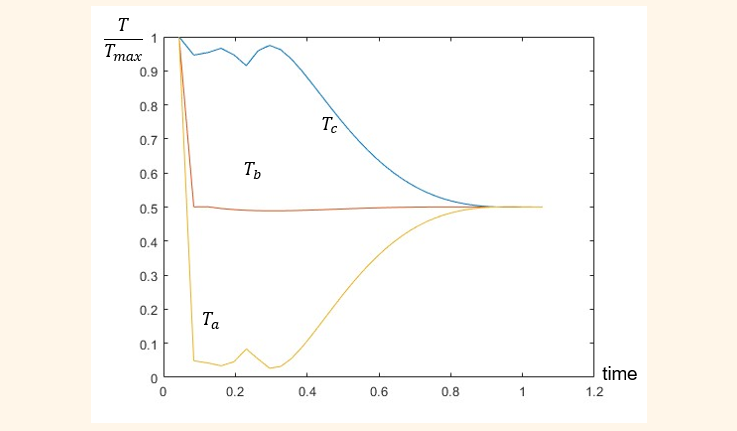

## KAIST AE201 Introductory Aeronautical Projects  
### 기초항공프로젝트  
---

This project focuses on the development of an LTA (Lighter-Than-Air) vehicle, addressing stability and control in roll, yaw, and pitch using advanced design approaches. It integrates 3D modeling via SolidWorks, computational analysis with MATLAB, and optimization techniques for aerodynamic and structural efficiency. Key efforts include achieving stable turning, optimizing pitch control through servo-motor mechanisms, and minimizing mass while ensuring operational endurance.  

---
Full Report: [LTA Modeling and Developments](https://github.com/seoyoonkims/seoyoonkims.github.io/blob/main/docs/pdf/AE201_Term_Project.pdf)  

---

### **Design**  

---

### **Analysis**

**Control**  

- Using back propeller to control pitch instead of control surface:  

- Distance between CoM and CoL is minimized:  

**Stability while Turning**  

- Degree of Freedom:  

- Optimizing thrust for each motor:  

**MATLAB**  
- Theoritical Thrust:  

- Using ODE45 to Calculate Thrust:  

---

### **Final Model**   

Our LTA did great job at the final race, so we got A+!
