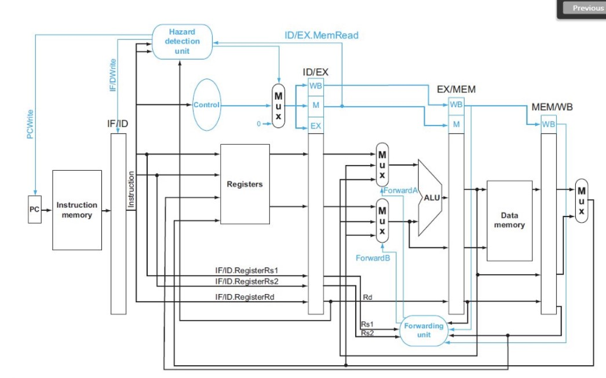

## KAIST EE312 Computer Architectrure  
### 컴퓨터구조개론  

This Verilog project implements a RISC-V processor with several key modules. It includes pipelining, caching, branch prediction, and hazard handling. 

---

