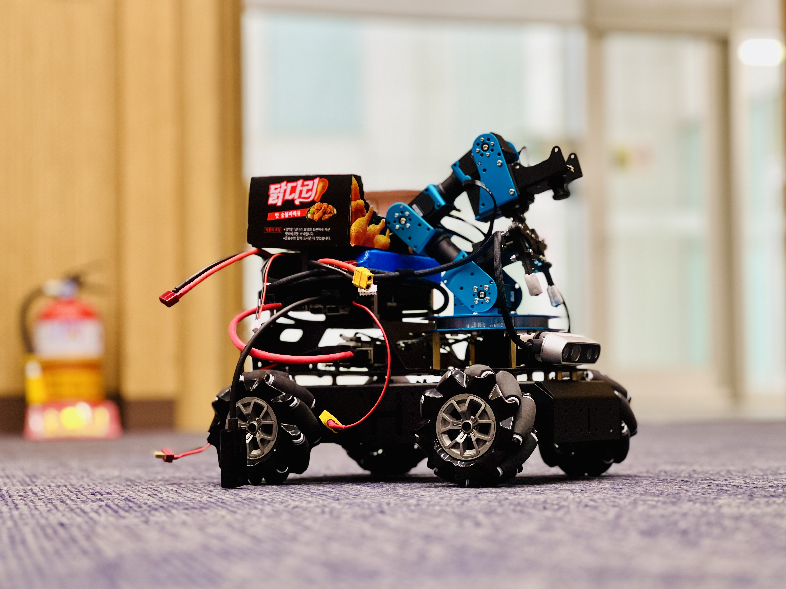
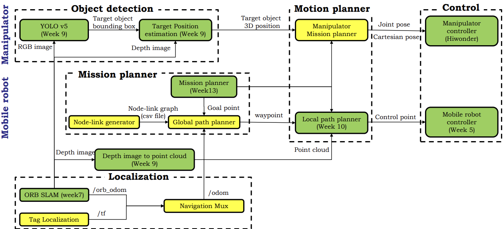
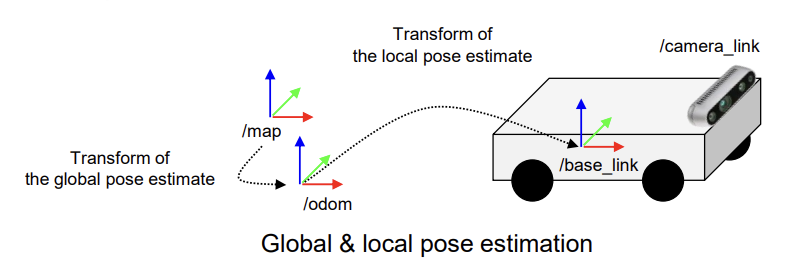
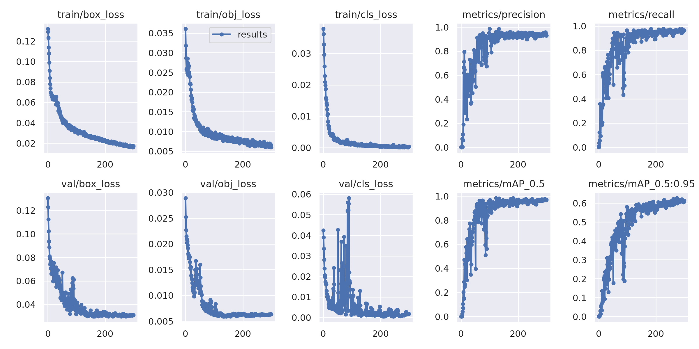
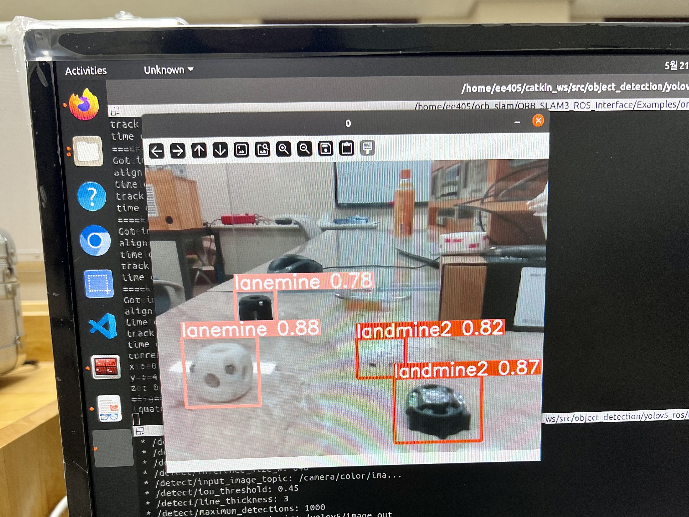
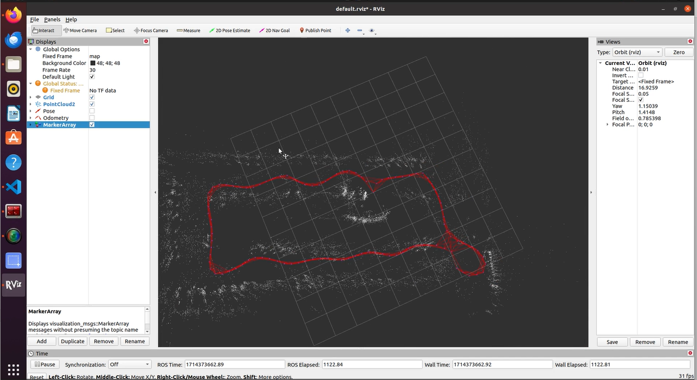
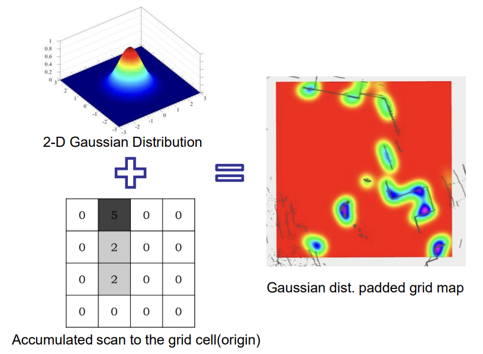
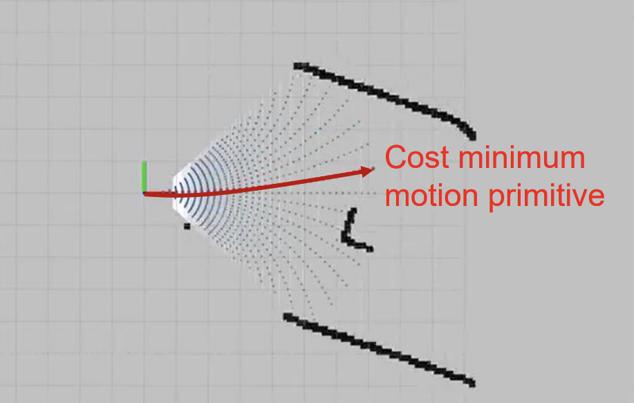

## KAIST EE405A AI-based Autonomous Rover  
### 지능기반 자율주행 로버 개발  

---

{: width = "100" height = "100"}  


**Set Up**  
> Ubuntu 20.04 LTS   
> ROS1 Noetic   
> NVIDIA Jetson Orin Nano (Main PC)  
> Hiwonder ArmPI Pro (Robot)  
> Intel Realsense (Sensor)  

---
**Overall Architecture**  

  

Task : Avoid Obstacles and Grasp Landmines  
- ROS, Gazebo, Jetson Orin Nano, Armpi Pro  
- ORB_SLAM3, tag : localization  
- Node-Link Dijkstra : global path planner  
- Motion Primitive : local path planner  
- PID control : mobile robot controller  
- YOLOv5 : object detection  
- Pose Estimation : depth image to point cloud   
- LLM : task planner  
- Grasping : manipulator controller  

---
**1. Localization**  

  Localization은 map의 fixed global frame을 동적인 local body frame으로 Transformation 하는 것이다.  

**ORB SLAM**  
SLAM(Simultaneous Localization and Mapping)은 Robot이 주행하면서 자신의 위치를 추정하고 스스로 지도를 생성하는 기술이다. Visual SLAM은 카메라로 Feature Points를 찍어서 그 점들의 위치 변화를 통해 지도를 만든다. IMU 데이터를 기반으로 시작 위치로부터 현재 위치를 계산하고 Kalman Filter로 잡음을 제거하여 정확한 위치를 파악한다. RGB image, Depth image, ORB Odometry 등 주행에 필요한 여러가지 topic들을 publish 한다.


**Tag Localization**  
Map과 Tag 사이의 Transformation은 이미 알고 있기 때문에 Robot이 카메라로 Tag를 인식하면 ORB SLAM으로부터 얻은 Robot의 base link coordinate인 local position(/odom)을 global position인 map coordinate으로 **Transformation** 할 수 있다. 3D Rotation by Quaternions 및 Homogeneous Transformation Matrices를 이용하여 /tf topic을 publish 한다.

 


---
**2. Object Detection**  

**YOLO v5**  
3D printing 한 지뢰를 Robot이 인식할 수 있도록 labelme로 지뢰를 라벨링 하여 데이터를 학습시켰다. Class 당 150장 정도의 사진을 이용하였다. 300 epochs를 학습시켰는데 12시간 정도 걸렸다.

  ```
    $ python train.py --data custom.yaml --epochs 300 --weights 'yolo5n.pt' --cfg yolov5n.yaml --batch-size 128”
  ```

 

  Realsense 카메라를 켜고 YOLO를 launch 한 결과이다. Class별로 지뢰가 잘 Detect 되는 것을 볼 수 있다. Detect된 Target의 정보는 Bounding Box의 형태로 publish 된다.

  


**Target Position Estimation**    
YOLO가 publish 한 Target의 Bounding Box 정보와 ORB SLAM이 publish한 Depth Image를 토대로 Target의 3D 좌표를 계산한다. 2D로는 깊이를 알 수 없기 때문에 Target을 정확하게 줍기 위해서 반드시 3D 좌표를 알아야 한다.


---
**3. Mission Planner**

**Node-Link Generator**  
노드는 Robot이 방문할 수 있는 map 상의 점이다. Heuristic Value를 더해서 Goal node를 지정할 수 있다. 링크는 두 노드를 잇는 Collision free straight path이다. Goal point와 가장 가까운 노드를 Goal node로 지정하고 Dijkstra, A\*, RRT\* 등의 알고리즘으로 최적의 경로를 찾는다. 아래는 ORB SLAM3를 이용하여 Map과 Node-link를 생성한 결과이다. Visualization에는 rviz 프로그램을 사용하였다.  

  
  Youtube Link: <https://youtu.be/wnNi2hI_0C0>


**Global Path Planner**  
Node-link generator가 만든 csv file과 Mission Planner로부터 받은 Goal Point 정보를 바탕으로 target으로 가는 최적의 경로를 Dijkstra 알고리즘으로 찾아낸다. 로봇의 현재 위치와 가장 가까운 노드가 Start Node가 되고 target과 가장 가까운 노드가 Goal Node가 된다. Goal Node에 도착하면 새로운 path가 생성된다. path는 nav_msgs::Path 형식으로 publish 된다. 

```
pub_global_path = nh_.advertise<nav_msgs::Path>("/graph_planner/path/global_path", 1);
pub_node_points = nh_.advertise<sensor_msgs::PointCloud2>("/graph_planner/points/node_points", 1);
```

---
**4. Motion Planner**

**Local Map Generation**  
동적인 장애물을 피하기 위해서 실시간으로 Occupancy grid map을 생성해야 한다. RealSense Camera에서 3D depth point cloud 정보를 받기 때문에 Obstacle height를 알아낼 수 있다. Height가 높을수록 cost를 크게 주는 방식으로 cost map을 생성한다. Robot의 크기를 고려하여 padding도 더해준다. Padding에는 Gaussian Distribution을 이용했다. 이를 통해 traversable / non-traversable region을 구분할 수 있다.

  

**Local Path Planner**  
Global Path Planner로부터 받은 global path와 local cost map 등을 기반으로 실제 path를 계산하는 모듈이다. **Motion Primitives-based planning algorithm**이 사용되었다. Motion Primitives는 precomputed 된 path의 후보들이다. 핵심 아이디어는 연속적인 control space를 discretize 하여 여러 개의 Motion Primitives로 나누고 Cost를 계산하여 Minimum Cost를 가진 Primitive를 선택하는 것이다. Cost는 goal point와의 거리, 장애물과의 거리, path의 길이 등 여러가지 고려사항을 Weighted Sum으로 구한다. 최종적으로 구한 최적의 경로를 /path/selected_motion로 publish 한다.  

  


코드는 이런 느낌이다. 현재 노드를 startNode로 하는 Motion Primitives가 RolloutMotion을 통해 실시간으로 생성된다.  
```
std::vector<std::vector<Node>> MotionPlanner::GenerateMotionPrimitives(nav_msgs::OccupancyGrid localMap){
  // initialize motion primitives
  std::vector<std::vector<Node>> motionPrimitives;

  // compute params w.r.t. uncertainty
  int num_candidates = this->MAX_DELTA * 2 / this->DELTA_RESOL; // the maximum displacement / resolution * 2

  // max progress of each motion
  double maxProgress = this->MAX_PROGRESS; // the maximum distance of progress
  for (int i=0; i<num_candidates+1; i++) {
    // current steering angle_delta
    double angle_delta = this->MAX_DELTA - i * this->DELTA_RESOL;

    // initialize start node
    Node startNode(0, 0, 0, 0, angle_delta, 0, 0, 0, -1, false);
    
    // rollout to generate motion
    std::vector<Node> motionPrimitive = RolloutMotion(startNode, maxProgress, this->localMap);

    // add current motionPrimitive
    motionPrimitives.push_back(motionPrimitive);
  }
  return motionPrimitives;
}
```


---
**5. Control**
**Mobile Robot Controller**  

**PID Control**로 로봇을 제어하는 모듈이다. Local Path Planner가 publish한 /path/selected_motion으로 Robot의 linear velocity와 angular velocity를 조절한다. 세 가지 Mode에 따라 PID Controller를 다르게 디자인했다. 먼저 Navigation Mode 일때는 아직 Target을 발견하지 못한 상태로 Motion Primitives에 의존하여 Target을 탐색한다. Target이 Detect 되면 Detection Mode로 바뀌고 Motion Primitive가 아니라 Target과의 거리에 의존하여 속도를 조절한다. Target과의 거리가 Threshold 안에 들어오면 Grasping Mode로 바뀌고 속도는 0이 된다. Target을 성공적으로 잡으면 다시 Navigation Mode가 된다. 

디테일한 가중치들은 실험적으로 업데이트한다.  

```
    if (!bGetTarget){
      vel_command.linear.x = 0.5 * (proportional_x + integral_term_x + derivative_term_x);
      vel_command.linear.y = 0.0;
      vel_command.angular.z = 0.1 * (proportional_y + integral_term_y + proportional_yaw + integral_term_yaw + derivative_term_yaw);
      msg.data = "Navigation";
      pubTargetplan.publish(msg);
    }
    else{
      if ((std::abs(control_target_x - 0.28) < thresx) && (std::abs(control_target_y) <= thresy)){
        vel_command.linear.x = 0;
        vel_command.linear.y = 0;
        vel_command.angular.z = 0;   
        msg.data = "Grasping";   
        pubTargetplan.publish(msg);
        // bGetTarget = false;
      }
      else{
        vel_command.linear.x = 1.5 * (control_target_x - 0.28);
        vel_command.linear.y = 1.0 * (control_target_y - 0);
        msg.data = "Detection";
        pubTargetplan.publish(msg);
      }
    }
```

**Manipulator**  
Grasping Mode 일 때 로봇 팔의 동작을 제어하는 모듈이다. ArmPI Pro는 자유도가 5인 팔을 갖고 있다. 팔과 집게의 관절을 조절하여 지뢰를 줍도록 한다.


---
**실제 동작 영상**  
Youtube Link: <https://youtube.com/shorts/x1CDmk1ZDtc?feature=shared>

---
2024/06/16


