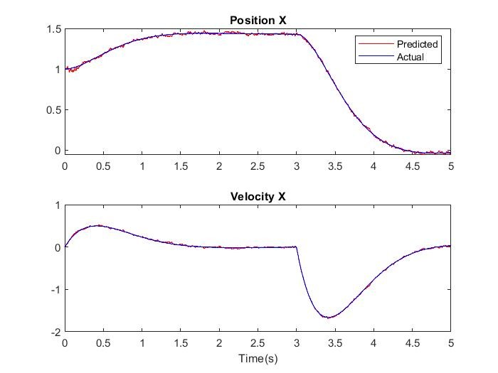
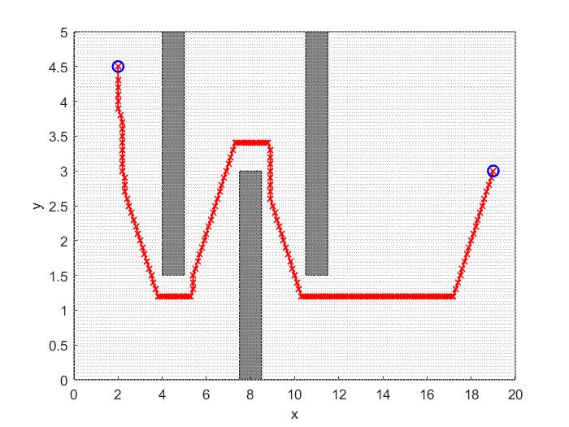
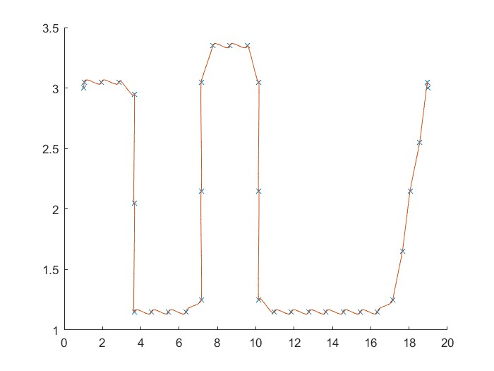

## NYU ROB-UY3303  
## Robot Motion and Planning  

**Project 1: Kalman Filter for State Estimation**  

Task: Implement a Kalman Filter (KF) to estimate the state (position and velocity) of a robot cart.
Steps: 
- Convert the system into state-space form and discretize it using the Euler method.  
- Implement the Kalman Filter prediction and update steps in MATLAB.  

---
**Project 2. Trajectory Generation for a Point-Mass Robot**  
Task: Generate a trajectory for a point-mass robot moving through a given set of points.
Steps:
- Apply trajectory smoothing techniques to ensure position and velocity continuity.
- Compute a polynomial trajectory for each segment.
- Allocate segment time proportionally to the segment length, ensuring total trajectory time is 10 seconds.
- Implement MATLAB functions that computes polynomial coefficients and segment time allocation. 

---
**Project 3. Graph Search Algorithms for Path Planning**  
Task: Implement Dijkstra's algorithm and A algorithm* to find the shortest path in a 2D environment with obstacles.
Steps:
- Convert the 2D environment into a discretized voxel grid.
- Implement Dijkstra’s shortest path algorithm to find a resolution-optimal path from start to goal.  

