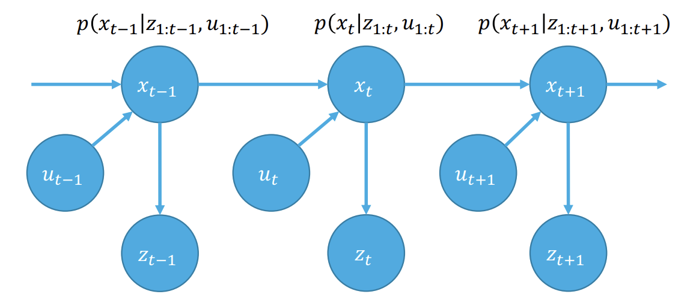

## **칼만 필터 원리 & 구현**  

칼만 필터는 루돌프 칼만이 개발한 제어 알고리즘으로, 노이즈가 포함된 관측값을 바탕으로 선형 시스템의 상태를 추정하는 재귀 필터이다.  

**1. Markov Property**  

Definition: Future state of the system is conditionally independent of the past states given the current state  

즉, State가 완전하기 위해서는 미래를 예측하는데 필요한 정보들만 갖고 있으면 된다. 과거의 정보나 독립적인 정보들은 필요하지 않다. 

이를 식으로 보면,

$$
p(x_{t+1} \vert x_{0:t}, z_{0:t}, u_{0:t}) = p(x_{t+1} \vert x_t, z_t, u_t)  
$$  
$$
p(x_{t+1} \vert x_{0:t}, z_{0:t-1}, u_{0:t}) = p(x_{t+1} \vert x_t, u_t)  
$$  
$$
p(z_t \vert x_{0:t}, u_{0:t}) = p(z_t \vert x_t)  
$$

**2. Bayes' Filter**  

Prior: $p(x_0)$  
Process model: $p(x_t | x_{t-1}, u_t)$  
Measurement model: $(z_t | x_t)$  

Prediction Step: $p(x_t \vert z_{1:t-1}, u_{1:t}) = \int p(x_t \vert x_{t-1}, u_t) p(x_{t-1} \vert z_{1:t-1}, u_{1:t}) dx_{t-1}$  

Update Step: $p(x_t \vert z_{1:t}, u_{1:t}) = \eta p(z_t \vert x_t) p(x_t \vert z_{1:t-1}, u_{1:t})$

$\eta$ 는 marginal distribution 이다.  

**3. Assumptions**  
- Prior follows a Gaussian distribution  
$p(x_0) \sim N(\mu _0, \sigma _0)$

- Process model $p(x_t \vert x_{t-1}, u_t)$ is linear with additive Gaussian white noise

$$
x_t = A_t x_{t-1} + B_t u_t + n_t  
$$
$$
n_t \sim N(0, Q_t)
$$

- Measurement model $p(z_t \vert x_t)$ is linear with additive Gaussian white noise

$$
z_t = C_t x_t + v_t  
$$
$$
v_t \sim N(0, R_t)
$$

